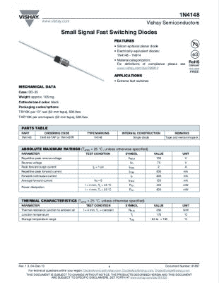
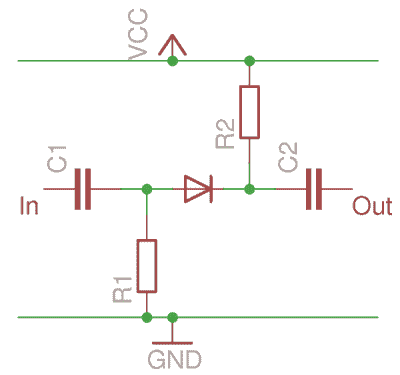
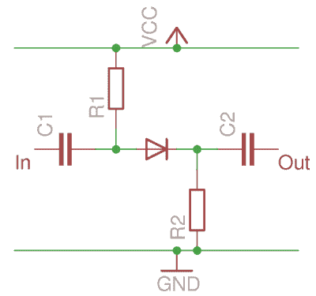
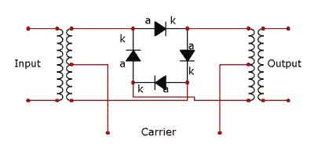

# 二极管:你从未意识到自己拥有的开关

> 原文：<https://hackaday.com/2016/12/09/diodes-the-switch-you-never-knew-you-had/>

Vishay’s take on the [1N4148 data sheet](http://www.vishay.com/docs/81857/1n4148.pdf) (PDF), describing it as a switching diode.

当查看电子军械库中的分立元件时，很容易忽略不起眼的二极管。毕竟，这个组件的日常版本并没有*做*太多事情，这个结论是可以理解的。它们没有你在隧道二极管、耿氏管、变容二极管、齐纳二极管、雪崩二极管甚至发光二极管中发现的特殊技能，相反，它们只是一个电流的单向阀。把它们往一个方向连接，电流就会流动，往另一个方向连接，电流就不会流动。他们把交流电整流到 DC，电力供应充满了它们。也许你还用它们来产生稳定的压降，因为当电流流动时，它们两端的电压相当恒定，但仅此而已。二极管:有史以来最短的黑客文章。

不过，去掉二极管不会这么快。他们还有另一个锦囊妙计，他们还可以充当开关。这不应该太令人震惊，毕竟快速浏览一下许多通用二极管的数据手册，就会发现它们被描述为开关二极管。

那么二极管开关是如何工作的呢？关键在于我们前面提到的那个单向阀。当二极管正向偏置并导电时，它将通过施加在其上的任何电压变化，但当二极管反向偏置且不导电时，它不会通过。因此，信号可以通过正向偏置的二极管接通，然后通过反向偏置的二极管断开。

### 二极管开关基础知识

A simplified diode switch in the reverse biased Off position.

为了说明基本的二极管开关，我们准备了几张简化电路图。第一幅图显示阳极通过 R1 接地，阴极连接到 Vcc 电源轨。二极管处于反向偏置，没有电流流过。施加到 C1 的交流电压将出现在阳极，但不会出现在阴极和通过 C2 输出。在这种情况下，开关是关闭的。

第二张图显示了一个非常相似的电路，但电阻连接到相反的电源线。现在，阳极连接到 Vcc 轨，阴极接地。电流流过二极管，二极管正向偏置。因此，施加到 C1 的交流电压将出现在二极管的阳极和阴极，并通过 C2 输出。开关已经打开。

A simplified diode switch in the forward biased On position.

这是一个简化的电路，但不是很多。实际的二极管开关通常通过将二极管的一侧保持在偏置点来工作，使得当逻辑电平被施加到另一点时，它将二极管从正向偏置切换到反向偏置，以允许开关被电子控制。换句话说，将二极管的一端放在中间，将另一端上下摆动。

特别是对于 RF 电路，偏置线路中还会出现 RF 扼流圈，阻止 RF 进入电源和逻辑电路。但本质就在图中，二极管开关真的就这么简单。

现在你知道二极管如何被用作简单的开关了。您甚至可以通过将单个二极管开关并联到单个偏置点来制作多路开关。但这并不是普通二极管在开关方面的能力极限，因此我们现在将考虑更多应用。

### 二极管:它们只是逻辑上的

第一批电子数字计算机，如你在 20 世纪 40 年代的军事设施或大学里看到的那些，使用真空管，有时与继电器或其他机电元件一起使用。随着计算机在 20 世纪 50 年代早期的发展并进入民用领域，它们开始使用体积更小、耗电更少的半导体来生产，这在当时还是新鲜事物。然而，20 世纪 50 年代晶体管的问题是它们既昂贵又不可靠，而不是我们今天使用的超级可靠的平面硅晶体管。20 世纪 50 年代早期的设计者不得不使用锗点接触晶体管。这些器件除了脆弱之外，还有一个不幸的特性，就是锁存在逻辑高电平状态，并且在状态改变后需要刷新电源。显然，任何可以减少对它们依赖的电路都是很有意义的。

[![The diode OR gate. Thingmaker [CC BY-SA 4.0], via Wikimedia Commons.](img/7bcb5b2652da42b7ad84448f8f7413d4.png)](https://hackaday.com/wp-content/uploads/2016/11/640px-diode_or_ideal_diode.jpg) 

二极管或门。Thingmaker [CC BY-SA 4.0]，via [Wikimedia Commons](https://commons.wikimedia.org/wiki/File:Diode_OR_Ideal_Diode.jpg) 。不起眼的二极管拯救了 20 世纪 50 年代的设计师。它们比点接触晶体管便宜得多，也可靠得多，而且只需电阻就能构成与门和或门。这种所谓的二极管电阻逻辑，或 DRL，在这个时期被用在固态计算机中，晶体管只在需要反相器的地方使用。

两个二极管门都在其输入线路上使用二极管，通过一个上拉或下拉电阻将二极管的另一端连接在输出点。

二极管或门的阳极面向输入端，输出端有一个下拉电阻，而与门的阴极面向输入端，输出端有一个上拉电阻。

[![The diode AND gate. Thingmaker [CC BY-SA 4.0], via Wikimedia Commons.](img/0de67f49f0659f867fbbb48f4b8be9ce.png)](https://hackaday.com/wp-content/uploads/2016/11/diode_and2_ideal_diode.jpg) 

二极管与门电路。Thingmaker [CC BY-SA 4.0]，via [Wikimedia Commons](https://commons.wikimedia.org/wiki/File:Diode_AND2_Ideal_Diode.jpg) 。除了每当需要逻辑反转时都需要晶体管之外，这些门还存在每个门上都有电压降的问题。因此，如果你将一系列二极管门以菊花链形式连接起来，你会发现每一层的逻辑电平都会下降，最终达到一个点，其跃迁不足以操作连续的门。

然而，在可用的电路库存中使用二极管逻辑仍然是值得的，因为有时在一个项目中，您可能需要一个“与”或“或”,使用几个二极管而不是另一个 74 系列芯片快速组装一个可能是有意义的。

### 用二极管把它混合起来

A diode mixer or ring modulator (corrected circuit, thanks commenters!) Via [Wikimedia Commons](https://commons.wikimedia.org/wiki/File:Ring_Modulator.PNG?uselang=en-gb).

还有一个地方你会碰到二极管开关，尤其是如果你对收音机或电子音乐感兴趣的话。二极管桥式混频器或环形调制器是一种使用四个二极管的电路，其配置表面上与桥式整流器相似，其功能相当于混频器，将交流信号和振荡器的输出混合，产生它们的和与差。四个二极管充当平衡信号输入和输出之间的开关，并在本地振荡器的每个周期上具有反转它们之间的路径极性的效果。它用于合成器和吉他踏板，以及任何需要频率转换的无线电电路中。

我们希望你现在能以新的眼光看待你的垃圾盒子里的那些二极管，因为你知道它们也能很好地进行切换。在实践中，您可能从未使用过二极管作为开关，但熟悉这个概念是有好处的。如果二极管引起了你的兴趣，为什么不继续看看我们最近出版的二极管的历史呢？