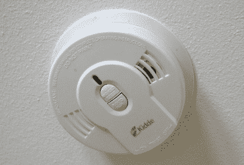
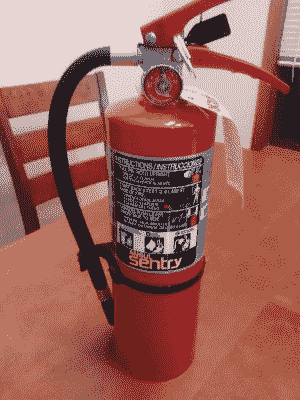

# 安全入侵:家庭商店的消防安全

> 原文：<https://hackaday.com/2016/12/06/hack-safely-fire-safety-in-the-home-shop/>

在过去的两个月里，我们已经报道了两起与 3D 打印相关的火灾。一次是由[一次不明智的尝试引起的，用明火加热的丙酮使印迹](http://hackaday.com/2016/08/16/fail-of-the-week-how-not-to-smooth-a-3d-print/)变得平滑，而另一次由消防官员调查，发现是由[过度使用发胶将印迹粘在承印床上引起的](http://hackaday.com/2016/11/03/3d-printer-tragedy-claims-a-life/)。前者可能是致命的，但最终只不过是一个很好的恐吓和一个“黑客最有趣的家庭视频”的获奖剪辑；后者悲惨地夺走了一个 17 岁前途无量的少年的生命。

鉴于这些事件，我们 Hackaday 认为回顾一些与家庭商店相关的消防安全基础知识是个好主意。没有什么地方比报道致命火灾的帖子的评论区更清楚地表明了这种需要。关于这场火灾的原因以及它可能对 3D 打印社区产生的潜在负面影响，人们展开了激烈的辩论，评论从慎重和深思熟虑到令人震惊的冷酷无情。但最终敲定这笔交易的是一位名叫[混战]的用户的评论:

> “我的反思是，我早就应该为我的工作站购买灭火器了。因为现在我的救火计划基本上就是对着火焰大喊脏话，希望它自己熄灭。”

让我们试着为[混战]和其他人想出一个更好的计划。我们将涵盖基本知识:躲避、探测、控制和逃脱。

### 逃避

黑客的生活方式充满了“不要在家里尝试这个”的时刻。我们经常接触高电压、明火、焊接和焊接的高温、挥发性和易燃的溶液——有时是同时接触。当您处于构建区域时，您可能不会注意到焊台上散落的数据手册，也不会注意到您在电源板上插入了过多的仪器。情况变得非常糟糕只需要一秒钟。

举个例子:在研究生院的时候，一天晚上我去实验室做实验，迟到了。我一打开门，就知道有麻烦了；空气中弥漫着塑料燃烧的气味。我进一步调查，发现一个长凳上的本生灯周围有一滩冒着烟的熔化包装泡沫。显然是一个风扇自动启动，把架子上的泡沫吹走了；它飘了下来，完美地落在我们的技术员在一天工作结束时留下的燃烧器上。

这是各种因素的完美风暴，我只是碰巧在那里干预并阻止火势蔓延，但它说明了几个重要的问题:

1.  你需要定期对你的工作场所进行安全检查。确保没有任何东西会让燃料在氧气存在的情况下受热——氧气是起火的基本条件。
2.  明火和高温需要格外警惕。去吧，保持多疑——在离开商店之前，把所有的东西都检查两三遍。如果有必要的话，从《商业飞行员手册》中选一个剧本，制作一份商店关闭清单。
3.  专心比赛。我以前的同事因为一时分心差点烧掉实验室。回想起来，这是完全可以理解的——当时他正在经历离婚。但是当你累了，生病了，或者情绪受到影响时，这可能不是去商店的最佳时间。安全起见，还是去看看黑客日报吧。

### 侦查

Most modern smoke detectors are wired to mains or have a sealed 10-year battery

建筑规范几乎普遍要求安装烟雾探测器，你可能会认为，在大众市场上广泛而廉价地供应烟雾探测器 40 多年后，没有一个住宅不安装烟雾探测器。不幸的是，事实并非如此，报纸每天都刊登悲伤的报道，引用一位消防队长的话说，“房子里没有工作的烟雾探测器。”

确保你的商店被至少一个工作的烟雾探测器覆盖。如果你像我们中的许多人一样，因为你的黑客活动而被关到地下室，不要依靠高层的烟雾探测器来完成这项工作，在附近安装一个。如果你的商店在一个独立的建筑里，你就有一个额外的问题，如果警报响起，你就听不到了。考虑一下[一个支持 WiFi 的烟雾探测器](http://www.firstalert.com/site_content/item/1098-onelink-wi-fi-smoke-carbonmonoxide)，或者[自己动手做一个](http://hackaday.com/2015/11/16/audio-coupled-smoke-alarm-interface-sends-texts-emails/)。你甚至可以通过简单地给[加一块智能电池](http://getroost.com/product-battery)来控制任何烟雾探测器。

### 消防

尽管你尽了最大的努力去预防，你还是有可能面临你的商店着火的那一天。现在不是意识到你没有办法救火的时候。在需求出现之前，你需要准备好工具和培训。

你需要一个高质量的灭火器，适合家庭商店可能发生的火灾类型。快速回顾[火灾分类](http://www.femalifesafety.org/types-of-fires.html):

*   A 类——木材、纸张、垃圾和塑料等普通可燃物
*   B 类-易燃液体，如汽油、油或溶剂
*   C 类–通电电气设备中的火灾
*   D 类–易燃和易反应金属，如镁、锂或钛

Ansul Sentry 5-lb ABC fire extinguisher I just purchased for my new shop.

还有一种 K 类用于烹饪油火，但除非你正在黑火鸡炸锅，否则这可能超出了家庭游戏玩家的范围。在大多数情况下，你会在市场上购买 5 到 10 磅的 ABC 型干粉灭火器。

帮自己一个忙，不要买便宜的。灭火器是生命安全用具，那可不是节约的地方。总的来说，大盒子商店里的灭火器都是垃圾。经验法则:如果气门头是塑料制成的(就像这篇文章的横幅图片)，它会泄漏。多花几块钱买一个你知道会在你需要的时候发挥作用的设备。大多数城市至少有一家销售和服务灭火器的消防安全公司；就我个人而言，我宁愿在本地公司多花一点钱，建立一种将来会受益的关系。

你还需要知道如何使用灭火器。这根本不是你的第二天性，当你要使用它的时候，就不是抱怨的时候。至少你会想看一些[好的训练视频](https://www.youtube.com/watch?v=nkbVC0FnMUU)，这样你至少有了基础。但是没有什么能打败实践训练。您当地的消防服务公司可以提供帮助，尽管他们可能会收取实弹训练的费用。你也可以试着联系当地的消防站；消防员可能会非常乐意帮助你接受培训。

### 逃跑

当其他一切都失败时，你需要能够脱离危险。同样，这需要深谋远虑。你需要考虑逃生路线作为你安全审计的一部分。确保你确定了至少两条撤退路线，以防其中一条路线被大火阻断。不要忘记实践你的计划——在危机中，我们往往不会随机应变，而是以我们训练过的最高水平来执行。

无论你的游戏是什么，如果你正在阅读 Hackaday，你很有可能经常做一些比普通人更危险的事情。比普通人更聪明一点，准备更充分一点，难道不是很有意义吗？