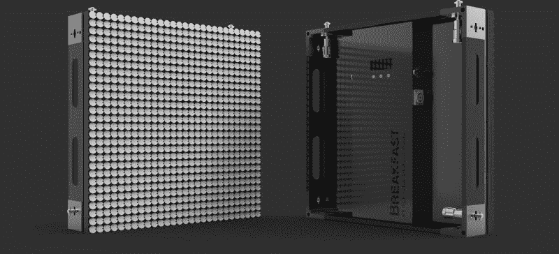

# 翻转点显示出现与现代化的驱动程序

> 原文：<https://hackaday.com/2016/11/29/flip-dot-displays-appear-with-modernized-drivers/>

承认吧，你一直想拥有自己的翻转点显示器来玩。随着分裂皮瓣显示器，翻转点有一个令人上瘾的外观和声音，听起来回到半个世纪，但仍然感觉像现代技术。他们使用一个磁性线圈来驱动每个像素——两面涂上对比色的物理圆盘。这意味着当改变像素时，你真的只需要电，并且每个像素在翻转时都会发出令人满意的不显眼的点击声。这种显示器的唯一问题是，众所周知，它们很难拿到手。

总部位于布鲁克林的硬件公司 Breakfast 以其创造性的营销装置而闻名，今天早上，该公司发布了他们的[翻转盘显示系统](http://breakfastny.com/flip-disc)。二手显示器不时出现在常见的网站上，但通常没有控制器。传统的 flip-dot 制造商还没有找到个人黑客或黑客空间，点击购买选项很难找到，如果不是不可能的话。

早餐提供现代化的驱动程序，用于管理所有这些机电像素。这是否会使显示器更容易接近，这是一个仍然需要回答的问题。

Breakfast 为每个 28×28 像素的面板设计了自己的驱动电路，其中包括一个 Cortex-M 微控制器。易于菊花链连接的面板(使用 cat5 +电源)将显示器上的最大数据传播速度提升了至少两个数量级，超过了传统驱动器。下面的演示视频显示了飞行时间相机控制的 30 FPS(在这种情况下是华硕 Xtion，但在生产中可能会改变)。每个面板在静止时的功耗约为 300 mW，典型的全动操作时每个面板的功耗为 25-50 W，但该系统具有智能电源设计，可以限制总功耗。

***你*** 能拥有一个吗？可能不是——但那只是因为你的钱包。早餐不会给出一个确切的价格，但当我们问及本田飞度的近似值时，他们答应了。最小订单为 15 块面板(140×84 像素或约 7'x4.25 ')，将花费您约 6.25 本田飞度。

Your workbench would look fantastic with one of these panels on it, right?

尽管你没有六位数的钱花在这上面，但这是一个显著的进步。驱动程序的现代化，应用程序和编程 API 的增加，以及向更广泛的客户群销售的推动，应该会重振本世纪几乎灭绝的翻转点显示器的出现。如果购买量激增，二级市场将在许多年后受益，但希望兴趣的激增将鼓励他们以更…轻率的…价格提供他们显示器的黑客版。

我们已经看到很多工作来自早餐，特别是这个 6400 像素的彩色线显示器，这是一个机械工程游乐场。当谈到倒装点时，没有什么能打败我们在 2015 年 CES 上看到的。

 [https://www.youtube.com/embed/s94PscZJ5EE?version=3&rel=1&showsearch=0&showinfo=1&iv_load_policy=1&fs=1&hl=en-US&autohide=2&wmode=transparent](https://www.youtube.com/embed/s94PscZJ5EE?version=3&rel=1&showsearch=0&showinfo=1&iv_load_policy=1&fs=1&hl=en-US&autohide=2&wmode=transparent)

