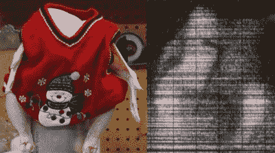

# 快速原型 X 射线反向散射机

> 原文：<https://hackaday.com/2016/12/01/quickly-prototyping-x-ray-backscatter-machines/>

本·克拉斯诺是那种没有人对他有不好看法的人。他是 Verily(谷歌的生命科学 Alphabit)团队的一员，在那里他正忙于治疗癌症。他共同创建了 Valve 的硬件部门和他的 YouTube 频道，[应用科学](https://www.youtube.com/user/bkraz333)，这是一个以非常低的预算非常快速地构建非常高科技的工具的探索。从电子显微镜到液氮发生器，再到用不同比例的配料制作单个巧克力曲奇的机器人，本都做过。他正在治愈癌症*和*寻找完美的巧克力饼干配方。

在今年的 Hackaday 超级会议上，Ben 演讲的重点是快速构建低成本的科学仪器。在应用科学领域，本巩固了自己巫师的地位，他能在易贝或剩余商店找到任何东西。本告诉我们，真正的诀窍是让他的老板和会计理解这种快速原型思维。

 [https://www.youtube.com/embed/S-pxPcF2zUQ?version=3&rel=1&showsearch=0&showinfo=1&iv_load_policy=1&fs=1&hl=en-US&autohide=2&wmode=transparent](https://www.youtube.com/embed/S-pxPcF2zUQ?version=3&rel=1&showsearch=0&showinfo=1&iv_load_policy=1&fs=1&hl=en-US&autohide=2&wmode=transparent)

本带领超级计算机走过的第一个建筑是一个测试假说的装置。大约 2009 年至 2013 年在机场安检线发现的 X 射线反向散射机实际上能有效阻止恐怖分子吗？尽管评估 X 射线反向散射设备会引发明显的安全和公民自由问题，但这只是一个关于 TSA 最炫新设备有效性的问题。X 射线反向散射装置比金属探测器更能有效阻止恐怖分子吗？

A chicken, wearing a sweater, and smuggling an Allen key onto its flight. Chickens can fly.

这个问题的答案来自一个月的构建。即使在建造之初，本说他对 X 射线了解不多。反向散射 X 射线机不像你在牙医诊所里看到的那样——那些是透射 X 射线，每天给数百万飞行员做 X 射线检查将会是一场全球性的健康危机。

反向散射 X 射线的工作原理完全不同，它不是让 X 射线穿过每个通过 TSA 检查站的人。在快速的专利搜索之后，Ben [发现了一个关于反向散射 X 射线扫描仪的非常好的描述](https://www.google.com/patents/US5181234)，并开始构建一个原型来评估这些设备的有效性。

这个建筑包括一个在易贝很容易找到的 X 射线源，一个在易贝找到的荧光屏，一个在易贝找到的光电倍增管，还有一些在商店的垃圾箱里乱七八糟的东西。虽然你可以简单地买一台 Rapiscan 反向散射仪(从易贝的一个机场买来的)，但那要花上几千美元。本在他的机器上只花了几百美元。

在建造了一个用 X 射线扫描物体并检测反射光子的装置后，本有了一台可以工作的反向散射 X 射线机。它成功地探测到一把艾伦内六角扳手被一只鸡偷偷带上了飞机。这是一个简单的设置，但它证明了你可以使用在易贝购买的零件非常容易地制造非常复杂的设备。

从本的演讲中得到的是简单的快速原型制作。经常迭代，找到所有在线可用的信息，并快速构建原型。利用某处出售的所有商品的可用性。先构建，后提问，你可能有时间发现完美的曲奇配方。