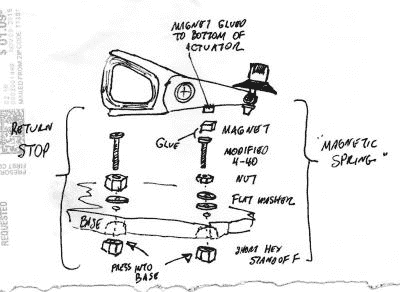

# 一个美丽的莫尔斯键从硬盘驱动器驱动器

> 原文：<https://hackaday.com/2016/12/10/a-beautiful-morse-key-from-a-hard-drive-actuator/>

莫尔斯电码，或 CW，是一个将业余无线电爱好者从上到下划分开来的主题。对一些人来说，这是一种褪色的时代错误，而对另一些人来说，这是最纯粹的艺术形式。随着它不再用于重要的商业或军事用途，业余无线电爱好者使它保持活力，而那些热爱它的人则为继续使用它付出了相当大的努力。

有着超过一个世纪的历史，CW 爱好者可以使用大量的莫尔斯键。从老式的电报钥匙，到二战时期剩余的军用钥匙，再到横放的“窃听器”钥匙和现代的精品手工钥匙，许多操作者都会因为喜爱而收藏起来，并经常使用它们。

Just one of the hand-drawn illustrations for this project.

其他运营商创建自己的钥匙，要么用原材料制作，要么使用手头的任何材料。钥匙是由每一件可以导电的废旧物品制成的，可以与世界各地联系。

[H. P. Friedrichs，AC7ZL]用多余的材料制作了这样一把自制的钥匙，但它一点也不像垃圾箱。[他用一个多余的硬盘驱动器的磁头驱动器作为一个直键的臂](http://www.hpfriedrichs.com/radioroom/hdmorsekey/hdmorsekey.htm)，结果是一个美丽的项目。传动轴承是枢轴点，钥匙的商业端取代了硬盘的磁头。弹簧由磁体之间的排斥力提供，后部的连接由一根吉他弦提供，触点本身来自剩余功率继电器。甚至他的评论也是一件美丽的事物，一本引人入胜的手绘插图读物。如果你不是莫尔斯爱好者，这仍然是一个迷人的项目。

这些年来，我们在这里推出了许多按键，这并不是第一个使用硬盘驱动器的按键，正如[这个薄荷味的拨片](http://hackaday.com/2012/05/28/fine-tune-your-morse-code-skills-with-this-mint-tin-practice-keyer/)所示。除此之外，我们还将你与[的一系列非正统钥匙](http://hackaday.com/2010/07/25/alternative-morse-code-keys/)联系起来，当然还向你展示了[一把带有树莓 Pi 解码器的老式电报钥匙](http://hackaday.com/2016/02/21/breathing-new-life-into-an-old-key/)。