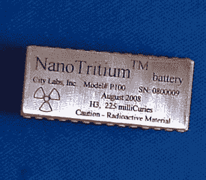

# 制造你自己的核能电池

> 原文：<https://hackaday.com/2016/12/01/make-your-own-nuclear-battery/>

A commercial nuclear battery from City Labs.

β伏打电池是一种使用β粒子放射源和半导体 p-n 结来发电的设备。氚，氢的一种同位素，经常被用作放射性元素。你可能认为氚很难获得，甚至被禁止，然而，最近你可以在自发光钥匙链中找到氚，它也被用于手表和火器夜视。氚放射性过程中产生的β粒子(电子)导致设备中的磷光体发光，发出的光可以持续数年。

[NurdRage]刚刚用钥匙链上的氚小瓶制造了一个核电池[。扔掉塑料容器后，他将小瓶夹在两块小太阳能板之间。仅此而已！未来 15 年的即时供电。当然，你可以从这个设备中获得的功率是微瓦量级的。这种电池在 800 毫微安时产生大约 1.6 伏的电压。他得到了 1.23 微瓦，不算多，但事实上比商业单位 0.84 微瓦的输出要多，只需 10%的成本。如此微小的能量实际上不容易测量，他很好地解释了他用来测量电流的电路。](https://www.youtube.com/watch?v=KKdzhPiOqqg)

微瓦级的核电池用于关键计算机系统的时钟电路和一些医疗植入物。它们的价格大约是 2200 美元，所以你可以算出每瓦的价格。[NurdRage]版本可以用 220 美元建造。你的下一个电子项目可能不需要，但我们相信你会喜欢他的项目。如果你想要一个持续数年的光源，但不想使用放射性氚，考虑一下[氚化](http://hackaday.com/2016/07/11/tritiled-lights-up-the-night-doesnt-make-you-glow/)。

 [https://www.youtube.com/embed/KKdzhPiOqqg?version=3&rel=1&showsearch=0&showinfo=1&iv_load_policy=1&fs=1&hl=en-US&autohide=2&wmode=transparent](https://www.youtube.com/embed/KKdzhPiOqqg?version=3&rel=1&showsearch=0&showinfo=1&iv_load_policy=1&fs=1&hl=en-US&autohide=2&wmode=transparent)

