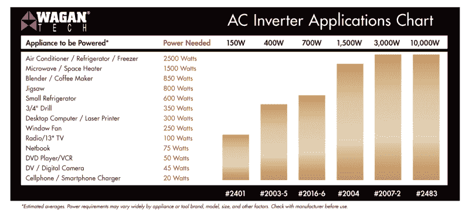
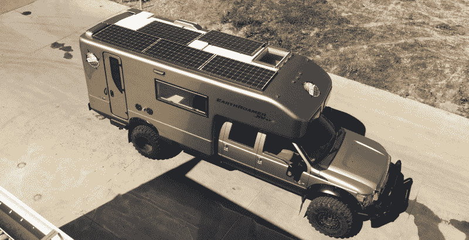
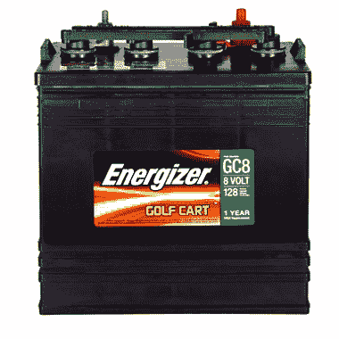

# 离网旅行——建立一个太阳能系统

> 原文：<https://hackaday.com/2016/12/20/off-grid-travel-setting-up-a-solar-system/>

当你住在车外，甚至只是外出旅行时，电力很快成为一个大问题。你需要它来照明，给你的各种设备充电，运行你的咖啡机和其他电器，如果你有电冰箱，甚至可能储存你的食物。你可以像许多房车车主那样做:依靠有电连接的露营地，加上几个汽车电池，让你从一个露营地到下一个露营地。但是，这些露营地价格昂贵，往往相当于美化停车场。如果你可以自由地在任何地方露营，而不用担心找不到电源，那不是更好吗？

这正是我们将在这篇文章中讨论的:离网电力在路上。有两种主要的方法来做到这一点:与便携式气体发生器，或与太阳能。气体发电机长期以来一直是首选方法，因为它们可靠地提供大量电力。然而，它们也相当昂贵、笨重、噪音大，而且显然需要你带上燃料。幸运的是，过去十年太阳能技术的重大进步使得在旅途中使用太阳能作为唯一的电力来源变得非常实际。

## 目标

每当你开始一个新项目时，清楚地定义你的目标总是很重要的。当你打算依靠结果来获得个人幸福时，这是最真实的。所以，首先，我们要讨论普通的陆上旅行者想要和需要什么样的能量。最明显的首要要求是照明。

幸运的是，如今高效的 LED 照明随处可见。用 12V 的 LED 灯完全点亮你的车可能需要不到 50 瓦的功率。大多数现代电视将使用类似数量的能量。

接下来，你将希望能够运行至少一些基本的设备。对于我们 Hackaday 来说，咖啡机是最重要的。不幸的是，咖啡机耗电量很大——一个 Keurig 在加热时可以使用高达 1500 瓦的电能。其他电器使用类似的高功率。一台微波炉运行时大约消耗 1200 瓦，一台烤面包机甚至会消耗更多。

## 描述您的需求

This chart, provided by WAGAN, lists some common appliances and their power consumption (though TV power consumption has been dramatically reduced in recent years)

然后是真正高能耗的电器，比如空调和取暖器。这两者都需要大量的电力来运行，并且还需要长时间运行。虽然从技术上来说，这两者都可以通过太阳能装置运行，但这需要在太阳能电池板和储能电池上进行大量投资。在这种情况下，发电机将更具成本效益。

因此，为了简洁起见，让我们假设你已经决定放弃空调(或者只有在你可以使用岸上电源时才会使用它)。加热器、热水器和冰箱都将使用丙烷。这就给你留下了一个大部分时间只消耗约 100 瓦的设置，偶尔在使用电器时会达到接近 2000 瓦的峰值。现在让我们来谈谈你需要买些什么来实现这一点。

## 该设备

有四个主要部件将进入你们的太阳能系统:转换器、逆变器、电池和太阳能电池板本身。几乎所有的房车(以及一般的车辆)都被设置为使用 12V DC 电力。这是因为它们可以直接由标准汽车电池驱动。然而，你的大多数电器和其他家用设备都是由 120 伏交流电供电的，你通常从墙上的电源插座获得。

### 换流器

这就是逆变器发挥作用的地方。它从你的电池中获取 12V DC，并将其转换为 120V 交流电，这样你就可以运行所有普通的家用设备。也就是说，这一过程并不完全有效，这意味着你应该尽可能多地使用 12V 系统(例如，用于 LED 照明)。逆变器也会消耗一些电力，即使没有任何东西通过它们，所以最好在不使用时完全关闭它们。

正如我们在上一节中提到的，你可能想要一个能够连续输出 1500 到 2000 瓦的逆变器。尽管额定功率可能匹配，但并非所有逆变器输出都相同。纯正弦波逆变器更贵，但提供的功率更接近插座上的“真正”交流功率。一些电器在使用较便宜的改进型方波逆变器时会出现问题(甚至可能损坏)。如果你不确定你需要哪一个，最好在纯正弦波模型上多花一点钱。

### 转换器

与逆变器相反的是转换器——它将 120 伏交流电转换成 12V DC。这些是从岸上电源(电源插座)给你的电池充电和从岸上电源运行你的 12V 系统所必需的。几乎所有的房车都有一个内置在电气系统中的转换器，但是如果你还没有转换器，并且想要通过插座给电池充电，你就需要购买一个。

### 太阳能电池板

对于太阳能电池板本身，你真的只受到你有多少可用空间和你有多少钱的限制。你能负担得起的瓦特数越多(并且适合你的钻机)，就越好。虽然有些面板比其他面板效率略高，但它们现在彼此都非常接近。这意味着它主要是关于你有多少平方英尺的可用空间和你愿意花多少钱。大多数人至少需要 150 瓦，600 瓦左右更理想。

Earthroamer, a leader in off-grid expedition vehicles, provides a 1,200 watt solar panel array on their XV-LTS model.

然而，你实际需要多少是很难猜测的。例如，一个 150 瓦的面板在完美的条件下(晴天、阳光直射头顶等)实际上只能提供 150 瓦。).不过，一般来说，你可能会期望在白天得到平均 1/3 到 1/2 的额定功率。这显然会因天气条件、一年中的时间以及如何放置面板而异。你还需要一个太阳能充电器来搭配电池板，但这些都不贵，而且通常与你的太阳能电池板的功率相匹配。

### 电池

最后，你需要电池来储存所有的能量。所有这些设备都是专门为使用标准的 12V 汽车电池而设计的，但它们实际上并不是最理想的应用电池。汽车电池意味着提供大量的启动电流(启动你的汽车引擎)，而不是你想要的那种长时间缓慢消耗的太阳能装置。有专门为太阳能装置设计的电池，但一个既理想又经济的解决方案是使用高尔夫球车电池。

Golf cart batteries are mass produced and optimized for deep cycle use.

高尔夫球车电池擅长储存大量的能量，而且一般都不贵。然而，大多数是 6V 而不是 12V。这意味着你需要至少两个串联的电线来达到 12V(多对电线可以并联)。你需要根据你的预期用途来选择电池的数量。一个很好的经验法则是有足够的电量来运行你的系统一两天而不用充电，这应该足以让你度过太阳能电池板输出功率不多的情况(例如，在恶劣天气下)。

## 设置

在本系统上，有三种方式给电池充电:

1.  当有足够的阳光来产生电流时，太阳能电池板总是被动发生。
2.  从你的汽车的交流发电机，你只希望发生在车辆实际运行时(以避免耗尽你的汽车电池)。
3.  有了岸电，当你有主电源时，它是给电池快速充电的理想选择。

用太阳能电池板给你的电池充电将完全在后台进行。你的太阳能充电器应该一直连接到电池上，这样你就可以在任何有阳光的时候收集和储存能量。如果你的电池已经充满，太阳能充电器会简单地用涓涓细流让它们充满。

利用汽车的交流发电机给电池充电也同样简单。如果你的车是有线牵引拖车，那么你已经得到了你需要的。只需连接一个 12V 的插头和地线，并让这些电线进入你的电池组。每当车辆运行时，来自交流发电机的一些电力将用于为您的电池充电。对于大多数车辆来说，这不会是一个巨大的力量，但它很好地利用了你所拥有的一切。

### 尺蠖

使用岸电变得有点复杂，因为它很容易创建一个循环，不断运行你的充电/放电系统。转换器将获得市电(120 伏交流“岸电”)，并将其转换为 12 伏 DC，以给电池充电并运行 12 伏电子设备。然而，如果你的逆变器连接，它会试图把权利回到 120 伏交流电。此外，如果逆变器输出没有与海岸电源电路隔离，就会形成一个环路，逆变器向转换器供电，转换器向逆变器供电。这是一个永无止境的循环，往好了说会耗尽你的电池，往坏了说会损坏你的设备。

这意味着你的整个系统基本上需要有两种“模式”——一种是当你连接到岸上电源时，另一种是当你没有连接时。当你连接到岸上电源时，它应该直接馈入你车辆的 120 伏系统(为你的电器供电)和转换器，为你的电池充电并运行 12V 系统。当你从岸上电源断开时，逆变器应该被重新引入(并且转换器断开)，并且你的 120V 系统应该由此运行。

您可以通过三种方式之一来处理这种电路设置:手动(当您插入岸电时，物理地拔掉逆变器的插头)、用开关或用继电器。很明显，手动是最便宜和最简单的，但是你有忘记做的风险。此外，根据设备存放的位置，可能很难找到。对于解决后一个问题，开关是一个很好的选择，但当你连接或断开岸电时，你仍然要记得翻转它。继电器解决了这两个问题，并且不需要你的努力，但是你需要电气知识来连接它(这对黑客读者来说应该不是问题)。

[![A complete mobile system overview [Image Source: Living In My Car]](img/09194d2616e26dbdc1c2dbdd1c5452ad.png)](https://hackaday.com/wp-content/uploads/2016/12/draft-of-my-rv-electrical-system.jpg) 

一个完整的移动系统概述【图片来源:[住在我的车里](http://livinginmycar.com/blog/2010/12/30/schematics-for-girls/)

无论你选择哪个选项，重要的是逆变器和转换器永远不要同时运行。当您连接到岸电时，应断开逆变器并连接转换器，并且您的 120V 电路应直接连接到岸电。当你从岸上电源断开时，逆变器应该连接，转换器断开，你的 120V 电路应该连接到逆变器的输出。

关于输出的问题，我们已经提到过你将有两个主要电路:12V 电路和 120V 电路。12V 电路将直接连接到电池，并为任何依靠 12V 运行的设备供电(LED 灯、水泵、加热器点火器等)。该电路可以使用为汽车或房车设计的廉价保险丝盒。请记住，电线规格在这里很重要，特别是如果你要在 12V 电路上运行很多，所以选择适合安培数和电线长度的电线尺寸。

120V 电路将连接到逆变器的输出端(当您使用岸电时，将切换到主电源)。这将为您的任何家用设备供电。逆变器本身会有自己的保险丝，但请记住，当你在岸上供电时，这些不会是电路的一部分。因此，谨慎的做法是在切换到主电源后熔断整个电路。

## 死刑

如上所述，该系统被设计成尽可能被动。如果一切都设置正确，你应该不必做任何事情，除了像你期望的那样使用你的电器和设备。如果你使用继电器切换到岸上电源，那就更是如此。在这种情况下，你唯一要做的就是把你的设备插到电源插座上，如果有的话。其他一切都应该在背景中愉快地哼唱。

也就是说，有一些事情你应该注意，并不时检查。第一点似乎很明显，但是要意识到你的能量消耗。例如，如果你只想喝一杯，那就没有必要煮一整壶咖啡。你应该很快学会什么会消耗很多能量，以及什么是你想要优先考虑的。

接下来是基础维护。这种系统实际上需要很少的维护，但偶尔监控你的电池以确保它们健康是个好主意。基本上，只是看一看，看看他们是否似乎充电和放电一致和可预测的。你还应该时不时地花时间清洁一下你的太阳能电池板，以确保你能从它们身上获得尽可能多的能量。

最后，定期检查你的线路，确保它是安全的。作为一名业余读者，我们假设你知道如何正确设置线路，但当它在路上被推搡时，东西可能会丢失。你最不想看到的就是某处短路引起的火灾。

除此之外，你能做的最重要的事情就是享受离网旅行的自由！如果你渴望上路，我们甚至讲述了如何打造自己的旅行拖车。有没有自己的小贴士，或者关于旅行的酷故事？一定要在下面的评论里分享出来！