# JTAG 的多面

> 原文：<https://hackaday.com/2016/12/15/the-many-faces-of-jtag/>

如果只有一个标准来连接、编程和调试硬件，那不是很好吗？如果你能插上电源，所有的东西都会工作吗？做梦吧，做梦的人！但是，当然，我们这些业余爱好者并不是唯一遭受多重标准困扰的人。工业也有同样的问题。随着智能设备——微控制器、传感器和它们的朋友——在任何给定的印刷电路板上的激增，很难测试它们，更不用说它们作为一个系统的功能了。

联合测试行动小组(T1)(JTAG)在 80 年代中期聚集在一起，使电路板的自动化测试成为一个标准化的过程。只要有足够的大脑支持，几乎任何消费电子产品上都可以找到 JTAG 端口，它也是调试自己的工作和侵入他人系统的非常有用的入口。总有一天你会需要用到 JTAG。

如果实施得当，这是一个非常酷的系统，让您可以从单个连接器测试板上的任何兼容 IC。黑客主要使用它来运行和暂停单个处理器，将它们置于调试模式，检查它们的内存状态等。基本上每个微控制器都响应 JTAG 命令，这是一个非常广泛和强大的标准。理性和标准化的胜利！

当然，连接器引出线由制造商决定。恐怖啊！

## 五个信号

原则上，JTAG 使用五条信号线。它们从调试器开始形成一个链，其中一个设备的输出是下一个设备的输入，直到结果返回给调试器。

[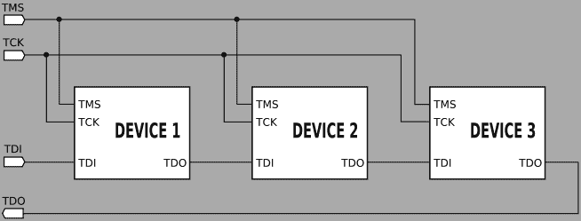](https://hackaday.com/wp-content/uploads/2016/11/654px-jtag_chain.png)

JTAG, as imagined by [Vindicator](https://commons.wikimedia.org/w/index.php?curid=838166) CC BY 2.5

*   测试数据输入(TDI)是调试器的输入
*   测试数据输出(TDO)是该链的返回端
*   与 SPI 类似，测试时钟(TCK)同步记录该数据
*   测试模式选择(TMS)让器件知道它们正在被调试——这是一个全局芯片选择
*   测试复位(TRST)是一个可选信号，用于复位链中的所有器件

还有其他信号，但它们不是标准的，大多是单个设备复位。如果您正在编写 ARM 芯片，您可能还会遇到串行线调试(SWD ),这是 JTAG 的双线简化，其中 TMS 线用于双向数据传输(SWDIO)和时钟(SWDCLK)。

## 一千种配置

只有五个信号，或其中两个信号的子集，你会认为可能的引脚数有限。那太天真了。您通常会看到 20 针、14 针和 10 针版本的 JTAG 端口。自然地，在每一个针数中有子种类。这是我遇到的一个分类。肯定还有其他人。

疯狂始于 ARM，当时他们决定在一个 20 针连接器上传输 5 个信号。(平心而论，他们多加了几条信号线，还有很多多余的地线。)这也是我见过的唯一一个 20 针连接器，如果你看到两排 10 针，最好从这个引脚排列开始。两个 MIPS JTAG 版本也可以在 20 针外壳中出现，但是因为它们只使用 14 针，所以它们也出现在 14 针版本中。

[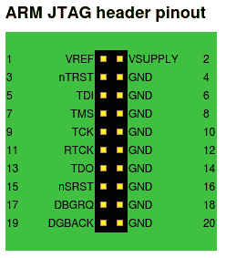](https://hackaday.com/2016-11-30-173447_1366x1792_scrot/)[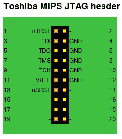](https://hackaday.com/2016-11-30-173458_1366x1792_scrot/)[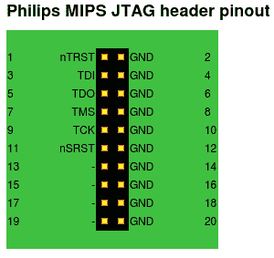](https://hackaday.com/2016-11-30-173504_1366x1792_scrot/)

这就把我们带到了 JTAG 地狱的第一层:十四个瓶子。除了 ARM-14 引脚排列和上述 MIPS 变体，还有 Xilinx 和 TI 的 14 引脚 MSP430 JTAG 布局。嘘！这里会有一些尝试和错误。如果有 MSP430 芯片(或者你用的是[Travis Goodspeed]的 [GoodFET](http://goodfet.sourceforge.net/) ，那么 TI 版本最有可能。如果你看到一个 Xilinx FPGA，这是一个可靠的赌注。如果是路由器，先赌 MIPS 布局，但如果有 ARM 芯片，你可能想试试 ARM-14。

[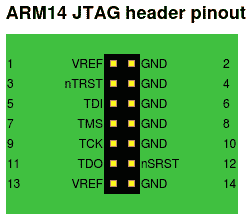](https://hackaday.com/2016-11-30-173453_1366x1792_scrot/)[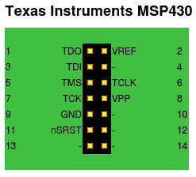](https://hackaday.com/2016-11-30-173540_1366x1792_scrot/)[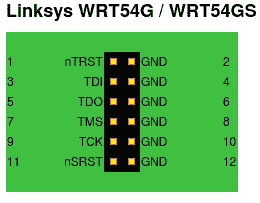](https://hackaday.com/2016-11-30-173606_1366x1792_scrot/)[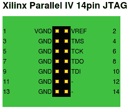](https://hackaday.com/2016-11-30-173546_1366x1792_scrot/)

这让我们陷入了绝望的深渊:十瓶头球。这里的好消息是 Alterra ByteBlaster 和 AVR 引脚匹配，可能是最常见的布局。当我看到一个十瓶的头，我从这里开始。不幸的是，飞思卡尔/晶格半导体也有自己的十针 JTAG，它是不同的，所以这是你的下一个停靠港。

[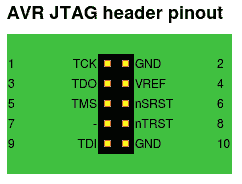](https://hackaday.com/2016-11-30-173509_1366x1792_scrot/)[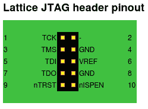](https://hackaday.com/2016-11-30-173534_1366x1792_scrot/)

尽管如此，这也不能保证:我的 Lattice FRDM-KL25Z 开发板同时具有 10 引脚 JTAG 和 SWD 端口，但这两个端口都不符合我所知的任何 JTAG 布局，但至少它们在数据手册中有所描述。所有其他较小的 JTAG 变种似乎也是十针，所以如果你发现一个不是 Alterra 或 Lattice 的十针头球，你就陷入困境了。

## 是哪一个？

所有这些连接器当然都是对称的。一旦你有了一个大头针计数和一些好的猜测，测试他们。使用连续性测试仪，您应该能够非常容易地找出接地针脚。它符合任何标准吗？如果是，你就能搞清楚方向，你就上路了。如果你知道芯片制造商，自然首先从他们的 JTAG 版本开始。如果你能从集成电路中找出已知的 JTAG 线，那就这么做。

但是有时候连接器完全是非标准的，要么是因为他们的设计者不想让你使用它，要么是因为他们使用定制的测试夹具而不在乎。在这些情况下，是时候开始玩蛮力彩票了。大胆猜测哪一个是哪一个，看看是否能得到回应。重复一遍。并重复。并重复。

[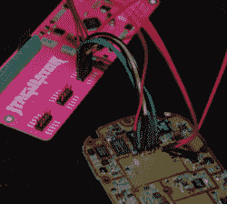](https://hackaday.com/wp-content/uploads/2016/11/jtagulator_image.png) 但是如果你是一个黑客，“蛮力”这几个字会让你瞬间想到“自动化”，对吧？在其他设备中，[乔·格兰德]的[助手](http://www.grandideastudio.com/jtagulator/)也许能帮你算出密码。

它通过测试 JTAG 链来工作，当引脚设置正确时，它会得到响应。由此，它可以计算出链中有多少个芯片，因为每个芯片本质上都是一个一位移位寄存器。接下来，它将要求每个芯片的 ID 代码。当它开始得到合理的答案时，你就赢了。如果你想了解更多，请阅读[Joe]在 DEFCON 演讲中的幻灯片。

## 变野

到目前为止，我们只关心 JTAG 针携带的信号。在不试图混淆事物的情况下，有两种常用的引脚间距选择:宽 0.1”间距和较小的 0.05”间距。我只在薄版中见过十针 JTAG 头，它们比 0.1 英寸版本更常见。在你开始担心电路板编程之前，你需要一个适配器。除了针距问题，还有性别问题。你需要更多的适配器。

0.05″ Header

[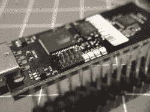](https://hackaday.com/dscf9067/)

0.05″ Header Populated

[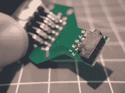](https://hackaday.com/dscf9073/)

Tiny Pins Adapted to Big Pins

[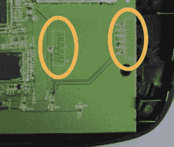](https://hackaday.com/wrt54g2/)

Camouflaged JTAG Pins on WRT54G2

然后就是混淆视听。一旦硬件上市，那些不希望你使用他们的 JTAG 接口的厂商会用各种可能的方式伪装他们。甚至在正确的铜焊盘上安装探针也是一项艰巨的工作。

## 构建您自己的

但是把 JTAG 设计成你自己的作品怎么样？应该选择哪种引脚排列？我默认 AVR/altera 引脚间距尽可能为 0.1 英寸。一个原因是它为在家蚀刻板上布线留下了足够的空间，另一个原因是它很容易为接头钻孔或为弹簧针留下裸露的铜垫。

对于间距为 0.1 英寸的针夹具，我会将弹簧针插入电缆连接器的一端，并尝试将我的手放在桌子上，同时用另一只手按下笔记本电脑上的 enter 键，同时用脚趾弹奏大号。针会在槽里摆动，我会诅咒。理性的人会求助于编程夹具，而[有一个针对那个](https://hackaday.com/2016/10/23/openfixture-takes-the-pain-out-of-pogo-pins/)的应用。

如果你没有稳定的手，并且不能被测试夹具困扰，看看[标签连接](http://www.tag-connect.com/)。Tag-Connect 是一个简单的想法:在 0.05”JTAG 图案周围的非对称配置中添加定位销(和可选的锁片)。定位销可以轻松地将弹簧针固定到位，锁定夹可以让您的双手自由活动。您只需露出铜焊盘并钻几个孔，而不是在生产的每块电路板上都安装一个接头。这是一个出色的系统，已经被 TI、Microchip 和其他公司采用。一个 DIY 版本的 0.1 英寸间距的 Tag-Connect 在我的程序员连接器短名单上，以实现标准化。

[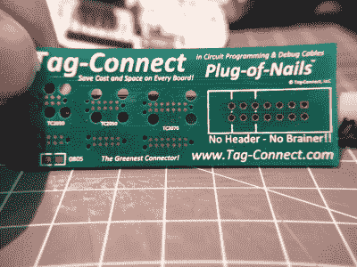](https://hackaday.com/dscf9072/)

Tag-Connect Business Card and Breakout

[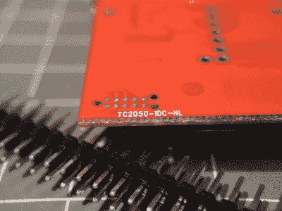](https://hackaday.com/dscf9068/)

Tag-Connect on TI Tivo Launchpad

## JTAG:喜欢还是讨厌

不管你喜不喜欢它，总有一天你会需要使用 JTAG，不管是为了你自己的设计和标准化目的，还是为了开发开发板编程，或是侵入某个设备。令人惊讶的是，连接五条信号线这样看似简单的事情会导致如此复杂的情况。好消息是，一旦你克服了第一个障碍，JTAG 实际上在协议层面已经相当好地标准化了。但这是另一个话题了。