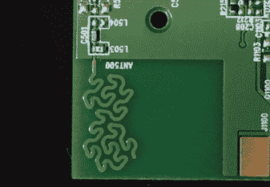

# 人体有氧体重秤拆卸

> 原文：<https://hackaday.com/2016/12/05/body-cardio-weighing-scale-teardown/>

如果你站在浴室磅秤上称自己的体重，不喜欢结果，然后向一个角落走去，在秤上减去几磅，你就被困在了上个世纪。现代浴室秤不仅从机械发展到电子，它们还收集人体成分测量数据，并具有强大的计算能力。

然而，它们是一件家用电器，放在我们的浴室里，很少受到仔细检查。它们是如何工作的，包含哪些内容？该团队在 11 月 5 日[拆除了顶级 Withings 人体有氧运动秤](https://novemberfive.co/blog/hardware-teardown-withings-body-cardio/)来寻找答案。

经过与双面粘性垫的斗争，秤揭示了它的秘密:一个简单而完美的设备。有四个称重传感器、用于车身测量的电极和 PCB。板上有一个 120 MHz ARM Cortex M4 微控制器、一个无线芯片组、电池管理和模拟测量芯片组。最后一个特别有趣，是德州仪器(ti)的 AFE 4300(T1)，这是一款专门用于这种应用的模拟前端。这是一个我们大多数人永远不会使用的芯片，但一如既往，一个晦涩的数据表值得一读。

The rather pretty fractal antenna.

最后，无线天线不是 ESP8266 等电路板上常见的简单角度轨迹，而是一条有机曲线。这是一个分形天线，大概是设计来为芯片组提供精心计算的带宽。一个不错的接触，虽然消费者永远不会意识到。

这些年来，我们向您展示了不少浴室秤。有这个[俏皮的树莓皮](http://hackaday.com/2016/04/15/weight-tracking-wise-cracking-iot-bathroom-scale/)秤，这个秤[逆向工程收集重量数据](http://hackaday.com/2014/10/18/reverse-engineering-a-bathroom-scale-for-automated-weight-tracking/)，这个[裸露出来用作控制器](http://hackaday.com/2010/01/31/hacking-a-digital-bathroom-scale/)。