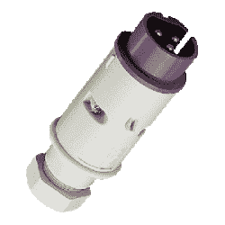
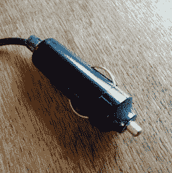

# 我的低压 DC 壁式插座在哪里？

> 原文：<https://hackaday.com/2016/12/21/so-wheres-my-low-voltage-dc-wall-socket/>

你的童年有哪些令人回味的声音和气味？那些你当时没有注意到，但又立刻带你回到过去的感觉？对我来说，其中之一是一件旧的消费电子产品加热后散发出的轻微酚醛树脂气味；它立刻让我盘腿坐在客厅的地毯上，大约是在 1975 年。

[!["Get ready for a life that smells of hot plastic, son!" John Atherton [CC BY-SA 2.0], via Wikimedia Commons.](img/ad9f97d958ec01b67d32c2784fc5e0bc.png)](https://hackaday.com/wp-content/uploads/2016/12/656px-early_1950s_television_set_eugene_oregon.jpg) 

“准备好迎接充满热塑料味道的生活吧，孩子！”约翰·阿泽顿[CC BY-SA 2.0]，通过[维基共享](https://commons.wikimedia.org/wiki/File:Early_1950s_Television_Set_Eugene_Oregon.jpg?uselang=en-gb)。酚醛气味已经从我们的现代电子产品中消失了，不仅因为现代外壳是由 ABS 和其他更现代的塑料制成的，还因为它们包含的电子产品不再那么热。例如，我们现在的液晶电视仅用 50 瓦，而它在 20 世纪 70 年代的前身 CRT 电视要用几百瓦。在 20 世纪 70 年代之前，你不会发现许多家用电器的功率低于 100 瓦，但如果你盘点一下现代电器，很少有使用功率超过 100 瓦的。除了你厨房里的白色家电和你可能拥有的任何电暖器或吹风机，你今天的电器都是低功率的。就连你的照明也在迅速被 led 取代，led 是它们的核心低压设备。

几十年来，许多微小的技术进步促成了这种变化。开关模式电源、LCD 显示器、大规模集成、D 类音频，当然还有热离子管的消亡，仅举几例。结果通常是电器本身在低电压下运行。以前你会有一堆电源插头争夺你的插座，现在你会有一堆等效的壁式电源。即使是那些有电源线的电器，内部也可能有一个开关电源。

## 历史课

在 19 世纪末的某个时候，市电首次出现在非常富有的家庭中。随着时间的推移，它从以交流或 DC 形式提供的多种不同电压演变成了我们今天所知道的交流标准。一般来说，在美洲，60 赫兹交流电接近 120 伏，在大多数其他地方，50 赫兹交流电接近 230 伏。高压交流电成为配电介质的选择有几个原因，但其中最主要的是易于发电和传输中的抗损耗性。

 这种高压电源的最初用途是提供明亮的电力照明，这对习惯了油灯和煤气灯的维多利亚时代的人来说一定是不可思议的。多年来，随着电器的发明，电源布线和我们都熟悉的[家用连接器](http://hackaday.com/2016/05/19/hackadays-fun-with-international-mains-plugs-and-sockets/)也随之发展，此后所有电源供电的电器都遵循这些标准。

一百多年后的今天，我们拥有了 21 世纪的电力转换技术和低功率、低压电器，但我们仍然在使用本质上是 19 世纪的电源插座。失陪一下，我需要雇一个人拿着一面红旗走在我的无马马车前面——我要去为我的留声机找些砰砰作响的曲子。

鉴于目前我们使用的许多设备都具有低功耗并接受低电压，是时候制定一个家庭低压配电标准了吗？不要完全取代电源插座的需要，毕竟有时 3 千瓦的水龙头是非常方便的，但要消除所有这些电源立方体的需要，如果你有其他低压电源，也许允许使用它们。用 19 世纪的方式给我们的房子供电还有意义吗？

## 旧插头

[XKCD 927](https://xkcd.com/927/), on the nail as always. (CC BY-NC 2.5)

你们中有些人会急于指出，我们最不需要的就是另一个连接器系统。你是对的，经过几十年的发展，你会认为连接器行业的目录中已经有了低压和中功率产品。例如， [IEC60309](https://en.wikipedia.org/wiki/IEC_60309) 标准，即所谓的 CEE-form 连接器，有一个 24 V 或更低的变体。或者有基于熟悉的 [XLR](https://en.wikipedia.org/wiki/XLR_connector) 系列的连接器可以在这种应用中投入使用。你甚至可以为这个角色定位 USB C。

The [Mennekes 662A](http://www.mennekes.co.uk/index.php?id=135&L=0&asimProductId=1000876&asimMenuId=1002070), a low-voltage CEE-form plug.

遗憾的是，没有完全符合要求的候选人。例如，这些低压 CEE-forms 体积庞大、价格昂贵且难以获得。XLR 的许多变体已经有了大量的用途，不应该与一个提供动力混淆，所以这是一个不可行的方案。同时，USB C 需要有源电缆、插座和设备，牺牲了任何简单的伪装。显然还需要其他东西。

奇怪的是，我们确实有几个低压电源插座的既定标准。或者，也许我应该说*事实上的*标准，因为它们都不是为此目的而制定的，或者甚至都不适合它。它们只是根据需求和渠道的可用性发展起来的，而不一定是一个好的解决方案。

USB A 插座是我们现有的第一个标准。这是一个数据端口而不是电源，但它可以在 2A 提供 10W 的 5V 电源，所以它演变成了一个独立的存在，作为一个电源连接器。你可以在墙上的疣、墙上的插座、飞机座位、火车、汽车和许多其他地方找到它。反过来，当你不只是用它给手机充电时，还有大量 USB 供电的配件，其中一些不是无用的新奇东西。它甚至催生了一场便携式电源革命，锂离子电池组将 USB 连接器作为配电点。但是对于你习惯使用的便携式设备来说，10 W 的功率是微不足道的，尽管连接器相当可靠，但它几乎不是最方便的。

Is this really the best low voltage connector we can create?

我们现有的另一个标准是汽车附件插座。从 12 V 到 10 A 的 120 W 功率是一个更有用的前景，但连接器本身是一个灾难。它是从曾经是汽车标准设备的点烟器演变而来的，因此它从未被设计为通用连接器。这种连接器的流行仅仅是因为没有其他方法来获取车内电源，而且它的巨大圆筒很不方便。可以说的是，汽车配件插头内部有足够的空间容纳一些电子设备，使得它的一些设备几乎是独立的。

## 新插头？

那么，在将现有低压连接器的不良状态撕成碎片后，我的解决方案是什么呢？给一张白纸，我将如何分配低压？

首先，指定电压和电流很重要，因此要考虑功率水平。在这里写的是，布线规则不适用于 50 伏以下的电压，所以这设定了我们的电压上限。虽然选择一个接近上限的电压很有吸引力，但保持一个更有用的电压也是有意义的，无需进一步转换。因此，虽然我会直接选择 48 V，但我还是会选择熟悉的 12 V。

看看我们现有的 12 V 标准，汽车附件插座提供 120 W，对于大多数低压照明和电器来说应该足够了。因此，每个插座 10 安 12 伏是一个合理的折衷方案，即使汽车插座不是。因此，我们需要找到一个更容易接受的插座，考虑到 10 A 的最大电流并不算大，想象一个这样的插座应该不会太难。如果我有一个插头和插座制造商，我准备忽略上面的 XKCD 漫画，我会从一组相当传统的引脚开始，与上面的 CEE-form 连接器没有什么不同，但没有工业加固，并加入一个保险丝来保护电器电缆免受火灾。那些英国 BS1363，保险丝电源插头的习惯很难改变。在插座周围，我可能还会加入一个 5 V 的 USB 插座调节器。

[![These are best kept out of sight. Smial (Own work) [FAL], via Wikimedia Commons.](img/20a32f5dd2586f93cb619dac7561c0e9.png)](https://hackaday.com/wp-content/uploads/2016/12/atx-netzteil.jpg) 

这些最好放在看不见的地方。由 Smial(自己的作品)[FAL]，通过[维基共享](https://commons.wikimedia.org/wiki/File:ATX-Netzteil.jpg?uselang=en-gb)。一个插座固然很好，但是没有电源和电缆就没有用。离网自给自足的爱好者无疑会有一两个铅酸电池和一组太阳能电池板，但我们大多数人更有可能将低压插座连接到交流电源供电的开关模式 PSU。一个 ATX PSU 可能很难提供一个以上的插座，以 10 安培的全 12 伏，但会是一个很好的开始。

然而，我们不想用开关模式的 PSU 盒来代替一堆壁疣。这里描述的插座的目的是拿走其他设备，而不仅仅是提供电力。显然需要某种形式的布线。此时，必须考虑拓扑结构，每个插座是否有一根电缆，如果没有，一根电缆上有多少个插座？如果是前者，那么从我们的配电点引出 16 A 绝缘软线，每根电缆配一个 10 A 保险丝，就足够了，并有足够的裕度允许合理的电缆运行，而如果是后者，那么就需要更多的东西。例如，国内低压照明行业的柔性绝缘铜母线产品就足够了。

## 

这是一场史诗般的咆哮，如果你愿意的话，这是一份个人宣言，为了一个稍微安全和更方便的电源插座的未来。不知何故，我不希望看到像这样的低压家庭配电系统很快出现，尽管我可以保持希望。

你对低压配电的看法可能与我不同，例如，它可能包含一些我避开的智能元素。你甚至可能是一个电源电压爱好者。请在评论中告诉我们。