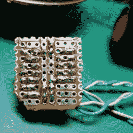
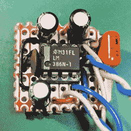
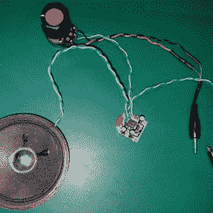

# 本周失败:意外调频收音机

> 原文：<https://hackaday.com/2016/12/04/fail-of-the-week-the-accidental-fm-radio/>

[B Arnold]听到了声音，需要 Hackaday 社区的帮助。但是在你们这些纸上谈兵的精神病学家跑去 WebMD 之前，请放心[B Arnold]没有患精神分裂症，而是有射频耦合问题。

这个项目(还没有公布)试图将一台 [C.H.I.P](https://getchip.com/) 变成一台亚马逊 Echo，为此【B . Arnold】需要一台音频放大器。转到垃圾箱，他发现了一个 LM386，这是一个古老的功率放大器芯片，在 70 年代中期首次出现。LM386 非常简单，能够使用 9 伏电池，它已经进入了成千上万的商业产品和[无数的](http://hackaday.com/2011/05/01/lm386-altoids-tin-amp/) [黑客](http://hackaday.com/2016/11/08/simple-hearing-amplifier/)。

在给放大器通电后不久，[B . Arnold]开始听到一些声音——微弱的、遥远的声音，沙哑但清晰可辨。电线和指针的一点重新定位改善了信号，足以作为电台 ID-97.1 MHz 的调频谈话广播电台。[B 阿诺德]没有提到呼号，但它可能是密苏里州圣路易斯市的 KFTK 在任何情况下，知道从发射机到疏忽的接收机的距离都是有帮助的。下面包括两个低保真度音频剪辑，供您欣赏——您需要戴上耳机，样本 2 比样本 1 更好——违规电路的照片也是如此。

你认为这是怎么回事？我们以前听说过 AM 广播电台的 RF 耦合，但是 FM 信号是如何进入这个电路并从扬声器中出来的呢？是不是[B 阿诺德]做错了什么才得到这个结果？请在评论中说出你的想法，让我们知道你关于射频耦合的恐怖故事。

示例 1:

<https://hackaday.com/wp-content/uploads/2016/12/sample-1.mp3?_=1>

[https://hack aday . com/WP-content/uploads/2016/12/sample-1 . MP3](https://hackaday.com/wp-content/uploads/2016/12/sample-1.mp3)

sample 2:

<https://hackaday.com/wp-content/uploads/2016/12/sample-2.mp3?_=2>

[https://hack aday . com/WP-content/uploads/2016/12/sample-2 . MP3](https://hackaday.com/wp-content/uploads/2016/12/sample-2.mp3)

      

* * *

《一周失败》是一个黑客专栏，它把庆祝失败作为一种学习工具。通过写下你自己的失败和[给我们发送一个故事的链接](mailto:tips@hackaday.com?Subject=[Fail of the Week])——或者发送你在互联网旅行中发现的失败报道的链接，帮助保持乐趣。