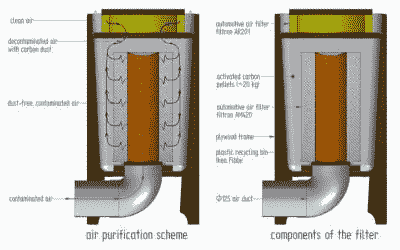

# 使用激光切割机空气过滤器轻松呼吸

> 原文：<https://hackaday.com/2016/12/05/breathe-easy-with-a-laser-cutter-air-filter/>

激光切割机是商店里一个很好的工具，但像其他数控机床一样，它可能会成为一个糟糕的邻居。蒸发你的股票意味着你最终会吸入你可能不想吸入的东西。如果你要整天在这些烟雾周围，你会想要良好的烟雾提取，你可能会考虑 DIY 烟雾和微粒过滤器来净化排出的空气。

 虽然没有构建日志本身，但[ZbLab]的脸书页面有一个照片库，展示了足够详细的设计和构建，以获得要点。过滤器的主要成分是 25 公斤活性炭，用于捕集激光废气中的挥发性有机化合物。木炭被装在宜家垃圾桶中，周围是由罐式汽车空气滤清器制成的预滤器——[ ZbLab]使用 Filtron 过滤器，与更常见的 Fram CA3281 交叉使用。另一个空气滤清器元件(Fram CA3333)确保没有松散的木炭粉尘从过滤器中排出。框架由桦木板制成，管道由简单的聚氯乙烯制成。有了 125 毫米的入口，看起来这个过滤器真的可以呼吸，它可以根据你的需要轻松地放大或缩小尺寸。

你说，你的店里没有激光切割机来证明这种过滤器的合理性？为什么不[造一个](https://hackaday.com/2016/08/20/bachelor-builds-enormous-laser-cutter-nobody-complains/)？或者，如果你做焊接，[这个倒吸式油烟机](https://hackaday.com/2015/06/27/downdraft-fume-extractor-saves-your-lungs/)是净化空气的好方法。