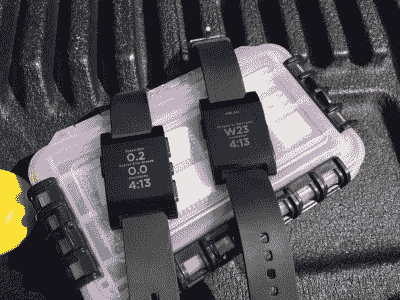
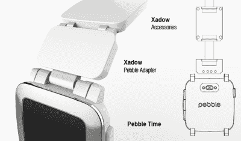
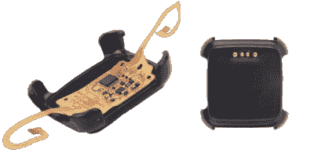
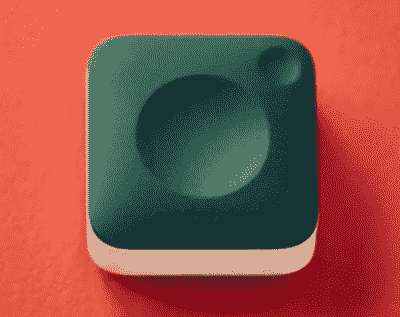

# Pebble 平台的消亡

> 原文：<https://hackaday.com/2016/12/06/the-demise-of-pebble-as-a-platform/>

尽管我拥有五块智能手表，包括最初的 Pebble，但我一直对智能手表持怀疑态度。即便如此，泄露出来的消息称, [Fitbit 将以“少量”价格收购 Pebble](https://www.theinformation.com/fitbit-to-buy-pebble) ,这让我对可穿戴设备市场的现状感到有些沮丧。因为 Pebble 可能是一个竞争者，尽管可能不是你可能猜到的原因。

Pebble 是可穿戴设备市场的先驱，早在 2012 年就推出了首款智能手表，比 Apple Watch 早了两年。但在 2015 年拒绝了西铁城 7.4 亿美元的收购要约后，尽管融资轮注入了现金，最近又获得了 1280 万美元的 Kickstarter。

英特尔今年早些时候提出的 7，000 万美元的报价反映了 Pebble 的前景黯淡，传言中 Fitbit 支付的 3，000 万至 4，000 万美元的价格对于一家不久前还处于高位的公司来说肯定是一个令人失望的结果。

### 制造可穿戴工具，而不是可穿戴产品

There is no more hackable smart watch than the Pebble. Here it’s used as [part of a sailing computer](https://hackaday.io/project/9438-mr-gibbs).

现在，可穿戴设备市场正在遭受平台问题的困扰，甚至比物联网还要严重——人们正在构建平台，而不是产品。当人们或公司看到一项新的新兴技术，但还不太知道该怎么做时，这种情况就会发生。这个问题一直存在，直到平台足够好，或者足够普及，人们会自动选择一个现有的平台，而不是重新发明轮子。换句话说，他们开始制造产品。尽管进展缓慢得令人痛苦，但物联网正开始摆脱平台问题——但可穿戴设备却并非如此。

或许可以说，物联网起飞的主要原因之一是蓝牙 LE，苹果将其移出其限制性的 [MFi 程序](https://developer.apple.com/programs/mfi/)。Bluetooth LE 硬件便宜、容易获得，并且比以前的 Bluetooth 标准更容易使用。它还使用非常少量的功率，并且具有足以用于大多数传感器的数据速率。它非常适合物联网，但直到制造商可以利用它将 UI 任务卸载到更合适的平台——智能手机——时，它才被广泛采用。当苹果将蓝牙 le 移出 MFi 计划时，它解决了我一直提到的“50%问题”,即世界上只有一半的智能手机可以与使用它的传感器和其他硬件对话。

可穿戴设备类别过去需要、现在仍然需要的是能够类似地推动简单、廉价的传感器被采用的东西。这将允许制造商和生产商集中功能，而不是必须为每个设备重新发明轮子，必须给它自己的用户界面。这让我们想到了智能表带。

### 作为平台的 Smartstrap

Pebble 时代的到来，以及该公司的第二个 Kickstarter [推出了 smartstrap](https://www.kickstarter.com/projects/597507018/pebble-time-awesome-smartwatch-no-compromises/posts/1151421) 。这个想法很简单，这款新手表带有一个智能配件端口，允许表带连接到手表，并包含电子设备和传感器，可以直接与 Pebble Time 上运行的应用程序连接。

如果处理得当，smartstrap 很容易被证明是可穿戴市场创新的驱动力——允许制造商不仅为他们的可穿戴设备提供动力，还可以将 UI 任务卸载到一个合适的平台，一个用户在任何情况下都会随身携带的平台:他们已经拥有的手表。

有趣的是，smartstrap 是一个相当开放的标准，构建一个相当简单。Pebble 发布了机械细节[以及组装说明](https://developer.pebble.com/guides/smartstraps/smartstrap-hardware/)，表带唯一没有现成可用的部分是适配器，Pebble 提供了 STP 和 STL 文件，允许您打印自己的文件，或者如果您不介意，您可以随时从 Shapeways 获得一个[。](http://www.shapeways.com/product/9TCGZ6UGZ/smartstrap-cad?li=shareProduct)

他们还提供了一个简单的建议电路——使用一个带齐纳二极管的缓冲/驱动器电压电平转换器进行 ESD 保护——将一个可能与 Arduino 一起使用的“正常”RX/TX 串行连接连接到 smartstrap。

甚至还有一个[示例 Arduino 库](https://github.com/pebble/ArduinoPebbleSerial/)，用于使用 smartstrap 端口与 Pebble Time 通信，作为 smartstrap 协议的示例实现，展示了如何从您的 Pebble 与 smartstrap 进行[对话，以及如何从 smartstrap 与 Pebble](https://developer.pebble.com/guides/smartstraps/talking-to-smartstraps/) 进行[对话。](https://developer.pebble.com/guides/smartstraps/talking-to-pebble)

### 错过跳跃

我认为智能表带之类的东西可以在几个主要领域对当前的可穿戴设备市场产生重大影响，通过提供一个“默认”平台，使制造商和制造商能够构建可穿戴设备。

第一个是可穿戴传感器，例如测量皮肤温度、心率和血氧水平的医疗传感器。尽管量化自我运动取得了明显的成功，但类似 Fitbit 的设备远少于手表，愿意把另一种设备别在自己身上的人也远少于愿意戴手表的人。Pebble 相对较长的电池寿命及其为传感器供电的能力也将在这里发挥作用，特别是在睡眠跟踪等应用方面。

但是，当考虑传感器和 smartstrap 时，重要的是要考虑可能很大的安装基数。除了个人传感器之外，还可以利用该平台提供大规模、高度分布式的测量，如天气和其他环境数据。

智能表带可能也为室内定位问题提供了重要的一击。目前，智能手机是导航的默认平台。然而，它不一定提供最好的——或者特别微妙的——UX 在那个角色，尤其是在室内。您可以使用智能带来想象触觉反馈，例如左转、右转、直行，让人们更自然地导航陌生的建筑。

换句话说，一个流行和开放的智能表带标准可能很容易驱动产品，因为它是一个“足够好”的可穿戴平台，可供人们使用，而不必发明自己的产品。

### 那么智能表带到底怎么了？

Seeed’s Xadow adapter clips onto the back of Pebble

Pebble [建立了一个 100 万美元的基金](https://www.kickstarter.com/projects/597507018/pebble-time-awesome-smartwatch-no-compromises/posts/1170379)来鼓励开发，并在博尔德举办了一个[周末黑客马拉松，但是开发者的兴奋相当平静。SeeedStudio 将其](https://www.hackster.io/hackathons/pebble-rocks-boulder/a-pebble-hackathon/projects) [Xadow 适配器](http://wiki.seeed.cc/Xadow_Pebble_Time_Adapter/)推向市场，但除了 Kickstarter】资助了一个 NFC 支付带和一个 [GPS 带](https://www.kickstarter.com/projects/655382546/pal-strap-gps-and-extended-battery-strap-for-pebbl)之外，几乎没有其他商业产品问世。

尽管一些真正有趣的一次性设备正在建造中(Pebble Hacks Boulder 活动的一个团队甚至为手表建造了一个[留声机基座](https://hackaday.com/2015/09/13/a-gramophone-for-your-pebble-smart-watch/)),但围绕 smartstrap 平台的开发[步履蹒跚](https://www.wareable.com/Pebble/pebble-best-smartstraps-963)。对于广泛的业余爱好项目来说，这从来都不是一个可行的选择。如果没有这种低水平的采用，就根本没有一种机制可以让智能表带吸引那些已经采用 Pebble 手表的人，更不用说吸引新的兴趣了。

### 只是超前于它的时代？

Pebble 在可穿戴平台上的下一次尝试和最后一次尝试是带着其最新的 Kickstarter 和 Pebble Core。随着我们的计算向环境、可穿戴设备和物联网扩散，我们有理由期待我们的用户界面——我们与计算互动的方式——也将从无处不在的智能手机及其屏幕中消失。Pebble Core 预示了这一趋势，它实际上是一部装在盒子里的智能手机，没有屏幕，可以作为你个人计算的中枢。一个供其他可穿戴设备和设备制造商构建的平台。

Pebble Core –“an entirely new device for runners”

随着 Pebble 被出售给 Fitbit，以及收购后 Pebble 品牌可能会被淘汰——Fitbit 毕竟对 Pebble 的知识产权感兴趣，而不是它的设备——我们可能不会看到这种平台尝试的结果。甚至有可能 Pebble Core 现在根本不会发货给支持者。尤其是 Fitbit 本身[做得并不那么好](http://www.marketwatch.com/story/fitbit-could-prolong-your-life-but-you-will-still-stop-wearing-it-2016-11-03)。

苹果牛顿可能是这句话最广为人知的典型代表，每一个成功的想法背后都是别人做的同样的想法，只是太早了。苹果失败的地方，至少在第一次，在 iPhone 改变一切之前，Palm 成功了。这一次我们只知道两件事。首先，Pebble 及其平台的消亡现在已经基本确定，至少一些公司[仍然对可穿戴设备市场](http://www.vanityfair.com/news/2016/12/gopro-fitbit-pebble-and-the-future-of-snapchat)有信心。也许下一个平台运气会更好。

[主图由[第 23 工作室](http://www.23rdstudios.com/) —科罗拉多州博尔德拍摄]