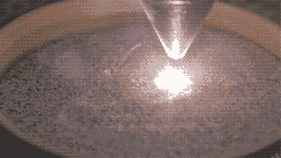

# 用激光切割机烧结沙子

> 原文：<https://hackaday.com/2016/12/07/sintering-sand-with-a-laser-cutter/>

我们都习惯于熔融沉积成型，或 FDM，3D 打印机。一个喷嘴在计算机的控制下喷射熔化的材料来制造 3D 物体。即使它们通常相当昂贵，我们也习惯于看到使用立体平版印刷术(SLA)的打印机，在这种打印机中，光催化液体单体一层一层地暴露出来，以允许绘制出 3D 物体。尽管真实的欲望对象不太可能给普通的黑客空间增色。选择性激光烧结 3D 打印机使用激光在粉末床上一层一层地固化 3D 物体。

The laser creating a ring.

虽然 SLS 打印机可能会超出大多数预算，但事实证明，尝试这项技术并非不可能。[ 威廉·奥斯曼]有一台 80 瓦的激光切割机，[他一直在试验用它烧结沙滩沙来制作 2D 物品](http://www.williamosman.com/2016/11/melting-sand-with-laser.html)。他的文章给出了玻璃制造的基本介绍，并展示了单独使用沙子和使用碳酸钠降低熔点之间的区别。他制作了几个没有它的易碎的几乎没有烧结的测试，然后用它制作了一系列形状，包括一个飞行的意大利面条怪物。

目前的结果更多的是装饰性的，而不是有用的，然而这项技术完全有可能被改进。毕竟，这是海滩沙，而不是精心挑选的材料，很可能更精细、更均匀的沙子会产生更好的效果。他说他将在未来研究它在 3D 作品中的应用。

我们已经把他的整个过程的视频放在了中断的下面，包括令人担忧的自制激光线路的故障。它值一块表。

 [https://www.youtube.com/embed/0O0k05_h89o?version=3&rel=1&showsearch=0&showinfo=1&iv_load_policy=1&fs=1&hl=en-US&autohide=2&wmode=transparent](https://www.youtube.com/embed/0O0k05_h89o?version=3&rel=1&showsearch=0&showinfo=1&iv_load_policy=1&fs=1&hl=en-US&autohide=2&wmode=transparent)

这个项目的灵感来自于一个利用阳光烧结沙子的视频[，我们在 2011 年](http://hackaday.com/2011/06/25/selective-solar-sintering-with-sand/)也报道过这个视频。