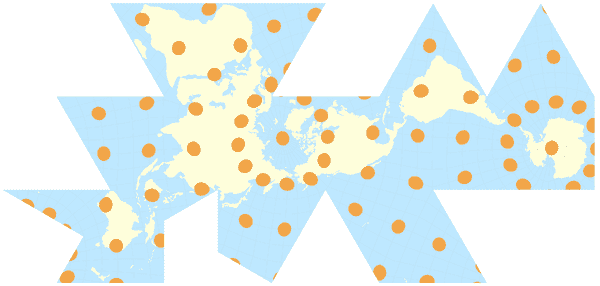

# 激光切割木制 Dymaxion 地球仪

> 原文：<https://hackaday.com/2016/12/09/laser-cutting-a-wooden-dymaxion-globe/>

每个人都知道地球仪很酷——你还会用什么作为你图书馆/书房的中心装饰品呢？但是，可悲的是，自己制作并不是一个简单的过程。即使你有一个大的(最好是空心的)球体，你仍然需要想出一个聪明的方法来打印出可以粘在曲面上的地图。如果你能用激光切割平面部分，然后把它们组装成一个多面的“球体”，不是更容易吗？

是的，你可以的！因为，tinkerings.org 的[Gavin](黑客的最爱)[已经创建了这样的文件！](https://tinkerings.org/2016/11/05/buckminster-fullers-map-a-lasercut-dymaxion-globe/)这个地图投影最初是由非常有趣的[巴克明斯特富勒](https://en.wikipedia.org/wiki/Buckminster_Fuller#Dymaxion_map_and_World_Game)设计的，它被设计成在二十面体(一个有 20 个面的多面体)上平放或三维放置。这使得它非常适合激光切割，因为 20 个面中的每一个都可以从平板上切割下来。

在面被切割(并用激光切割机标记)后，它们可以用 3D 打印的顶点和简单的机器螺钉来组装。最终产品是一张精确的三维地图，看起来很酷，充满了有趣的历史和制图原则。当然，如果你想提高技术赌注，你总是可以[建造一个互动的地球仪！](https://hackaday.com/2014/01/22/interactive-globe-is-awesome-for-google-earth/)