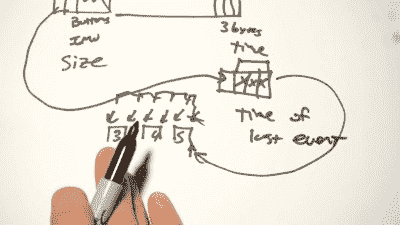

# 逆转生存，阀门工程师合作

> 原文：<https://hackaday.com/2016/12/12/cnlohr-reverses-vive-valve-engineers-play-along/>

这些部分不需要介绍。他完成了一些真正的史诗般的黑客攻击。最近，他着眼于编写一个简单、易于扩展的库，用于 HTC Vive VR 控制器设备，尤其是 Watchman 控制器。

之前已经有很多关于这个设备的工作，所以[查尔斯]不是从零开始，他直播他的工作，让其他人一起玩。在这个过程中，两名实际从事相关硬件工作的工程师[艾伦·耶茨]和[本·杰克逊]停下来，给了一些间接的暗示和“更热更冷”的指导。一个非常浓缩的版本出现在 YouTube 上(并嵌入在下面)。在链接中，你会发现代码和他们最初的辉煌的生活流，如果你想看看什么发生了吹一吹。代码和更多的文档都在[这个要诀](https://gist.github.com/cnlohr/581c433f36f4249f8bbc9c2b6450ef0e)里。

 最后，这一切都以大量艰苦的工作告终，因为守夜人控制器需要无线发送其方位和加速度计数据，这意味着将大量数据压缩成一条细流。使用了所有可能的技巧，包括可变长度字段，其中一位表示下一个字节是否仍属于该样本或下一个样本，并将数据从两端打包到一帧中。我们明白为什么弄清楚协议会让[查尔斯]发疯了！他的解剖在总结视频十分钟后开始。

除了提示、社区参与和纯粹的坚持，[Charles]还得益于能够生成自己的数据。AVR 不依赖于设备在空间中的位置，而是将红外发光二极管闪烁到控制器中，以产生已知的时间增量。如果你正在逆向工程任何东西，记住这个通用技术。

我们认为 Vive 非常酷，我们以前也曾报道过。从[Trammell Hudson]的早期黑客攻击到最近的[令人瞠目结舌的无人机定向演示](http://hackaday.com/2016/11/30/where-is-my-drone-ask-lighthouse/)，黑客们一直在研究如何自己使用灯塔。现在[CNLohr](和社区)已经解码了 OEM 硬件的最后剩余部分之一。呜！

 [https://www.youtube.com/embed/oHJkpNakswM?version=3&rel=1&showsearch=0&showinfo=1&iv_load_policy=1&fs=1&hl=en-US&autohide=2&wmode=transparent](https://www.youtube.com/embed/oHJkpNakswM?version=3&rel=1&showsearch=0&showinfo=1&iv_load_policy=1&fs=1&hl=en-US&autohide=2&wmode=transparent)

