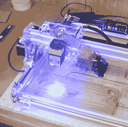

# 将廉价激光雕刻机转换为 100%开源工具链

> 原文：<https://hackaday.com/2016/12/23/convert-that-cheap-laser-engraver-to-100-open-source-toolchain/>

 LaserWeb 是开源的激光切割机和雕刻机软件，【JordsWoodShop】做了[一个视频教程](https://www.youtube.com/watch?v=9PijjOQbtZo)(嵌在下面)如何改装一个便宜的激光雕刻机来使用。视频中使用的激光雕刻机是一种经济的丙烯酸和挤压导轨装置，带有一个固态激光发射器，可从各种中国卖家那里获得(防护眼镜和任何类型的通风或屏蔽明显不包括在内)，但 LaserWeb 可以与任何硬件一起工作，包括更大的 CO2 激光器。

LaserWeb 很重要，因为大多数激光雕刻机和切割机都有专有软件。如上图所示的较小的雕刻机使用各种各样的东西，对较大的 CO2 激光切割机有经验的人可能熟悉一款名为 **LaserCut** 的软件——这是一个 CAD 程序和激光控制的组合，可以使用，但关闭了(我的副本甚至需要一个 USB 安全加密狗，eww。)

LaserWeb 让激光雕刻机和切割机更像我们大多数人对工具的期望:一个完全开源的工具链。例如，要在一台 40 瓦蓝盒中国激光切割机上开始使用 LaserWeb，唯一真正需要的硬件改变是用类似 [SmoothieBoard](http://smoothieware.org/smoothieboard) 的开源控制器替换运动控制器。剩下的只是安装软件和享受增加的功能。

 [https://www.youtube.com/embed/9PijjOQbtZo?version=3&rel=1&showsearch=0&showinfo=1&iv_load_policy=1&fs=1&hl=en-US&autohide=2&wmode=transparent](https://www.youtube.com/embed/9PijjOQbtZo?version=3&rel=1&showsearch=0&showinfo=1&iv_load_policy=1&fs=1&hl=en-US&autohide=2&wmode=transparent)

如果你喜欢从头开始组装你自己的机器，我们有[一系列关于自制系统的有用提示](http://hackaday.com/2016/06/29/taming-the-beast-pro-tips-for-designing-a-safe-homebrew-laser-cutter/)。由于处理废气一直是个问题，看看这个 [DIY 抽油烟机和过滤装置](http://hackaday.com/2016/12/05/breathe-easy-with-a-laser-cutter-air-filter/)，它是一个激光切割机，利用了宜家的一些产品。

谢谢你的提示，[彼得]！