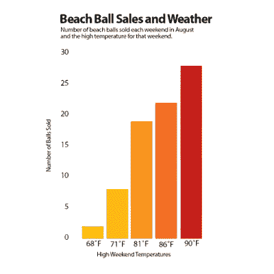
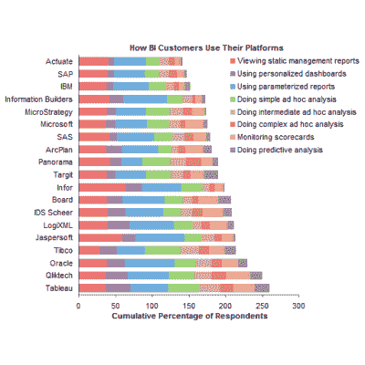

# 如何做好技术报告

> 原文：<https://hackaday.com/2016/12/29/how-to-nail-a-technical-presentation/>

无论你是工程师、制造者、黑客还是面包师，总有一天你会想和别人分享你的工作。也许是一次讨论过程改进的工作会议，或者是一次会议上的谈话，讨论你对入侵一个新的嵌入式平台所做的一些研究。或者你开发了一种全新的黑麦面包烹饪方式，可以将能源消耗减半。不管是什么，有一些技巧可以帮助你有效地与一屋子的人交流，并从中获得乐趣。不像有些人，我真的很喜欢站在众人面前展示我的作品，所以我写了这篇文章来与你分享一些技巧，可以帮助你做一个每个人都会喜欢的技术演示——包括你！

编者按:在凯丽·费雪去世之前，我们就为这篇文章策划了艺术。莱娅当然知道如何进行令人信服的技术演示。我们出版这本书是为了纪念一位伟大的女演员。

### 基础——准备演示

最重要的是——了解你的东西。这在商业环境中尤其重要。在投影仪屏幕上显示一个不准确的数字，你就完了。不仅有人会发现它，而且它肯定是你最大的敌人，产品开发部的特里。自从马克和他离婚并拿走本田后，他就一直是个十足的混蛋，今天他很生气，因为你把小数点放错了位置。为此他会在所有人面前拆穿你。但更糟糕的是，现在没人能相信你给出的数字。你会发现很难说服人们相信你的分析，从而相信你的结论。一个小小的错误可能会破坏一场演示；两个或更多会杀死它。
你会发现自己在使用各种形状和大小的图表。这里的关键是清晰。保持颜色和格式尽可能简单。最重要的是，仔细考虑如何呈现数据。过去在压铸行业，我参加了一个分析铸造工具部件不同磨损率的演讲。这些图表实际上难以理解，堆积的条形、二十种颜色、几乎没有标签的轴——简直是一团糟。如果你需要向人们解释你的图表，它可能还不够好。重新思考你是如何把它组合在一起的；重新安排事情或使用不同类型的图表会使它更清晰吗？如果你的话与你在屏幕上的图表相关联，人们会更容易相信你的话。

This is a good graph. It’s instantly obvious what the graph is trying to tell us, and it’s easy to get a read on the data behind it.

This is a bad graph – most stacked bar charts are. It’s very difficult to get a clear read of the numbers behind it and not obvious what it represents [Source: [Peltier Tech Blog](http://peltiertech.com/stacked-bar-chart-alternatives/)]

清晰适用于你演讲的所有方面。使用项目的照片？拍一张好的技术照片是有艺术可言的。聚焦、均匀照明，相关细节清晰可见。当然，这并不总是那么容易。当你在昏暗、充满液体的机器坑中拍摄损坏的液压软管时，你会很挣扎。最棒的是，现在是 2016 年，智能手机在一个紧凑的封装中提供了非常有用的相机，带有闪光灯和自动对焦。在我的职业生涯中，我发现我的工作对拍摄有问题的硬件非常有价值。结合三脚架，我已经能够拍摄出色的照片和视频，并在 Hackaday.io 和 YouTube 上分享我的项目。现在就努力吧，你的演示会顺利得多。

### 进入战斗状态

好了，你已经准备了一个很棒的演讲。你需要多少幻灯片就有多少，有一个很棒的图表，让你从数据中得出的结论一目了然。你的项目照片展示了所有相关的细节，看起来整洁而专业。现在最难的部分来了:站在人群面前，把它表达出来。

许多人天生不擅长公开演讲。如果你有一点自尊，喜欢被关注，那么你已经领先一步了。对于其他人来说，不得不站在一群人面前讨论(和辩护！)他们的工作很恐怖。一如既往，熟能生巧，有工具可以帮助。

心态决定一切。如果你害怕，你会表现出害怕的样子。如果你自信，你就会表现得自信。诀窍是，如果你能假装自信足够长的时间，让人们积极回应，你就会开始一个反馈循环，让你处于一个很棒的空间。但是怎么装呢？每个人都有自己的技术，但我最喜欢的是沙滩球。

当你走上前去开始你的演讲时，当你开始说话时，表现得好像你正拿着一个想象中的大沙滩球。说真的。走路的时候，就好像你刚刚从车里拿出你那令人敬畏的沙滩球，你正大步走向沙滩，准备把它扔向你最好朋友的后脑勺，然后放声大笑。让自己感到有点兴奋，然后介绍你的演示。

> 大家好，我是 Lewin Day，我想告诉大家我们如何通过优化机器人加工路径每年节省 100，000 美元。

你的第一句话应该大声清晰地说出来，以吸引注意力，盖过房间里的嘈杂。不要大喊大叫，而是用让所有人都转过头来看你的声音说话。你的第一句话应该让人们立刻明白你的陈述是关于什么的。一旦你让别人听了，你就可以根据需要调整你的声音。用均匀的速度说话，清晰地发音。你的目标是让你的想法尽可能容易理解，这从你的演讲开始，到你说话的方式。

让人们参与进来很重要。保持较高的能量水平，以阻止人们的注意力分散。如果是商业环境下的干货话题，紧扣重点，尽量简短。告诉人们他们需要知道的东西，并且保持简短、尖锐和爽快。如果你在会议或黑客空间展示的是一个个人项目，你可能更喜欢讲一个故事。从头到尾向人们介绍你的发展过程，分享发生的趣事。如果你和一个小团队一起工作，一个很好的技巧就是互动。通过在你的工作和他们个人之间画参考来让人们参与进来。使用人们的名字，并让他们参与到你的例子中——这是让人们的注意力集中在你的信息上的有效方法。

### 应对逆境

会有疑问。你可能会面临一些关于你的研究的激动人心的问题，或者质疑你的决定的尖锐的询问。理想情况下，如果你已经掌握了基本知识，它们不是关于为什么你的数字与上个月的报告不符。了解项目的一切是关键。人们会想知道，你考虑过 X，Y，Z 吗？你为什么选择用 B 而不是 A 或 C？为什么我们的做法与过去不同？

你首先需要做的是倾听。要恰当地回答一个问题，你必须先了解对方在问什么。让他们说完，然后停下来考虑你的回答。确保你知道对方在问什么，然后用你的知识来回答&尽可能用数据来支持你的陈述。考虑以下两种交换:

> 你为什么使用旧供应商的零件？他们是垃圾！你的结果一定到处都是。我们只是用了商店里的东西，看起来效果不错。

这种回答显示出对项目缺乏了解，并且没有解决真正的问题——这与零件无关。真正的问题是结果是否可信。

> 你为什么使用旧供应商的零件？他们是垃圾！你的结果一定到处都是。我们只有有限的时间来运行我们的测试机制，而且只有旧供应商的零件可用。我们的计算表明，对于该测试，旧零件完全符合该应用的规格，不会对结果产生负面影响。

这个回应好多了。它显示了对项目期间所做决策及其原因的了解。它还解决了基本问题(结果是否有效)，并用数据支持它。

### 带回家

你在一开始就做了艰苦的工作，完善了你的材料，然后做了一个充满活力、引人入胜的演讲。一路上，你展示了你的知识，与观众分享了一些欢笑，人们也学到了一些东西。做得好的演示会给你一种很棒的感觉，一旦你有了这样的感觉，自信就会比下一次更容易到来。

随着时间的推移，你会找到适合自己的技巧和方法，你会发现当你更有效地交流时，人们会更容易理解你的信息。抓住每一个展示自己作品的机会，在此期间，学习那些你尊敬的伟大的展示者。如果你需要一些灵感，可以看看在 Hackaday 超级会议上的演讲，并借鉴你看到的技巧和技术来发展你自己的演讲风格。