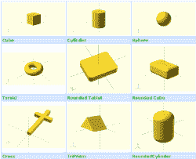
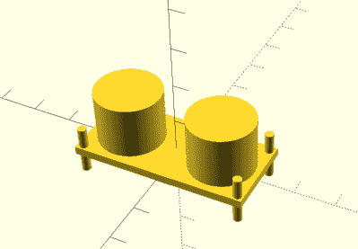

# C++的沟渠开口 CAD

> 原文：<https://hackaday.com/2017/01/03/ditch-openscad-for-c/>

有句老话说，一幅画胜过千言万语。如果你曾经试图用那些除了图片什么都没有的说明书来制作家具或玩具，你可能会不同意。对于很多人来说，3D 设计都大同小异。你认为你想用图形来画东西，但是一旦你开始做复杂的事情并做出改变，参数化建模就是你要走的路。一些 CAD 工具让你两者都做，但是许多 3D 打印机用户最终使用完全参数化的 OpenSCAD。

如果你使用过 OpenSCAD，你会知道它就像一种简单的编程语言，但是与你通常使用的语言有一些显著的不同。大多数 Hackaday 的读者很可能至少会用一种语言编程。那么为什么要学习新的东西呢？一种真正的编程语言很可能具有你在 OpenSCAD 中找不到的特性，理论上，这些特性应该有助于重用和管理复杂的设计。

我考虑过 [OpenJSCAD](http://openjscad.org/) 。它或多或少是 JavaScript 的 OpenSCAD。然而，JavaScript 本身有点像脚本语言。当然，它有对象和其他一些特性，但是我更喜欢 C++。我考虑过使用 OpenSCAD 使用的 OpenCSG 库，但是这暴露了很多细节。

相反，我转向了一个使用 C++代码生成 OpenSCAD 输出的项目， [OOML(面向对象的力学语言)](https://github.com/avalero/OOML)。OpenSCAD 执行渲染、导出和其他功能。不幸的是，这个项目似乎在几年前就已经停止了，而且主要的基于 web 的文档似乎也不存在。然而，它非常有用，如果您知道如何找到它，有大量的文档可用。

## 为什么不打开 SCAD？

[](https://hackaday.com/wp-content/uploads/2016/12/figure-6.png) 显然，在 OOML 中没有什么是你在 OpenSCAD 中做不到的。这就像说你可以用汇编语言做 C++做的所有事情:这是真的，但有点跑题了。首先，OOML 定义了许多更基本的对象(下面的图片摘自关于 OOML 的白皮书[)。例如，如果您想要一个 RoundedTablet，您只需创建一个，最终输出将具有必要的 OpenSCAD。](https://www.researchgate.net/publication/254034593_Boosting_mechanical_design_with_the_C_OOML_and_open_source_3D_printers)

当然，你可以用一个模块来定义这些东西。还有一个零件库，包括 Arduino 轮廓、轴承和其他有用的组件。但是真正的价值在于，您可以利用 C++的所有特性来开发新的形状。

这里有一个简单的例子。可用的部件之一是普通超声波换能器模块的形状。该类提供了一个构造函数，允许您设置不同的属性，如电路板的大小、传感器的大小等等。

[](https://hackaday.com/wp-content/uploads/2016/12/us.png) 还有一部分是特定品牌的超声波传感器(Seeed Studios 的一款)。以下是如何在 OOML C++程序中创建其中一个的方法:`SeeedUSSensor sensor;`

就是这样。下面是 SeeedUSSensor 构造函数的定义:

```
 SeeedUSSensor(bool fill_drills = true) :
 USSensor(43,20,15,2,40,17,1,16.1/2,20-16.1/2,fill_drills)
 {
 rebuild();
 }
```

那是断章取义的，但是那个物体里没有其他重要的东西。所有的渲染都在 USSensor 基类中。例如，我可以很容易地为支架上的 Seeed 传感器创建自己的类。我将只派生一个新类并提供额外的呈现(或者我可以使用任何其他 C++技术，比如让我的新对象实例化 sensor 对象)。

另一个不太吸引人的特性是我个人喜欢这个语法。以下是如何在 OpenSCAD 中翻译对象:

```
translate([10,10,0]) cube([5,5,10]);
```

以下是 OOML 中的相同代码:

```
Component cube(Cube(5, 5, 10));
cube.translate(10,10,0);
```

如果你想得到一些 OOML 对象的并集和差集:

```
result=cube1+cube2-boltholes;
```

## 文档就像氧气

曾经有一个 Wiki 上有关于这个项目的文档，但是它要么被移走了，要么消失了。然而，这个项目是为了做 Doxygen 文档而建立的。它并不完整，但有超过 2000 个 HTML 文件(这可能是它不在 GitHub 上的原因)。您可以很容易地生成它，但是为了省去麻烦，我将项目分叉并添加了[文档，作为您可以下载的 ZIP 文件](https://github.com/wd5gnr/OOML/raw/master/doc/htmldoc.zip)。

了解 OOML 的另一个方法是阅读源代码。特别是，`test`子目录包含了从简单的立方体到一些相当复杂的形状的所有东西。如果你深入到`src`目录中，你还可以找到一些有趣的例子，比如我之前给你展示的超声波传感器。

## 可用性

在你的设计指尖拥有 C++的能力是很好的。不好的是失去了使用 OpenSCAD 获得的即时设计周期。能够仅仅调整一个数字，点击`F5`，然后重复是相当上瘾的。使用八叉线(我有太多的英国朋友称之为英镑符号)这样的东西来可视化切割也是一个很大的损失。

除非通读 OpenSCAD 代码并找到放置它的正确位置(这在某种程度上违背了使用 OOML 的目的)，否则您对特殊字符无能为力。但是，通过一些设置，您可以帮助获得更即时的反馈。

您需要做的只是打开生成的 OpenSCAD 文件一次。然后确保在“设计”菜单上选中了“自动重新加载”。现在，当您重新运行您的可执行程序并覆盖 OpenSCAD 时，程序会检测到这一点，要求您确认并重新加载文件。不太方便，但还不错。

如果你只是做一个简单的钥匙链，这可能比你想要的更多。但是如果你正在做一个复杂的设计，有很多你可以重用的部分，有一些小的不同，这可能就是你想要的。

## 简单的东西

这是一个非常简单的 OOML 程序。我从编写输出的部分中提取了绘图代码。

```
#include <core/IndentWriter.h>
#include <components/RoundedTablet.h>
#include <components/Cylinder.h>
#include <iostream>
#include <fstream>

void render(IndentWriter &writer)
{
Component obj(RoundedTablet(100,100,5,25,true,false,false,false));
Component cyl(Cylinder(25,10));
cyl.translate(22,22,-2);
writer << obj-cyl;
}

int main(int argc, char **argv)
{
IndentWriter writer;
render(writer);
std::cout << writer;
return 0;
}
```

这意味着你可以忽略`main`中的代码，专注于渲染函数。我构建了一个只有一个角是圆形的 RoundedTablet(这没有很好的文档记录，但是可以从参数名中看出)。然后我从一个角上切下一个圆柱体。当然，这在 OpenSCAD 中并不难做到，而且它并没有真正展示您可以使用的特性，但是我想要一些简单的东西让您看看它是如何工作的。

你可以在这篇文章的开头看到 OpenSCAD 的渲染结果。一旦你有了它，你就可以做 OpenSCAD 能做的任何事情。

## 建筑物

由于 OOML 本身不做任何实际的图形生成工作，所以它很容易构建。我在 Cygwin 下建了一个副本，但是在 Linux 上应该差不多。您确实需要安装 cmake。以下是基本步骤:

```
cmake .
make
make install
```

我确实不得不在 Windows 上处理一些 DLL 位置，但这并不新鲜。为了编译我的示例，我发出了以下命令:

```
g++ -o had -L ../lib -I ../src had.cpp -lOOMLCore -lOOMLComponents -lOOMLParts && ./had >had.scad
```

请注意在`&&`实际运行结果程序之后的部分，然后您仍然必须打开`had.scad`文件(尽管如果您打开自动重新加载，只需打开一次)。

试试 OOML。它是开源的，所以如果有什么遗漏，你可以把它添加到你自己的代码中。虽然我会从小处着手，但真正的力量是当你想用 C++构建复杂的对象或对象系统时。例如，我可以想象一个象棋棋子的基类。或者从数据库中提取数据来驱动对象创建。