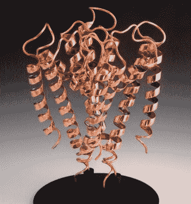

# 消失模铸造展现高分子之美

> 原文：<https://hackaday.com/2017/01/02/lost-pla-casting-brings-out-the-beauty-of-macromolecules/>

生物化学教科书充满了构成生命的蛋白质、核酸和其他生物聚合物的图像。基于结晶学的大分子的 3D 结构的描述和它们最有利的热力学构象的模型是重要的工具。有些只是简单的美丽，这就是为什么艺术家[Mike Tyka]开始使用[消失模铸造来创作青铜、铜和玻璃的高分子雕塑。](http://mtyka.github.io/art/2016/12/11/lostpla-casting-glass.html)

在 Hackaday，我们通常不涉及严格意义上的艺术项目，尽管我们也有例外，比如当[艺术对技术在社会中的地位进行评论的时候](https://hackaday.com/2016/12/28/open-source-art-encourages-society-to-think-inclusively/)。在[迈克]的例子中，不仅他的艺术是美丽的，充满了书呆子的街头信誉，而且他的技术可以被翻译成其他不那么艺术的项目。

对于横幅图片中展示的溶菌酶雕塑“眼泪”，Mike 从晶体学数据入手，精确定位蛋白质中的每一个肽残基。为 3D 打印机创建一个模型，并仔细关注如何将完成的打印拆分开来以进行铸造。透明的 PLA 细丝被用作正极，因为它比有色塑料更容易从模具中燃烧出来。印刷品用溶剂进行平滑处理，添加浇口和气孔，在塑料熔化和模具准备浇铸之前，在正片上涂上适合雕塑介质的石膏混合物。

[【Mike】的雕塑页面](http://www.miketyka.com/#copper)即使你对大分子或铸造技术不感兴趣，也很值得一看。如果你曾经想过你会想要开始失落的解放军铸造，一定要看看他的建设日志，为大量的提示和技巧。“眼泪”是用青铜和玻璃制作的，而[迈克]的描述中充满了如何处理如此不同的媒体的建议。

感谢[Dave Z.]的提示。