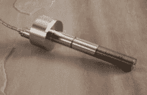

# 拯救生命的爆炸

> 原文：<https://hackaday.com/2017/01/06/explosions-that-save-lives/>

通常，当某样东西爆炸时，对所有相关人员来说都是糟糕的一天。但并不是每一次爆炸都是为了致残或致死。从高速公路到驾驶舱到电网，每天都有大量的爆炸旨在拯救生命。让我们来看看这些烟火奇观，以及它们如何保护我们的安全。

### 爆炸螺栓

我第一次听到“爆炸螺栓”这个词是在 60 年代末和 70 年代初，当时电视对阿波罗发射的报道已经饱和。爆炸螺栓似乎无处不在，释放脐带，限制了发射台的土星五号发射台。年轻的我想象着由固体炸药块加工而成的字面意义上的螺栓，并暗暗希望五金店里有一部分是为它们准备的，这样我就可以找点乐子了。

*烟火紧固件*为机械紧固件(螺栓、螺柱、螺母等))被设计成由于相关联的烟火装置的爆炸而以可预测的方式失效。他们不仅必须以可预见的方式失败，而且还必须足够强大，以抵抗在失败开始之前他们将经历的力量。失效通常也是快速和干净的，这意味着不会留下任何碎片干扰先前由紧固件固定在一起的零件。最后，爆炸失效不会对紧固部件或附近结构造成任何附带损害。

Explosive bolt. Source: [Ensign-Bickford Aerospace & Defense](http://www.eba-d.com/products/bolt-explosive/)

烟火紧固件分为两大类。爆炸螺栓看起来很像普通的螺栓，并且是用你能想到的制造螺栓的相同材料加工而成的。炸药通常装在螺栓杆的内部，头部装有某种起爆装置。为了确保干净，可预测的分离，螺栓上加工有一个凹槽，以创建一个剪切平面。

Frangible nut and booster, post-use. Source: [Space Junkie’s Space Junk](http://jonathan-spacejunk.blogspot.com/2008/12/todays-word-is-frangible.html)

*易碎螺母*是另一种烟火紧固件。这些往往是用于较大负荷的应用，如压制火箭。易碎螺母通常在主紧固件螺纹附近有两个较小的螺纹孔；烟火传爆药在螺纹孔形成的平面上劈开螺母，干净利落地松开紧固件。

### “弹射！弹出！弹出！”

阻止导弹发射是一回事，但烟火扣件拯救最多生命的地方可能是世界各地战斗机的驾驶舱。当战斗机出现问题时，飞行员需要迅速离开。进入战斗机驾驶舱实际上是坐在火箭顶上，被炸药包围。目前大多数座椅都是零零零设计——可在零空速和零高度下使用——通过一个小火箭将座椅和飞行员推出飞机，这个小火箭足够高，可以在飞行员着陆前打开降落伞。几十个炸药负责撕开飞机座舱盖，展开降落伞，并切断跳伞飞行员的座椅，通常在他乘坐一秒钟火箭后失去知觉，并因脊椎椎间盘压迫而缩短几英寸。

 [https://www.youtube.com/embed/Z1cnvJO1TF8?version=3&rel=1&showsearch=0&showinfo=1&iv_load_policy=1&fs=1&hl=en-US&autohide=2&wmode=transparent](https://www.youtube.com/embed/Z1cnvJO1TF8?version=3&rel=1&showsearch=0&showinfo=1&iv_load_policy=1&fs=1&hl=en-US&autohide=2&wmode=transparent)

### 驾驶

毫无疑问，自从安全气囊成为轿车和卡车的标准装备以来，它已经拯救了无数的生命。当你进入一辆现代汽车时，你几乎被安全气囊包围——方向盘、仪表板、膝垫、侧帘、安全带气囊，甚至后座乘客气囊。这些装置中的每一个都是一个小炸弹，等着爆炸来拯救你的生命。

当我们想到爆炸物时，我们往往会想到随着热气的膨胀会发生快速氧化的物质。根据这个定义，安全气囊充气机并不是真正的爆炸物，因为它们是由含氮化合物的快速化学分解提供动力的，通常是在硝酸钾和二氧化硅存在下的叠氮化钠。但区别纯粹是学术上的；任何曾经在他们面前展开过安全气囊或者看过“拿着我的啤酒，看这个”[安全气囊恶作剧视频汇编](https://www.youtube.com/watch?v=7YG7L_D_lfQ)的人都会证明那张化学物质光盘中蕴含的爆炸力。

当连接到安全气囊控制单元(ACU)的传感器检测到碰撞时，电流被施加到电火柴，类似于模型火箭中使用的发动机点火器，埋在充气机模块内。火柴在几毫秒内达到 300 ℃,导致叠氮化钠迅速分解成氮气和钠。随后的反应清除了活性副产物，产生了惰性硅酸盐玻璃，并在混合物中加入了一点氮气。整个反应大约在 40 毫秒内完成，安全气囊在 80 毫秒内完全充气，然后通过气囊背面的排气孔几乎立即再次放气。当你意识到自己发生了事故时，这个包软绵绵地挂在方向盘上，如果运气好的话，你可以从事故中脱身。

 [https://www.youtube.com/embed/I_hkGN8TiJY?version=3&rel=1&showsearch=0&showinfo=1&iv_load_policy=1&fs=1&hl=en-US&autohide=2&wmode=transparent](https://www.youtube.com/embed/I_hkGN8TiJY?version=3&rel=1&showsearch=0&showinfo=1&iv_load_policy=1&fs=1&hl=en-US&autohide=2&wmode=transparent)

### 网格向下

我们已经介绍了一些关于[电线杆](http://hackaday.com/2016/02/22/a-field-guide-to-the-north-american-utility-pole/)和悬挂在电线杆上的所有有趣的小齿轮。位于电杆顶部“供应空间”的安全装置之一是保险丝切断器，或爆炸隔离开关。这也是一个小爆炸可以拯救生命的地方——不仅可以保护生产线工人，还可以防止短路引起火灾。

然而，断路器不仅仅是保险丝。鉴于交流输电和配电网的性质，断路器保护的线路电压相当高，达到 11 kV 或更高。这么高的电压意味着如果触点没有迅速分离，可能会产生持续电弧；由此产生的等离子体所造成的损害即使不比短路更大，也和短路一样大。因此，使用一个小的炸药筒来快速地将断路器的保险丝体踢出框架，并尽可能快地断开电路。电弧抑制特征也内置于断流器中，以在电弧有机会形成之前将其中断。

 [https://www.youtube.com/embed/yi1Uh7BByQA?version=3&rel=1&showsearch=0&showinfo=1&iv_load_policy=1&fs=1&hl=en-US&autohide=2&start=25&wmode=transparent](https://www.youtube.com/embed/yi1Uh7BByQA?version=3&rel=1&showsearch=0&showinfo=1&iv_load_policy=1&fs=1&hl=en-US&autohide=2&start=25&wmode=transparent)

[大克莱夫]最近拆除了另一件线路安全装置，一个 11 千伏避雷器与爆炸隔离开关。用一个 Dremel 工具和一剂液体勇气，他从隔离开关中释放出一个碳块，当被线路故障加热时，点燃一个. 22 口径的炸药，类似于那些用[粉末驱动的紧固件工具](https://en.wikipedia.org/wiki/Powder-actuated_tool)使用的炸药。气体的快速膨胀使隔离开关的外壳破裂，并迅速切断电路。

 [https://www.youtube.com/embed/7hvg2Wey92E?version=3&rel=1&showsearch=0&showinfo=1&iv_load_policy=1&fs=1&hl=en-US&autohide=2&start=815&wmode=transparent](https://www.youtube.com/embed/7hvg2Wey92E?version=3&rel=1&showsearch=0&showinfo=1&iv_load_policy=1&fs=1&hl=en-US&autohide=2&start=815&wmode=transparent)

### 结论

我们已经讨论了在生命安全应用中使用膨胀气体能量的许多方法中的一些。还有其他方法——想到扑灭油田大火，以及有控制地拆除建筑物。但是，保护我们免受更常见事故伤害的炸药数量是相当惊人的，当你意识到它们是如何精心设计的时候就更是如此了。毕竟，这些日常炸弹通常不会无缘无故地爆炸。