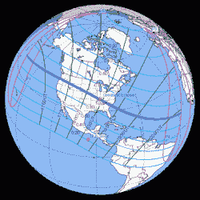

# 准备好迎接 2017 年的大日食吧

> 原文：<https://hackaday.com/2017/01/12/get-ready-for-the-great-eclipse-of-2017/>

2017 年 8 月 21 日，月亮将在北美大部分地区投下阴影，从俄勒冈州到南卡罗来纳州有一条狭窄的全食路径。数千万人将有机会看到美国大陆多年未见的景象——日全食。你准备好了吗？

上一次日全食出现在美国人口众多的地区是在 1970 年 3 月。我清楚地记得，一个四岁的孩子站在我家门前的人行道上，在阿波罗计划的那些令人兴奋的日子里，所有人都为太空而激动，透过烟雾玻璃凝视着月亮遮住太阳几分钟。仅仅是看它就令人兴奋，能够再次看到它，利用一生的极客经历来增强体验，并能够与我的妻子和孩子分享它，这是难以言表的兴奋。但是我只有八个月的时间来制定我的计划！

### 何时何地

第一，基础。日全食将于世界协调时 17:15 在俄勒冈州德波湾北部穿过太平洋海岸。它将穿过爱达荷州南部进入怀俄明州——大提顿和黄石公园的游客将会大饱口福——然后是内布拉斯加州、堪萨斯州的一个小角落、密苏里州、伊利诺伊州和肯塔基州的一小部分，穿过田纳西州和北卡罗来纳州的一部分，最后在世界协调时 18:49 分在查尔斯顿和南卡罗来纳州的默特尔比奇之间出海。需要看看你离全食还有多远，什么时候你可以期待日食开始？为此，美国国家航空航天局制作了一个便捷的交互式谷歌地图。

The Eclipse of 2017\. Source: [NASA eclipse web site](https://eclipse.gsfc.nasa.gov/eclipse.html)

你的首要任务是决定你将在哪里观察事件的发展。假设你想目睹全食，相当多的主要城市都在或非常靠近这条路径——俄勒冈州的塞勒姆；爱达荷州博伊西；内布拉斯加州林肯市；堪萨斯城和圣路易斯；和田纳西州的纳什维尔。在这些城市及其周边，观赏的机会会很多，所以在指定的时间出门不会是一件很麻烦的事。然而，我听说如果你能站在高处，月亮的影子在陆地上飞驰的景象会特别令人兴奋。所以在 21 日，你会发现我正坐在爱达荷州雷克斯堡外的梅南孤峰的山顶上，看着阴影穿过平原向西边逼近。

值得注意的是，密西西比河以东的全食路径距离美国大约一半的人口只有一天的车程。如果你需要旅行去看全食，你需要提前考虑，因为除了通常的夏季旅行者之外，你还将与许多其他日食观测者竞争。像国家公园和主要度假区这样的目的地很可能会被预订。事实上，可能已经太晚了——那个周末我在爱达荷福尔斯找不到酒店房间来救我一命。看来我们要在路边露营了。

### 如何观察

Eclipse glasses are a must. Source: [Sky and Telescope](http://www.skyandtelescope.com/astronomy-news/get-funding-for-eclipse-related-outreach-projects/)

一旦你决定去哪里，并为你选择的天气神做出适当的牺牲，你会做什么？大多数人会满足于观看，但无论你去哪里，都可能会有很多人和派对气氛，所以要准备好社交。

为了在全食前直接观看，你需要考虑一下[眼睛安全](https://eclipse.gsfc.nasa.gov/SEhelp/safety2.html)。在人口更多的观看地点，供应商无疑会以令人难以置信的加价销售[日蚀眼镜](https://www.amazon.com/Eclipse-Glasses-Certified-Shades-filters/dp/B00712I3JA)，生意兴隆，所以你可能会想提前订购，也许会有一些额外的东西与毫无准备的观众分享。[一个 shade 14 焊接头盔滤镜](https://www.amazon.com/Coated-Green-Welding-Filter-Shade/dp/B006VYHCQ4/ref=sr_1_5?s=hi&ie=UTF8&qid=1483047253&sr=1-5&keywords=welding+filter+shade+14)也可以，就像完全曝光和显影的黑白照片胶片一样，只要是银基胶片。针孔相机也是一个不错的选择，但是你需要至少一米的焦距来投射出一幅像样的图像。如果你不想带着冰箱到处走，把望远镜或双筒望远镜的图像投射到屏幕上也是一个不错的方法。

别忘了带上手电筒——在月亮阴影消失的几分钟内，这里会像夜晚一样黑暗。

### 日食不仅仅是用来观赏的

当然，黑客和太空极客可能不会满足于仅仅观看。就我个人而言，我会用一系列相机来捕捉这一事件，我想很多人也会这样做。许多业余无线电爱好者将试图在日食期间使用日间电离层跳跃来进行远距离联系，并且在日食期间有一些协调的努力来进行实验。其他有科学爱好和合适资源的人可能会选择复制亚瑟·爱丁顿爵士在 1919 年日食期间对爱因斯坦广义相对论的[证实；狮子座中明亮的轩辕十四星将会离太阳足够近，从而可以测量爱因斯坦预言的引力透镜。你甚至可以](https://www.wired.com/2009/05/dayintech_0529/)[获得公共推广活动的资金](http://www.skyandtelescope.com/astronomy-news/get-funding-for-eclipse-related-outreach-projects/)来提升观看体验。

无论你选择如何度过 2017 年月食日，尽情享受吧。如果你碰巧错过了，不要担心——美国将会在 2024 年看到另一次月全食。

如果你碰巧在爱达荷州雷克斯伯格外的梅南巴特，过来打个招呼。

 [https://www.youtube.com/embed/MJgXaqW3md8?version=3&rel=1&showsearch=0&showinfo=1&iv_load_policy=1&fs=1&hl=en-US&autohide=2&wmode=transparent](https://www.youtube.com/embed/MJgXaqW3md8?version=3&rel=1&showsearch=0&showinfo=1&iv_load_policy=1&fs=1&hl=en-US&autohide=2&wmode=transparent)

