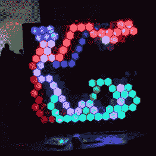

# 33C3:适合我

> 原文：<https://hackaday.com/2016/12/30/33c3-works-for-me/>

混沌通信大会(CCC)是德国最大的黑客大会，目前已经是第三十三届了，也就是 33C3。国大党是一个技术乌托邦式的无政府主义者，有着社会良知和对直接黑客攻击的强大支持。简而言之，每个人都有适合自己的东西，这部分是因为 CCC 就像黑客罗夏测验:每个人都把他们想要的东西带到 CCC，不管是象征性的还是字面上的。不知何故，12，000 人的贡献或多或少都联系在一起。毕竟，第一个“C”确实代表混乱。

将这些完全不同的类型带到汉堡的是维恩图中的交叉点。实际上可能受到国家监控的社会活动家对安全信息的兴趣不亚于偏执的安全极客或只是为了算法而参与其中的铁杆密码书呆子。技术，以及我们如何使用它来交流和组织社会，是一个非常广泛的话题。闪烁的灯好像也在路口。但最重要的是，我们都是极客。这里有很多技能、智慧和知识，极客们喜欢分享、教授和展示他们疯狂的创造。

## 会谈和会议

The Sessions Schedule (and Commemorative Mate Bottle)

忽视 CCC 中的直接黑客攻击将是一个错误——不缺少关于严肃的技术技能克服硅限制让他们的代码在机器上运行的讨论。逆向工程、加密、破解加密或保护系统。我们已经报道了一些会谈，但它们只是冰山一角。当我们写这篇文章时，我们被迫在参加一个关于我们最喜欢的开源逆向工程工具的演讲、一个关于大数据和隐私的演讲和一个关于测试伪随机数生成器的演讲之间做出选择。我们正在努力记录其余的杰出人物，但要赶上还需要一段时间。

在正式会谈的同时，在整个会议中心的许多较小的房间里也有自主会议和研讨会。我们现在错过了一个关于数字天气预报的报告。你不可能抓住所有的人。虽然 CCC 的工作人员在每次演讲结束后的几分钟内就将所有主要曲目上传到网上，但除非你在这里，否则会议和研讨会是看不见的。

## 集会和游戏

是的，会谈和会议是(小于？)节目的一半。“混乱”就是这个东西。其他大会有黑客空间村或特殊兴趣区，CCC 有“集会”。它确实拥有这些优势。四个大厅里摆满了桌子、3D 打印机、激光切割机、小型机器人、闪烁的东西和其他随机项目。这些集会也是一场盛大的展示和讲述，让大多数制造商感到嫉妒。

  The Data Octopus, Slupring Up Your Data  One of the Assembly Halls: 50 Assemblies?  Cardboard Iridium Satellite: Actually Functioning  Cyber cyber cyber…  Sewing Machines Were Always Busy, But I Couldn’t Take Photos of Children  Amazing Blinkies in Evidence  Where Do You Get Hexagonal Bottles?  Sand-box, Terrain-Mapping  No Comment    … Powered by Vacuum Cleaners, Pushing Shuttles, Routed by Steppers and Arduinos

德国和欧洲各地的黑客空间都在这里。其他汇编并不基于物理位置，例如 LISP 汇编和 FPGA 汇编。这些集会为黑客空间团体提供了一个迷你基地，他们中的大多数人在大会正式开幕的前一天就已经来到这里，准备好他们的东西。

### 没有游戏

贯穿整个 33C3 的是一款游戏，叫做《没有游戏》。本着混乱的精神，这个不是游戏的游戏实际上是一系列的挑战、谜语和与其他团队的秘密会议。终端分散在大会各处，每个团队都有一个 u 盘，他们每天插入 u 盘并收到一个信封。

与其他密码挑战或徽章游戏不同，绝对没有办法“赢得”这个游戏——毕竟没有游戏。相反，所有团队都需要[聚在一起](https://events.ccc.de/congress/2016/wiki/NoGameInformation)解决一个大难题，打开密室、灯光和音乐表演，甚至几个派对。

我走进了一个以疯狂制帽商为主题的活动，所有的团队都收集了制帽商喝茶需要的物品。我被吸引住了，花了一个晚上帮助慕尼黑 CCC 的一个小组使用 OpenCV 引导的伺服驱动转台拍摄气球。其他小组不得不解密铱星传呼机信息，破解代码，并建立东西。有一个医生贯穿了整个游戏，我真的还不明白。

然而，游戏的最终结果是社区建设。连接拼图，收集解开奇怪的秘密事件的信息，并试图弄清楚这一切是任何团体都不可能做到的。它提供了一个很好的借口和一群人一起到处跑，参观其他集会，和他们一起面对挑战。

## 天使和天堂

当然也不全是乱。有一个庞大的志愿者“天使”大军，他们管理从惊人的网络到 GSM 和无线电话系统的一切，与媒体争论，翻译谈话和采访客人，基本上做所有的艰苦工作，使一切顺利进行。据我所知，没有其他黑客大会会在演讲结束后 15 分钟内发布和播放演讲的预览版本，所有这些都是从几个摄像机角度多路复用的，并配有德语、英语和法语字幕。从 CCC 流出的数据峰值约为 8-10 GB/s。专为该活动构建的基础设施规模宏大。

今年，天使志愿者的数量超过了实际需求，这是一个很大的数字；2564 名天使为国会工作。他们从中得到了什么？他们知道他们让整个事情运转起来，他们得到了食物，他们可以提前拿到明年的门票。那些坚持了足够长时间的人会得到一件 t 恤。他们都得到了我们的感谢，感谢他们阻止了混乱演变成彻底的混乱。

## CCC 社区:为我工作

T2 今年大会的口号是“为我工作”——讽刺的意思。这个想法是让你思考:一个只对某些人有效的系统(计算机或其他)真的有效吗？“适合我”够好吗？或者我们应该努力让我们的产品为每个人服务？这至少是一个值得你在接下来的一年里随身携带的好问题。

至少从美国人的角度来看，CCC 真正引人注目的是妇女和儿童的存在。让我们面对现实吧，美国的黑客大会对家庭并不友好，其中一些对女性来说是完全不欢迎的。众多格言之一(混沌，还记得吗？)是“欢迎所有生命形式。”(虽然会议中心不允许人们带宠物，所以大概更像是“全人类”。)

Chaos Mentors Take Animal-Head Selfies

将感兴趣的局外人带入社区是 CCC 组织的一个非常积极的目标。我会见了“混乱导师”的菲奥娜·克拉肯伯格(Fiona Krakenbürger)，这是一个旨在让初次接触 CCC 的人和其他任何对整个场景感到恐惧的人更容易了解 CCC 的集会。(恐吓是一种完全合理的反应——人们很容易在大楼里迷路，而且发生的事情太多了，以至于感觉超负荷。)他们把新人分成小组，让他们适应环境，给他们一个称之为家的地方，然后最终让他们自由飞翔。对于那些没有自己的本地黑客空间的人来说，创建这些微型社区是非常宝贵的服务。很明显，在去年的会议上，大约四分之一的导师是新手。

当我写这篇文章的时候，一个蹒跚学步的孩子刚刚走过一群坐在地板上谈论提交给 Tails GitHub 的人。人类大小的雪球，作为一个烟雾弥漫、激光照明的通宵迪斯科舞厅，目前挤满了玩聚酯薄膜纸屑和扫帚的幼儿园小朋友。人们和他们重要的人在一起。第三层的一半是乐高玩具、球坑和典型的德国儿童玩具“波比车”的跑道。很难说那些散落在周围的各种游戏(自制 DDS，视频叠加乒乓球台)是针对 30 岁以上还是 30 岁以下的孩子。

## 黑客乌托邦

最后，CCC 是一个长达四天的德国黑客社区希望世界看起来像什么的表达:有趣，怪异，聪明，有足够的东西可以满足任何人的深度兴趣或短暂的注意力跨度。有机会亲自向你所使用的软件的开发者或维护者说声谢谢，给他们买一杯真正的啤酒而不是虚拟的，这也是很棒的。休息一周去玩，去计划，去聚会，是一件好事。但这也提醒我们，在这一年的另外 51 周中，我们可以努力以微小的方式改造世界。