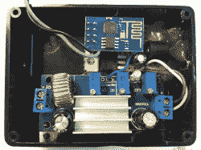

# 厨房灯的开放式声音控制

> 原文：<https://hackaday.com/2017/01/10/open-sound-control-of-kitchen-lights/>

控制物联网就是传递信息。实际上，使用什么并不重要，无论是 MQTT、HTTP、串行数据还是其他，只要发送方和接收方就数据的含义达成一致，发送什么数据也并不重要。例如，MIDI 可以用来来回传递信息，虽然 MIDI 在某些方面很好，但开放式声音控制是一种更现代的选择，OSC 优于 MIDI 的一个领域是互联网连接。[Matt]使用 [OSC 来控制他安装在厨房的照明](http://axio.ms/projects/2017/01/03/Internet-of-kitchen.html)。

ESP8622-1 and Buck Converter

[Matt]搬进了新家，想要为他的厨房打造一些橱柜下照明。他从网上买了一些便宜的暖白色 LED 灯，并着手把它们连接起来。对于控制器，使用 ESP8266-1 以及 12 伏恒流降压转换器。该软件运行在 [Sming](https://github.com/SmingHub/Sming/wiki) 框架上，而不是 Arduino 框架上，并监听输入的 OSC 消息。当回调函数接收到特定频道上的命令时，它会打开和关闭灯。【马特】还在控制盒外面加了一个开关，可以手动开灯关灯。

OSC 可能不是这个项目的正确选择，甚至[Matt]也不知道他为什么要使用它，但[Matt]让它工作起来，并使用他手机上的一个应用程序来控制它。如果他想的话，他可以使用 Ableton 或其他控制器来控制灯光。(他还没想。)OSC 是 MIDI 的一个有趣的替代品，也可以与没有以太网屏蔽的[Arduino](https://hackaday.com/2011/03/27/arduino-and-open-sound-control-without-an-ethernet-shield/)或有 RFID 标签的[一起使用。](https://hackaday.com/2009/12/30/rfid-meets-open-sound-control/)