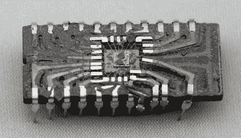

# 是的，你可以逆向工程这个 74181

> 原文：<https://hackaday.com/2017/01/07/yes-you-can-reverse-engineer-this-74181/>

[Ken Shirriff]是这个新年持续给予的礼物。他的最新作品是 74181 算术逻辑单元(ALU) 的逆向工程[。好消息是，芯片图像和复杂性都经过优化，有助于您成功完成自己的逆向工程。](http://www.righto.com/2017/01/die-photos-and-reverse-engineering.html)

我们最近看到【Ken】在工作[解释他在 Hackaday SuperCon 的解封和逆向工程过程](http://hackaday.com/2016/12/27/ken-shirriff-takes-us-inside-the-ic-for-fun/)，随后是[他在 8008](http://hackaday.com/2016/12/31/8008-exposed/) 上的工作。这个芯片非常复杂，一个色迷迷的新手(就像我们 Hackaday 团队中的几个人一样)除了简单地遵循他的解释之外，没有机会做更多的事情。这一次，74181 正适合好奇但不痴迷的人。不相信我？8008 有大约 3500 个晶体管，而友好的 74181 只有 170 个。我们喜欢这样的机会！

视觉识别晶体管的快速速成课程将带你走向竞赛。[Ken]也为更复杂的设备提供了参考。但他真正扭转局面的地方在于他的图解分析。看，传统的“教科书”逻辑设计在这个芯片上变得更快了，仔细阅读他的解释会让你回到正轨上来，了解骰子疯狂背后的方法。

[Ken]自己给死者拍了照片。你可以看到上面的供体芯片，它的陶瓷外壳被一把锋利的凿子轻轻敲碎了。