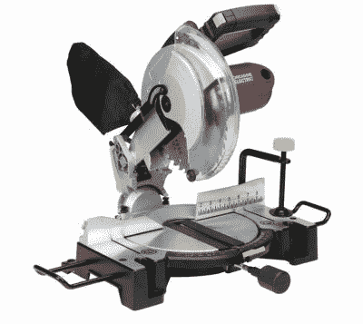
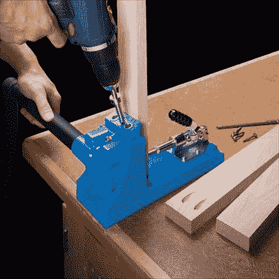
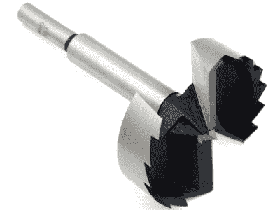
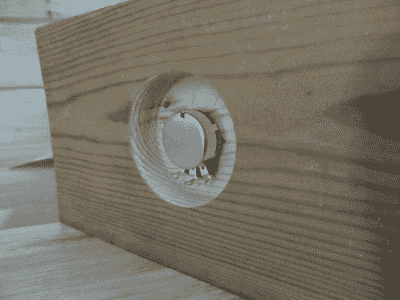

# 硬件黑客的木工基础

> 原文：<https://hackaday.com/2017/01/23/woodworking-basics-for-the-hardware-hacker/>

Hackaday 主要是电子黑客的地方，但这并不是说我们看不到相当多的项目中木工发挥了关键作用。脑海中浮现出魔镜模型，还有修复古董收音机、嵌入咖啡桌的街机，以及各种电子和机械设备的小盒子。在其中的一些项目中，木工真的很出色，让完成的项目很流行。在其他情况下——好吧，我们只能说有些木制品从远处看很好，但实际上一点也不好。

我绝不会对任何人的努力进行评判——我能想到我从事的几十个木工项目都可以作为危害木材罪受到起诉。但是我有相当多的木工经验，从我会用手锯开始，我就在我爸爸的店里做锯屑。我在过去几十年里学到了一些东西，我想我会分享一些技巧，可能会帮助你将你的硬件技术与木工技术结合起来，让你的项目大放异彩。我将主要针对木工新手，但这里也可能有一些针对更有经验的类型的提示。

## 基础:切割

Office side of my little “hack shack,” a prefabricated 10’x12′ shed. All the interior woodwork is mine except for the IKEA cabinets. I like wood.

木材作为一种材料的一个大问题是，你需要很多专门的工具来有效地使用它。虽然有一个台锯是伟大的，它也导致问题。一把好的锯子很贵，需要很大的空间，噪音大，灰尘多，而且考虑到一个错误的举动会切断附肢，它们使用起来很吓人。但是，在测量毛坯尺寸时，真的没有什么可以替代台锯，尤其是当你需要对木材的长纹理进行纵切时。怎么办？

我可以想出一些方法来解决这个问题，这是我最近经常遇到的一个问题，我在搬家前卖掉了我的台锯。第一是通过利用预先切割的材料来完全避免这个问题。大多数家庭中心都有许多种类的木材可供选择，所有木材都有多种厚度和 2 英寸到 12 英寸的标称宽度(抱歉，公制世界— [我坚持使用英制尺寸](http://hackaday.com/2017/01/13/whats-so-bad-about-the-imperial-system-anyway/)，因为我不知道在你的系统中木材是如何测量的)。为了使用现成的库存，您可能需要对设计稍作妥协或改变，但是很少有项目无法隐藏 1/2”的宽度差异。我会使用这个策略，甚至当我有一个台锯的时候——只是懒，我想。

但是大箱子商店里的大多数木材都是以 6 英尺到 10 英尺的长度出售的，所以你不可能长时间避免交叉库存。你可以充分利用商店来完成这项工作，因为几乎每个商店都有旋臂锯来将木材切割成合适的尺寸。通常在前几次免费削减后，削减是象征性的收费，但是要知道大多数地方都有免责声明，他们不会进行精确削减。因此，如果你需要 6 块 1×3 的橡木，正好 11-3/8 英寸长，你可能就不走运了。

Harbor Freight’s entry-level miter saw. Source: [Harbor Freight](http://www.harborfreight.com/power-tools/miter-saws/10-in-compound-miter-saw-with-laser-guide-system-61973.html)

因此，临时木工可能想看看入门级斜切锯，以满足他们的交叉切割需求。Harbor Freight 的产品名声不好，但 10 英寸的复合斜切锯售价 89 美元，即使是一次性工作也很难拒绝。诚然，像这样的工具是为价格点而构建的，并不是为了在日常工作场所的严酷使用中生存而设计的，但您并没有要求它这样做。

斜切锯是许多小项目的游戏规则改变者。能够以精确的角度切割木材是各种项目的第一步——它提升了你的建筑，超越了简单的对接接头，虽然通常很实用，但缺乏良好的斜接的视觉吸引力。一个便宜的斜切锯可能会让你在 45 度的急停时有点吃力，但大多数都可以调整到完美的接合。

不过，斜切锯仍然是一种灰尘多、噪音大的工具，最好在户外或专门的商店里操作。没有合适的空间放一个？不用担心——你可以用手动斜切锯得到足够的斜切。不过，我会远离超便宜的木头或塑料斜接盒。专用的手动斜切锯从内置锯所在的框架中获得精度。它们小巧、安静、容易清理，50 美元就可以买到——即使你的店里已经有了电动斜切锯，这也是一个不错的工具。

## 简单的细木工

一旦你完美地切好了你的原料，你如何把它们放在一起？这是许多木工新手容易出错的地方，一些简单的工具和技术可以帮你解决这个问题。但是首先，你需要看看关节在使用中将要承受的力。很多关节几乎没有受力。相框就是一个很好的例子——它们可以挂在墙上或放在桌子上。所以把这些碎片粘在一起就足够了。但是把同样的斜接接头放入一个一天需要打开和关闭十几次的盒子里，如果没有一些加固，胶合接头会在短时间内分崩离析。

Kreg pocket-hole jig. Source: [Kreg Tools](https://www.kregtool.com/store/c13/kreg-jigsreg/p35/kreg-jigreg-k4-master-system/)

有数不清的方法可以加固关节，首先从如何切割关节开始。但是，如果我们不是在谈论像燕尾榫或榫眼和榫接合这样的花哨东西，我们可能需要某种硬件来将我们的关节拉在一起。这意味着平头钉、钉子，或者更好的是螺丝钉。

在我看来，木工新手能做的最好的投资就是一个好的袖珍工具包。袖珍孔细木工是另一个游戏改变者。夹具夹在工件上，允许你在木头边缘钻一个角度很大的孔，通常使用一个特殊的阶梯钻头。该袋引导螺钉穿过一片原料进入另一片，仔细选择孔的深度和螺钉的长度以避免穿孔。

Oak edge-banding on an MDF desktop. Oak pieces are pocket screwed together and held to the desktop with more pocket screws.

细木工？一点也不。强大，快速，简单，便宜？你打赌。我在几分钟内就用袖珍螺丝把简单的对接框架和坚固的箱子组装起来了。Miters 也没有问题，大多数工具包附带的说明书向您展示了您可以构建的所有奇妙的东西。你必须小心隐藏口袋洞，或者如果你喜欢，你可以在事后把它塞住。我刚刚用袖珍孔细木工在我的新商店/办公室的一些简单的架子上放了一个加固边带。花了我几分钟的时间(在暴风雪中)，它已经足够好了。

我有一套 [Kreg Jig K4 大师系统](https://www.kregtool.com/store/c13/kreg-jigsreg/p35/kreg-jigreg-k4-master-system/)，它已经为我服务了很多年。零售价 150 美元并不便宜，但绝对物有所值。如果你想从小处着手，你可以花大约 40 美元买一套简单的工具，只有一个小夹具、一个阶梯钻头和一个方头螺丝刀头。公平的警告，虽然:你需要一个老虎钳夹面钳，以有效地使用夹具。

## 铣削和钻孔

木工新手，尤其是那些习惯于在机械加工车间使用不太顺从的材料的人，当他们试图在木头上打孔时，经常会感到沮丧。选择了错误的钻头或使用了错误的技术，洞最终会看起来很糟糕。

一般来说，用于金属加工的麻花钻不是在木头上打通孔的最佳选择。它们也不是盲孔的最佳选择，但是如果你小心的话，你可以逃脱。使用专为木材设计的麻花钻会有更好的效果；这些通常有一个布拉德点在中心和马刺在外径；布拉德点有助于保持钻头对准目标，马刺整齐地切割木纤维，使钻孔更加平滑。

Large Forstner bit – like and end mill for wood. But use a drill press! Source: [Traditional Woodworker.com](http://www.traditionalwoodworker.com/3-3_4-Forstner-Bit/productinfo/244-3340/)

直径较大的孔最好用扁钻头钻。这些也有布拉德点和马刺，但切割表面是平坦的，桨状，切割方法更多的是刮擦动作。一种改良版的铲形钻头，福斯特纳钻头，工作原理大致相同，但可以用来钻有角度的孔；在扁平刀片开始从木头上弹开之前，铲形钻头对木材的接受角度相当有限。把福斯特纳钻头想象成木材的端铣刀。算是吧。

Counterboring for mounting pot to a wood panel. I hogged out the wood to 1/8″ thick with a Forstner bit.

除了用钻头钻的导向孔之外，铲钻和福斯特纳钻头可以钻接近平底的孔。但是在钻埋头孔时，可以有利地使用导向孔。这对于在木板上安装开关、花盆和指示灯特别有用；这种零件的螺纹轴很少长到足以清理哪怕是一片很薄的坯料。大直径钻头用于在面板内部挖出足够的空间，以清理控制装置的背面，同时通过第一个钻头的导向钻一个轴的间隙孔。钻床最适合这种操作。

最后一个钻孔建议:不管你用什么钻头，总是用一块废木头支撑通孔，并且把你的枪托牢牢地夹在废木头上。你不会相信这个简单的技巧会有什么不同——洞会很干净，不会被打穿而破坏你的工作。

我希望这能鼓励你在你的项目中加入木材。好的结果只需要一些基本的工具，一点点练习和一些指导。请记住，所有这三种甚至更多的东西都可能在您当地的黑客空间中找到。也许值得去看看人们是如何处理木材的，并从中获得一些灵感。