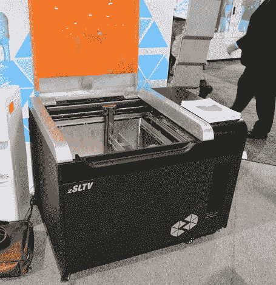
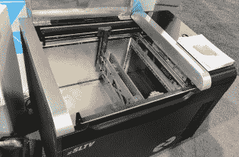
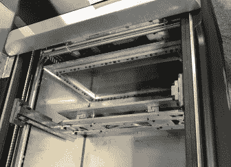

# CES2017:非常非常大的 SLA 打印

> 原文：<https://hackaday.com/2017/01/07/ces2017-really-really-big-sla-printing/>

去年在 CES 上， [UniZ 推出了 Slash](http://uniz3d.com/slash) ，一款桌面树脂打印机。它速度快、功能强，而且现在已经上市，但 UniZ 展台上还有更令人惊叹的东西。

UniZ zSLTV 是一个巨大的盒子，宽度略大于 1 米，高度和深度略小于 1 米。打开盖子，你会看到一个巨大的树脂打印机翻转过来。这里的想法是用树脂填充一个巨大的罐，(构建体积为 521 x 293 x 600 mm)，并将其用作一个相当标准的 UV LED / LCD 树脂打印机。这台机器和其他树脂打印机的唯一区别是零件总是浸在树脂里。

 [https://www.youtube.com/embed/uLn6pzUKEeA?version=3&rel=1&showsearch=0&showinfo=1&iv_load_policy=1&fs=1&hl=en-US&autohide=2&wmode=transparent](https://www.youtube.com/embed/uLn6pzUKEeA?version=3&rel=1&showsearch=0&showinfo=1&iv_load_policy=1&fs=1&hl=en-US&autohide=2&wmode=transparent)

这是我们从未见过的东西，它将很快上市。这台巨大机器的价格大约是 10，000 美元。

     