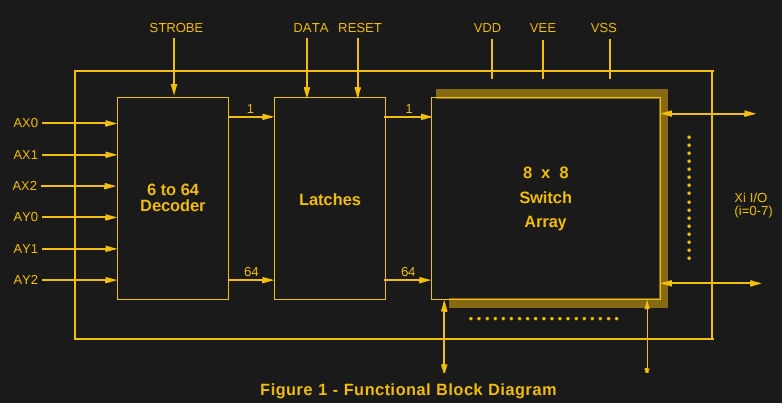

# 串行 C64 键盘仿真

> 原文：<https://hackaday.com/2017/01/14/c64-keyboard-emulation-over-serial/>

有很多理由可以让你模仿 Commodore 64 的键盘。时间和灰尘的蹂躏可能已经使原来的键盘出了毛病，或者也许你需要键入一个长程序，并且不喜欢用标准键的不太好的反馈啄走。[podstawek]提出了解决方案:[一个 Commodore 64 键盘模拟器，它通过串口](http://podstawczynski.com/c64/key64tapper/)工作。

这是一个简单的概念，但效果很好。Python 脚本接受输入的按键或预先键入的文本，然后将它们转换成 6 位二进制代码，通过串行连接发送到 Arduino。Arduino 使用 6 位代码作为 MT8808 交叉点开关的地址。

MT8808 Functional Diagram from [Datasheet](http://www.mouser.com/pdfdocs/Mt8808_DataSheet.PDF)

MT8808 本质上是一个 8×8 矩阵的可控开关，它是与 C64 的 8×8 键盘矩阵接口的完美工具。就硬件而言，这就像有人在真正的键盘上按键一样。它只是用一个由 Arduino 控制的电子版本取代了原来的按键开关。

[podstawek]已经在 Mac 上安装好了，它应该也能在 Linux 和 Windows 上运行。还有更多的事情要做——修改脚本以允许复杂的宏并允许持有按键——所以如果您想查看源代码，请查看 Github 。总的来说，这是一个整洁，有用的黑客取代股票键盘。

C64 仍然是一个受欢迎的黑客平台——它甚至从 2009 年就有了一个 Twitter 客户端。