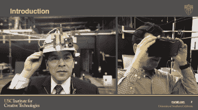
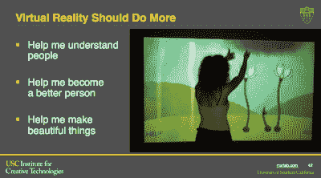
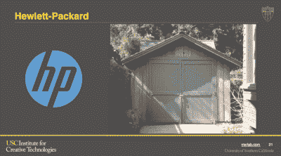
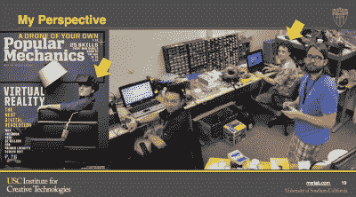
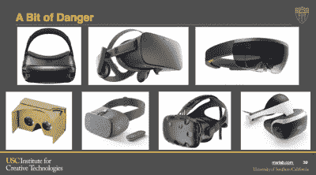
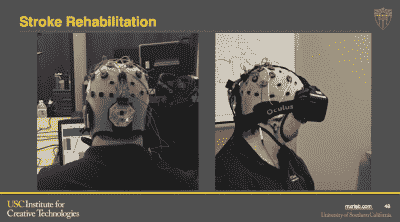
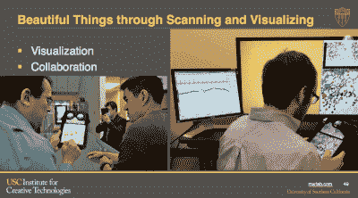

# 大卫·克鲁姆:虚拟现实的革命

> 原文：<https://hackaday.com/2017/01/09/david-krum-the-revolution-in-virtual-reality/>

[大卫·克鲁姆]是南加州大学创新技术研究所混合现实实验室的副主任。这使他处于科学和工程的交汇点:建造酷的虚拟现实(VR)设备，并利用科学来找出什么可行，什么不可行。他从 1998 年开始做 VR，所以他看到了许多很酷的想法来来去去。他的实验室处于现代虚拟现实爆炸的中心。来看看他的演讲，看看为什么！

 [https://www.youtube.com/embed/RKF4p5MW0p8?version=3&rel=1&showsearch=0&showinfo=1&iv_load_policy=1&fs=1&hl=en-US&autohide=2&wmode=transparent](https://www.youtube.com/embed/RKF4p5MW0p8?version=3&rel=1&showsearch=0&showinfo=1&iv_load_policy=1&fs=1&hl=en-US&autohide=2&wmode=transparent)

## 什么是虚拟现实，真的？

我们都知道什么是 VR 吧？这是科幻小说中的比喻，你被困在矩阵中，无法分辨你实际上不在现实世界中。你所有的感官都被模拟得如此之好，以至于你被愚弄来为蜂群思维产生能量。[大卫]有稍微更现实的目标。

 对【大卫】来说，就是沉浸感。对他来说，黄金标准是沉浸式虚拟现实让你仿佛虚拟世界是真实的。这并不是说你不能区分真实和虚拟，而是你在虚拟世界中的行为和反应与你在真实世界中的行为和反应是一样的。如果你订婚了，虚拟现实体验就是成功的。

如果目标是一个帮助训练军队或飞行员操作他们的机器和团队工作的虚拟世界，那么他们不能实际分辨坦克内部的气味有什么关系吗？相反，重要的是“感觉运动偶发事件”是正确的——你正在做的事情以正确的方式影响着这个世界。例如，在最早的 Oculus Rift 耳机中，它们只能用陀螺仪跟踪运动，因此你可以像在鱼缸中一样环顾世界。但是当你扫射时(左右移动你的头)，它不会有反应。后来的版本解决了这个问题，变得更加身临其境。

 但是 VR 并不全是硬件。如何构思情节，甚至艺术的质量都很重要。在演讲中一个比较诗意的时刻，[大卫]坚持认为你应该能够在沙滩上留下脚印。他谈到了用户如何改变虚拟世界，但他同样对虚拟世界如何改变用户感兴趣。

在所有这些指标中，虚拟现实在过去十年中取得了巨大的进步，[大卫]认为它将继续下去。是什么让这一切成为可能？经济实惠的 VR 头戴设备。当虚拟现实耳机的价格为每台 6 万美元时，无论体验有多沉浸，都不会有人用它来教孩子，或作为中风患者的治疗方法。随着基于手机的设备便宜到 10 美元，情况就大不相同了。

对[大卫]来说，Oculus Rift 是突破性的设备，因为它证明了“廉价”虚拟现实设备的市场需求，并鼓励其他公司制造竞争产品。

## 车库的神话(学)

那么 Oculus Rift 是从哪里来的呢？如果你相信他们的营销宣传，它是由一个天才游戏玩家孩子独自在父母的地下室里创建的，他克服了困扰 VR 几十年的所有绊脚石。这符合硅谷的神话，即这家公司从车库起家，然后改变世界，而[大卫]给了这个故事一个令人耳目一新的揭穿。

 HP 从车库里“起步”了。嗯，算是吧。早期的原型和研发实际上是在斯坦福大学的一个实验室里进行的。苹果是在史蒂夫·乔布斯的车库里起家的吧？那里没有设计或制造，但他们在将电脑运往商店之前，确实用它来进行测试和临时仓储。大多数概念性的工作是在斯坦福直线加速器的一个空间里完成的，当然也是在家酿计算机俱乐部的社区里完成的。谷歌有一个车库——在获得几百万美元的种子投资后，他们把车库租了出去。但是当然，关于页面排名的最初工作已经完成了。这项工作是什么时候开始的？当谢尔盖和拉里还是斯坦福的研究生时。

关键是，硅谷车库神话是一个神话。那些特殊的神童在他们的车库或地下室工作的想法是站不住脚的。在所有这些案例中，创始人实际上是致力于解决这个问题的更大社区的一部分。在所有这些情况下，社区也是一个学术社区，但没有理由认为下一个伟大的想法不会来自装备良好的黑客空间或任何有“创造和分享想法的社区和文化”的地方。(我们会认为这是无意的赞美！)

 【大卫】的实验室从 2010 年开始就有兴趣让低成本 VR 成为可能。例如，在 2012 年，他们制造了一个带有镜头的纸板虚拟现实设备，你可以将手机放入其中。他们能够用激光切割机以如此低廉的价格制造它们，以至于在一次会议上免费分发。2014 年，我们会看到这个想法随着谷歌纸板成为主流。

自 2011 年以来，他们一直在做基于智能手机的虚拟现实工作。三星的一些人实际上给他们写了一封电子邮件，感谢他们开源他们的工作，并启发了三星 Gear VR 耳机的开发路径。当然，[大卫]的实验室雇佣并培训了一名年轻的技术人员，他后来创立了 Oculus VR。“在他的车库里。”

## 下一步是什么？

 既然 VR 头戴设备无处不在且价格低廉，下一步会是什么呢？众所周知，未来十年，虚拟现实将由游戏主导。但[大卫]也对其他用途抱有希望:利用虚拟现实让我们成为更好的艺术家、工程师、建筑商和制造者。虚拟现实也将在教育中发挥作用，因为人们可以游览并与机器互动，而这在现实生活中是不可能的。

[大卫]对虚拟现实未来的担心是，随着主要游戏公司争夺细分行业，它将导致围墙花园。如果你想玩索尼的游戏，你需要购买他们的耳机，在他们的商店里为游戏付费，并从本质上把自己限制在他们的世界里——并为他们的底线做出贡献。
 但是如果我们能够避免落入那个陷阱，【大卫】看到了很多新的有趣的虚拟现实机会。你知道有时候你不得不走回楼下去回忆你在厨房时在想什么吗？“上下文相关记忆”是虚拟现实研究的一个有趣领域。关于虚拟现实中的人，有很多东西需要学习:人们如何与虚拟角色互动，以及这说明了我们对个人空间的想法。还有治疗的机会。[David]的实验室确实与中风患者合作，测试在虚拟世界中移动他们的手臂是否可以帮助他们重新控制自己的真实肢体。

 那么让 VR 本身变得更好就有公开的途径了。[David]的实验室做了一些特别出色的工作，将定格动画整合到虚拟现实环境中。事实证明，真实世界的纹理、照明和其他线索有助于使物体看起来比多边形拼贴更真实。最酷的应用之一实际上是 cardboard viewer 的扩展:平板电脑的 3D 打印覆盖物，允许屏幕的上三分之一作为可共享的 VR 平台，而下半部分则是一个小组中的每个人都可以看到的。在这种“休闲虚拟现实”中，人们可以在不佩戴侵入式耳机的情况下四处传递平板电脑，这有望使该技术更适合临时小组协作。

## 最后一课

虚拟现实的新繁荣不是凭空而来的——它来自于像[大卫]的研究实验室所做的工作，开放工作并分享他们的创新。这些人从 20 世纪 60 年代就开始研究虚拟现实，而新一代耳机背后的想法几乎已经过时了。当然，随着更高分辨率的屏幕和更好的图形处理，技术已经赶上来了。但真正推动公司投资、相互竞争并最终推动革命向前发展的是，原型的建立展示了更便宜的虚拟现实体验的可能性。这样的道德如何温暖黑客的心？