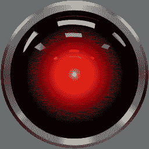
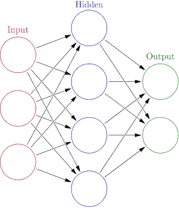

# AI 和机器中的幽灵

> 原文：<https://hackaday.com/2017/02/06/ai-and-the-ghost-in-the-machine/>

人工智能的概念可以追溯到现代计算机出现之前——甚至可以追溯到希腊神话。希腊工匠和铁匠之神赫菲斯托斯被认为创造了机器人为他工作。另一个神话人物皮格马利翁用象牙雕刻了一个美丽女子的雕像，并爱上了她。阿芙罗狄蒂赋予雕像生命，作为送给皮格马利翁的礼物，皮格马利翁随后娶了现在还活着的女人。

Pygmalion by Jean-Baptiste Regnault, 1786, Musée National du Château et des Trianons

纵观历史，被赋予智能的人工生物的神话和传说屡见不鲜。这些方法从简单的超自然起源(如希腊神话)到随着炼金术越来越受欢迎的更加科学合理的方法。在小说中，尤其是科幻小说中，人工智能从 19 世纪开始变得越来越普遍。

但是，直到 19 世纪和 20 世纪数学、哲学和科学方法足够先进，人工智能才被认真地认为是一种实际的可能性。正是在这一时期，数学家们，如乔治·布尔、T2、伯特兰·罗素和阿尔弗雷德·诺斯·怀特海开始提出形式化逻辑推理的理论。随着 20 世纪下半叶数字计算机的发展，这些概念被付诸实践，人工智能研究开始认真起来。

在过去的 50 年里，对人工智能开发的兴趣随着公众的兴趣和行业的成功与失败而起伏。该领域的研究人员和科幻小说中的幻想家所做的预测往往与现实不符。一般来说，这可以归结为计算限制。但是，一个更深层次的问题——对智力究竟是什么的理解——一直是一个巨大争论的来源。

尽管遇到这些挫折，人工智能的研究和开发仍在继续。目前，这项研究正在由看到这种进步的经济潜力的技术公司和世界各地大学的学者进行。这项研究目前进展如何，我们未来可能会看到什么？要回答这个问题，我们首先需要尝试定义人工智能的确切构成。

## 弱人工智能、AGI 和强人工智能

你可能会惊讶地发现，人们普遍认为人工智能已经存在。正如硅谷人工智能研究人员艾伯特(是的，这是化名)所说:“……人工智能正在监控你的信用卡交易是否有怪异行为，人工智能正在读取你写在银行支票上的数字。如果你在手机的图片中搜索‘日落’，是 AI 视觉找到了它们。”这种人工智能被业界称为“弱人工智能”。

### 弱人工智能

弱人工智能致力于一个狭窄的任务，例如苹果的 Siri。虽然 Siri 被认为是人工智能，但它只能在预定义的范围内运行，该范围结合了少数几个狭窄的人工智能任务。Siri 可以执行语言处理、解释用户请求和其他基本任务。但是，Siri 没有任何感觉或意识，因此许多人觉得甚至将这样一个系统定义为 AI 都不令人满意。

然而，阿尔伯特认为人工智能是一个移动的目标，他说:“在人工智能研究界有一个流传已久的笑话，一旦我们解决了一些问题，人们就会认为这不是真正的智能！”就在几十年前，像 Siri 这样的人工智能助理的能力会被认为是人工智能。艾伯特继续说道:“人们曾经认为国际象棋是智力的巅峰，直到我们打败了世界冠军。然后他们说，我们永远无法打败围棋，因为搜索空间太大，需要“直觉”。直到去年我们打败了世界冠军……”

###  强艾

尽管如此，艾伯特和其他人工智能研究人员只将这类系统定义为弱人工智能。而强 AI 则是大部分外行人一提起人工智能就想到的。一个强大的人工智能将有能力进行实际的思考和推理，并将拥有感觉和/或意识。这是一种定义了 HAL 9000、KITT 和 Cortana(在 Halo 中，不是微软的个人助理)等科幻实体的人工智能。

### 人工通用智能

究竟什么构成了强人工智能，以及如何测试和定义这样一个实体，这是一个充满激烈辩论的有争议的话题。从各方面来看，我们离拥有强大的人工智能还很远。但是，另一种类型的系统，AGI(人工通用智能)，是弱人工智能和强人工智能之间的一种桥梁。虽然 AGI 不会拥有强人工智能的感知能力，但它会比弱人工智能更有能力。一个真正的 AGI 能够从呈现给它的信息中学习，并且能够回答基于该信息的任何问题(并且能够执行与之相关的任务)。

虽然 AGI 是目前人工智能领域大多数研究的焦点，但许多人的最终目标仍然是强大的人工智能。几十年，甚至几个世纪以来，强大的人工智能一直是科幻小说的核心内容，我们大多数人都理所当然地认为有一天会创造出有感知能力的人工智能。然而，许多人认为这甚至是不可能的，关于这个话题的大量辩论围绕着关于感觉、意识和智力的哲学概念。

## 意识、人工智能和哲学

这个讨论从一个非常简单的问题开始:意识是什么？虽然这个问题很简单，但任何上过哲学导论课的人都可以告诉你，答案绝不是这样。这是一个让我们集体挠头了几千年的问题，认真尝试回答这个问题的人很少能得出满意的答案。

### 什么是意识？

一些哲学家甚至假定，通常认为的意识根本不存在。例如，在 [*意识解释*](http://www.nytimes.com/books/98/12/06/specials/dennett-consciousness.html) 中，丹尼尔·丹尼特认为意识是我们大脑精心制造的幻觉。这是哲学概念[决定论](https://en.wikipedia.org/wiki/Determinism)的逻辑延伸，认为一切都是一个原因的结果，只有一个可能的结果。从逻辑极端来看，决定论认为每一个思想(以及意识)都是对之前事件的物理反应(下至原子间的相互作用)。

大多数人对这种解释的反应是荒谬的——我们对意识的体验与我们的存在是如此不可分割，以至于这是不可接受的。然而，即使一个人接受意识是可能的，并且自己拥有意识的想法，如何证明另一个实体也拥有意识呢？这是唯我论和[哲学僵尸](https://plato.stanford.edu/entries/zombies/)的知识领域。

唯我论认为一个人只能真正证明自己的意识。想想笛卡尔的名言“我思故我在”。虽然对许多人来说，这是一个人自身意识的有效证明，但它对解决他人意识的存在没有任何帮助。说明这个难题的一个流行的思维练习是哲学僵尸的可能性。

### 哲学僵尸

哲学僵尸是不拥有意识，但能完美模仿意识的人类。来自维基百科关于哲学僵尸的页面:“例如，一个哲学僵尸可能被一个尖锐的物体戳了一下，感觉不到任何疼痛，但却表现得好像它确实感觉到了疼痛(它可能会说“哎哟”并从刺激中退缩，并说它很痛苦)。”此外，这个假设的生物甚至可能*认为*它确实感受到了疼痛，尽管它实际上并没有。

 

不，不是那种僵尸【行尸走肉，AMC】

作为这个思想实验的延伸，我们假设一个哲学僵尸诞生在人类存在的早期，拥有进化优势。随着时间的推移，这种优势允许成功的繁殖，最终有意识的人类被这些哲学僵尸完全取代，这样地球上的每一个其他人都是一个。你能证明你周围的所有人实际上都拥有意识吗，或者他们只是非常擅长模仿它？

这个问题是围绕强人工智能争论的核心。如果我们甚至不能证明另一个人是有意识的，我们怎么能证明一个人工智能是有意识的呢？约翰·塞尔(John Searle)不仅在他著名的中文房间思想实验中说明了这一点，而且进一步提出了有意识的人工智能在数字计算机中是不可能存在的观点。

### 中国室

塞尔最初发表的中文房间论点是这样的:假设开发了一个人工智能，它将汉字作为输入，对其进行处理，并产生汉字作为输出。它做得很好，足以通过图灵测试。那么，这是否意味着人工智能实际上“理解”了它正在处理的汉字呢？

塞尔说它不理解，但人工智能只是表现得好像它理解中国人。他的理由是，一个人(只懂英语)被放在一个密封的房间里，只要有适当的指示和足够的时间，他也能做到。这个人可以接收中文请求，按照英文指令处理这些汉字，并提供中文输出。这个人从来没有真正理解过汉字，只是简单地按照指示去做。因此，塞尔的理论是，人工智能不会真正理解它正在处理什么，它只是表现得好像它理解。

An illustration of the Chinese room, courtesy of cognitivephilosophy.net

中文房间思想练习与哲学僵尸的想法相似并非巧合，因为两者都试图解决真实意识和意识表象之间的差异。图灵测试经常被批评为过于简单，但艾伦·图灵在引入它之前已经仔细考虑了中国房间的问题。这比塞尔发表他的思想早了 30 多年，但图灵已经预见到了这样一个概念，它是“其他心灵问题”(也是唯我论的核心问题)的延伸。

### 礼貌的约定

图灵解决了这个问题，他给了机器和我们给其他人一样的礼貌惯例。虽然我们无法知道其他人是否真的拥有和我们一样的意识，但我们的行为就好像他们拥有一样，这是出于实际考虑——否则我们将一事无成。图灵认为，基于像中国房间这样的问题而轻视人工智能，将会把人工智能放在比我们对待其他人更高的标准上。因此，出于实际原因，图灵测试将完美的意识模仿等同于真实的意识。

Alan Turing, creator of the Turing Test and the “polite convention” philosophy

就大多数现代人工智能研究人员而言，这种对定义“真正”意识的不屑一顾目前对哲学家来说是最好的。特雷弗·桑斯(洛克希德·马丁公司的人工智能研究员，他强调他的声明反映了他自己的观点，不一定是他雇主的观点)说，“在我看来，意识或感觉不是 AGI 的先决条件，而是作为智能的结果出现的现象。”

艾伯特采取了一种反映图灵的方法，他说“如果某样东西表现得足够令人信服，就像它是有意识的，我们将被迫把它当作是有意识的，即使它可能不是。”当哲学家和学者们还在争论的时候，这个领域的研究人员一直在工作。意识问题被放在一边，支持发展 AGI 的工作。

## 人工智能发展史

现代人工智能研究始于 1956 年在达特茅斯学院举行的一次会议。许多后来成为人工智能研究专家的人参加了这次会议，他们对人工智能的早期发展负有主要责任。在接下来的十年里，他们将会引入软件来激发人们对这个不断发展的领域的兴趣。计算机能够玩(并赢得)跳棋，解决数学证明(在某些情况下，创建比数学家以前更有效的解决方案)，并能够提供基本的语言处理。

不出所料，人工智能的潜在军事应用引起了美国政府的关注，到 60 年代，国防部投入大量资金进行研究。乐观情绪高涨，这项资助的研究很大程度上是无方向的。人们相信，人工智能的重大突破就在眼前，研究人员可以按照他们认为合适的方式工作。马文·明斯基是当时一位多产的人工智能研究者，他在 1967 年声称“在一代人的时间内……创造‘人工智能’的问题将会得到实质性的解决。”

不幸的是，人工智能的承诺并没有兑现，到了 70 年代，乐观情绪已经消退，政府资助也大幅减少。缺乏资金意味着研究速度大大减慢，在接下来的几年里几乎没有取得进展。直到 80 年代，私营部门在“专家系统”方面的进步才再次为人工智能的大量投资提供了财务激励。

在整个 80 年代，人工智能的发展再次得到了充分的资助，主要是由美国、英国和日本政府资助。令人想起 60 年代的乐观主义很普遍，并且再次做出了关于真正的人工智能即将到来的重大承诺。日本的第五代计算机系统项目被认为是为人工智能的发展提供了一个平台。但是，这个系统缺乏成果，以及其他失败，再次导致人工智能研究的资金下降。

在世纪之交，人工智能开发和使用的实用方法显示出了强大的前景。随着(通过互联网)获得大量信息和强大的计算机，弱人工智能被证明在商业中非常有益。这些系统在股票市场、数据挖掘和物流以及医疗诊断领域获得了巨大成功。

在过去十年中，神经网络和深度学习的进步导致了人工智能领域的复兴。目前，大多数研究都集中在弱人工智能的实际应用和 AGI 的潜力上。弱人工智能已经在我们周围使用，AGI 正在取得重大突破，对人工智能的乐观情绪再次高涨。

## 人工智能开发的当前方法

今天，研究人员正在大力投资于神经网络，它大致反映了生物大脑的工作方式。虽然真正的[虚拟仿真生物大脑](https://en.wikipedia.org/wiki/Mind_uploading)(对单个神经元建模)正在研究中，但目前更实用的方法是通过神经网络进行深度学习。这个想法是，大脑处理信息的*方式*很重要，但它没有必要在生物学上完成。

 

神经网络使用简单的节点连接起来形成复杂的系统【图片鸣谢:维基百科】

作为一名专门从事深度学习的 AI 研究人员，尝试教会神经网络回答问题是艾伯特的工作。当被问及他的目标是什么时，艾伯特的回答是:“问答的梦想是拥有一个能够吸收人类所有知识并能够回答关于这些知识的任何问题的神谕”。虽然这还不可能，但他说“我们已经达到了让人工智能阅读一份短文件和一个问题，并从文件中提取简单信息的地步。令人兴奋的是，我们开始看到这些系统推理的开端。”

特雷弗·桑兹为洛克希德·马丁公司做神经网络方面的类似工作。他的重点是创造“利用人工智能技术使人类和自主系统作为一个协作团队工作的程序。”和艾伯特一样，桑兹使用神经网络和深度学习来智能地处理海量数据。我们的希望是找到正确的方法，并创建一个系统，该系统可以被给予自主学习的方向。

艾伯特描述了弱人工智能和最近的神经网络方法之间的差异，“你可以用一种算法让视觉人，用另一种算法让语音识别，还有其他人做 NLP(自然语言处理)。但是，现在他们都转向使用神经网络，这基本上是所有这些不同问题的相同技术。我觉得这种统一非常令人兴奋。尤其是考虑到有人认为大脑和智力实际上是单一算法的结果。”

基本上，作为一个 AGI，理想的神经网络可以处理任何类型的数据。像人类的大脑一样，这将是真正的智能，可以处理任何类型的数据。与当前弱人工智能系统不同，它不必为特定任务而开发。可能用于回答历史问题的同一系统也可以建议投资者购买哪些股票，甚至提供军事情报。

## 下周:人工智能的未来

然而，就目前情况来看，神经网络还没有成熟到足以完成所有这些工作。这些系统必须在它们接收的数据类型以及如何处理这些数据方面接受“训练”。对于 Albert 来说，成功往往是一个试错的问题“一旦我们有了一些数据，那么任务就是设计一个我们认为会在任务中表现良好的神经网络架构。我们通常从实现学术文献中的一个已知的架构/模型开始，这个架构/模型工作得很好。在那之后，我试着想办法改进它。然后我可以运行实验，看看我的改变是否提高了模型的性能。”

当然，最终目标是找到在所有情况下都能很好工作的完美模型。一种不需要手把手和特殊训练的机器人，但它可以从给它的数据中自己学习。一旦发生这种情况，系统可以做出适当的反应，我们就已经开发出了人工智能。

像艾伯特和特雷弗这样的研究人员对人工智能的未来有很好的想法。我与他们两人就此进行了长时间的讨论，但今天已经没有时间了。请务必参加我下周举办的“人工智能的未来”黑客日，我们将深入探讨一些更有趣的话题，如伦理和权利。回头见！