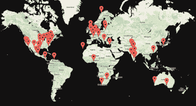

# 索菲·克拉维茨:木卫一的现状

> 原文：<https://hackaday.com/2017/01/12/sophi-kravitz-state-of-the-io/>

在 11 月的 Hackaday 超级大会上，Sophi Kravitz 有机会回顾过去一年的 Hackaday.io，这是多么伟大的一年。Hackaday.io 现在有超过 17.8 万名成员，他们发布了 12.6 万个项目，其中大约 10%是协作团队项目。但这些数字只是 Hackaday 这个充满活力的社区的一个小故事。

 [https://www.youtube.com/embed/w_vuZ8eTqBk?version=3&rel=1&showsearch=0&showinfo=1&iv_load_policy=1&fs=1&hl=en-US&autohide=2&wmode=transparent](https://www.youtube.com/embed/w_vuZ8eTqBk?version=3&rel=1&showsearch=0&showinfo=1&iv_load_policy=1&fs=1&hl=en-US&autohide=2&wmode=transparent)

Hackaday 的工作人员在 2016 年开始了一次沙漠之旅。这导致[hack aday 奖视频](https://www.youtube.com/watch?v=Z2wWUilmWrg)启动了工程倡议，并在 SuperCon 的颁奖典礼上结束。该视频启动了 2016 年黑客日奖，但不久之后，世界各地 80 个不同的地方同时聚集在一起参加[世界创造日](https://hackaday.io/event/10664-hackaday-world-create-day-2016)。许多这样的聚会产生了参赛作品，加入了竞赛第一轮挑战期间提交的 550 个项目。当然最后总数总计【1000 多个项目！

Over 80 Locations for Hackaday World Create Day

Hackaday 社区今年增加了它的 live meetups。 [Hackaday MakeIt NYC meetup](https://www.meetup.com/MakeIt-NYC/) 是 2016 年创办的月度聚会。 [Hackaday LA meetup](https://www.meetup.com/Hackaday-Los-Angeles/) 继续蓬勃发展，现在每个月都在新开放的 Supplyframe 设计实验室举行会议。

Hackaday.io 上的社交互动持续增长。黑客频道是开始的地方。任何时候你都可以和你的黑客伙伴互动，加入有组织的黑客聊天，比如本周五的老鹰聊天。[就业委员会](https://hackaday.io/project/8563-jobs-board)现在刚刚成立一年，是一个寻找工作或做广告的好地方。围绕像[旅行黑客盒子](https://hackaday.io/project/7373-travelling-hacker-box)这样的特殊项目，已经有了大量的社区互动。

也许 2016 年最有趣的惊喜之一是[平方英寸项目](https://hackaday.io/project/7813-the-square-inch-project)。这是一场完全由[ [阿尔法 _ 忍者](https://hackaday.io/alphaninja)发起的社区组织的比赛。但就像 Hackaday.io 上的任何好主意一样，这项广受欢迎的竞赛很快就获得了帮助。挑战在于利用一平方英寸的 PCB 设计出有意义的电路。有[近 80 个参赛作品](https://hackaday.io/list/7909-square-inch-project-entrants)！

从那来的还有更多。你可以尝试自己动手为用户设计一个通过算法生成的默认头像。一个即兴的挑战出现了，送出一些永远难以捉摸的超级门票，这本身[产生了第二个挑战](https://hackaday.io/project/16670-hackaday-super-conference-ticket)。

创造的乐趣和友谊今天仍在继续，像 1kB 挑战这样的竞赛。如果你不在木卫一上，你就错过了！