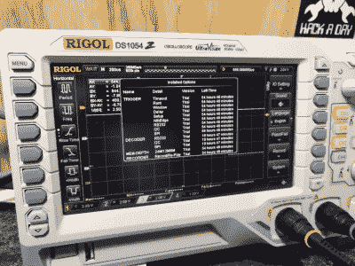

# 问问 Hackaday:可解锁的特性对用户有好处吗？

> 原文：<https://hackaday.com/2017/02/02/ask-hackaday-are-unlockable-features-good-for-the-user/>

有许多例子表明，硬件具有等待软件解锁的潜在特性。最近，我们看到了[一个卡西欧计算器](http://hackaday.com/2017/01/13/crippled-calculator-features-unlocked-with-automated-help/)，它与隐藏在固件中的更大的兄弟具有相同的功能，只是被一个缓冲区溢出漏洞暴露出来(或者如果你更喜欢硬件黑客的话，从铅笔引出)。

更著名的是，示波器因其残缺的功能而臭名昭著。Rigol DS1052E 在黑客长凳上非常受欢迎，因为它的价格非常实惠。该型号配备了 50 MHz 带宽，但人们发现一个简单的黑客将其变成了 DS1102E 100 MHz 范围。泰克公司也参与了这一行动，在示波器上安装了、CAN 和 LIN 分析等模块，但需要硬件钥匙才能解锁(这些模块被发现有[一种非常不安全的解锁方法](http://hackaday.com/2014/07/28/cloning-tektronix-application-modules/))。在 Rigol 新推出的入门级示波器 DS1054Z 上也发现了类似的功能障碍，该示波器配备了协议分析模块(以及其他模块)，仅在示波器运行的前 70 个小时内启用，需要额外付费才能解锁。大多数 scope 制造商都参与了这场游戏，当然这并不局限于我们的工具。WiFi 路由器是硬件托管固件可解锁特性的另一个很好的例子。

所以，我想问所有 Hackaday 社区的问题是:可解锁功能对我们这些使用这些工具的人有好处吗？让我们看看这些做法的一些背景，然后在评论中展开讨论。

首先，我想我们都同意这一点:在许多模型中重用硬件设计的一部分是合理的。如果你想运送五个型号，但只卷一个电路板，这使得一切都更容易，从采购电路板到填充和测试每个单元，因为你有一个夹具和其他过程的通用规格。这种情况时有发生，通常 PCB 会为某些型号组装元件，而不为其他型号组装元件。我将在接下来的部分中回到这个问题。

让我们来了解一下一家公司可能会以多个型号发布产品，但却拥有相似功能的几个原因。

## 底线和将硬件提供给需要的人

我将称之为这种做法的利他原因。公司寻求最大的利润，这将是高端设备，他们可以从竞争对手中脱颖而出，有购买力的企业是客户。工业中的人认为硬件是他们想要使用的东西。这种硬件只出现在专业长椅上，因为新的热点有一个价格标签，这意味着你需要一个理由来拥有这个范围，然后你才会咬紧牙关买一个。但是一旦你的测试板上有了这些探针，你就会很高兴拥有它。对于公司和承包商来说，购买高端示波器是有意义的。更好的设备可以帮助工程师更快地工作或更容易地发现问题，这在计费时间和制造方面是值得的。

但是你看，这些客户数量有限。明智的做法是不要只看高端产品，原因有几个，所以公司在同一系列产品中寻找中低端型号。因此，有人想出了一个好主意，去掉了一些选项，在表壳正面丝网印刷了一个不同的数字，并将其作为黄金标准范围的入门级型号进行销售。

### 入门级模型的效果

![The price point made the DS1052E the first scope for a generation of hackers. [via Unboxing Video]](img/24b00dc9027f8e6daa5f7acc614741ba.png)

价格点让 DS1052E 成为一代黑客的第一个范围。[via [拆箱视频](https://www.youtube.com/watch?v=AzMbYv_tEBo)

低价入门级车型有几个好处。现在，学生、业余爱好者和好奇者能够接触到硬件。从公司的角度来看，这建立了品牌忠诚度；该产品运行良好，他们喜欢它。当这些用户获得更大的预算(比如被聘为硬件工程师)并希望升级时，他们会首先考虑这家公司。该公司还继续以更高的价格销售 pro 型号，并获得巨大的利润，同时这些公司仍然受益于拥有优秀的工具。

从用户的角度来看，这加快了原型开发、开发和故障排除的速度。用更少的时间做更多的事，学更多的东西，这与我之前提到的专业工程师的个人价值观相似。

大家都赢了，对吧？

## 这就像一个应用程序商店

如果你觉得自己的硬件被忽视了，需要购买软件才能发挥其效用，我建议你关注智能手机。你购买了硬件(让我们避开运营商补贴的手机的无关问题)，它带有基本的功能，即使它有更多的能力。您可以通过购买在相同硬件上做更多事情的应用来扩展功能。

当你想到价格时，智能手机的比较仍然成立。示波器上的简单功能(例如，协议解码)比手机上的应用程序要贵得多。但是你的示波器软件最后一次崩溃是什么时候？我希望答案是永远不会。

这些设备正被用于设计和测试工业中的电子设备。示波器的故障可能会波及消费者市场，造成各种各样的混乱，因此示波器制造商保持他们的围墙花园整洁。这种坚如磐石的可靠性比一个因为内存泄漏而耗尽电池的应用程序要贵得多。当然，智能手机的市场比示波器大得多，这极大地影响了定价。

## 市场部让我们做的

有一点应该非常清楚:硬件开发人员不希望在生产过程中遵循几个并行的设计。但是市场部会坚持在生产线上有几个选择。这是一个叫做[市场细分](https://en.wikipedia.org/wiki/Market_segmentation)的概念的一部分，它寻求为精心挑选的客户群量身定制产品。我早些时候谈到了这背后的逻辑:专业设计的工程师需要顶级的工具和功能，并且能够支付得起，爱好者没有相同的需求或相同的钱包。

Whenever I turn on my scope it tells me how much time I have left before these functions are crippled.

因此，市场营销希望有一种产品，对于任何给定的细分市场都像糖果一样，但正如我所说的，硬件开发团队不会希望为每个细分市场设计完全不同的硬件。最简单的做法是设计所有的华而不实的东西，并为中低端产品抛弃一些。用软件做到这一点相当容易。Rigol DS1052E 的所有硬件都是 100MHz 示波器，但附带的固件以半速对 ADC 进行采样，人为限制为 50MHz。他们可以重新设计一个更慢的模拟前端，但这需要巨大的成本，因为改变固件中的采样率几乎不需要任何成本(只需要一点软件工程时间和测试)。

## 我们对追加销售的看法

Rigol 从 DS1054Z 中吸取了教训，该产品的所有功能都开启了大约 70 个小时(一些功能开启了 55 个小时)，然后当计时器超时时，这些功能就会失效。这打开了向入门级客户追加销售的大门。DS1032E 从来没有“购买”选项来启用潜在功能…只有一个“黑客”选项。

有趣的是我对这个倒计时器的感觉。在过去的两年里，我从未真正使用过这些功能。但我觉得在某个时候他们会被从我身边带走，这有点可疑。我把它等同于买一辆车，你可以在使用的前 70 个小时开到商场。之后你可以开着它去任何你想去的地方，只要不是在商场。它仍然能够实现这一目标，但如果没有追加销售，软件不会让您这样做。如果瞄准镜已经锁定，我的态度是这就是我购买入门级型号的结果。相反，我觉得有些东西被拿走了。我猜是人性吧。

## 我是骑墙派

现在我想听听你的意见。我不知道我对此有什么感觉。在我的用例中，我对那些被锁定的特性没有太大的需求。我当然也买不起更贵的型号；这是我的第一次尝试(这是我的第一次尝试)。

当 LinkSys WRT54G 还是新产品，DD-WRT 问世时，我刷新了解锁某些功能的固件，并实际使用了它们。在这种情况下，我不觉得我轻视了这家公司——毕竟我首先支付了硬件费用，并使用开源固件来获得更多收益。

您对带有缺陷或不可锁定功能的硬件有什么体验？让更多的硬件掌握在大众手中对用户有好处吗？还是我们错过了比允许的更强大的硬件？