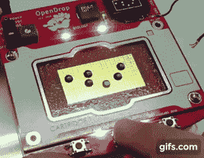

# 微流体“青蛙过河”改变了 DIY 生物学的游戏规则

> 原文：<https://hackaday.com/2017/01/16/microfluidics-frogger-is-a-game-changer-for-diy-biology/>

看到 GIF 里那些蓝绿色的点了吗？那些不是液晶显示器上的像素。这些是真正的液滴在特殊的印刷电路板上移动。液滴被操纵来玩“青蛙过河”的微流体游戏的事实只会让 OpenDrop v 2.0 更酷。

实验室生物学主要是一项液体处理的练习——用移液管将一点溶液 X 转移到一些溶液 Y 中。手动移液繁琐、容易出错且通量非常低，但自动化液体处理工作站的成本高达数十万美元。这使得[Urs Gaudenz]的“OpenDrop”微流体项目成为新生的生物黑客运动的潜在游戏改变者，它提供了廉价而简单的桌面液体处理。

在 OpenDrop 网站上很少关于这是如何工作的细节，但深入研究引用的[文献](http://cmosedu.com/jbaker/papers/2014/A_Fast_Fabricating_Electro_Wetting_Platform_to_Implement_Large_Droplet_Manipulation.pdf)可以发现，PCB 上的焊盘被驱动到高电压以吸引液滴。PCB 本身覆盖着一层疏水膜——用花生油或 Rain-X 处理过的保鲜膜。移动液滴是控制哪个衬垫带电的简单事情。拆分水滴是可能的，组合水滴也是可能的——看看“青蛙”被蓝色汽车碾过。

在微流体领域有很多很酷的工作正在进行，我们期待看到这一开放努力的成果。我们之前已经报道过微流体领域的其他开源成果，但是这一个看起来如此平易近人，以至于它肯定会抓住一些人的想象力。

 [https://www.youtube.com/embed/FKR5nrJtj08?version=3&rel=1&showsearch=0&showinfo=1&iv_load_policy=1&fs=1&hl=en-US&autohide=2&wmode=transparent](https://www.youtube.com/embed/FKR5nrJtj08?version=3&rel=1&showsearch=0&showinfo=1&iv_load_policy=1&fs=1&hl=en-US&autohide=2&wmode=transparent)

感谢[托马斯]的提示。