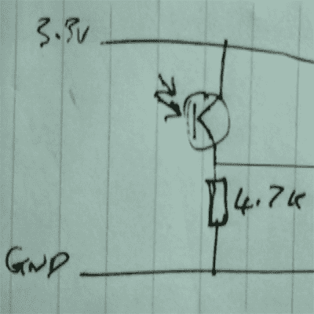

# Shmoocon 2017:太赫兹频率的软件定义无线电

> 原文：<https://hackaday.com/2017/01/16/shmoocon-2017-software-defined-radio-for-terahertz-frequencies/>

在蓝牙之前，在物联网之前，在万物联网之前，红外线是王道。在 90 年代，个人管理器、键盘、键盘和重要的基础设施都是基于红外线构建的。这些设备中的一些仍然存在，藏在显眼的地方。这意味着有很多机会进行一些非常有趣的开发。这是[Mike Ossmann]和[Dominic Spill]在今年的 Shmoocon 上的演讲焦点，探索红外世界。挂钩是什么？使用太赫兹频率的软件定义无线电。

【Dominic】的红外探测器

自笔记本电脑上的 IrDA 端口时代以来，红外通信一直没有改善，这意味着与这些设备通话所需的硬件异常简单。你唯一需要的是一个红外光电晶体管和一个 4.7k 电阻。这足以读取信号，但过度杀戮是这个游戏的名字，它导致了剑兰邻居的发展。这款用于 GreatFET 的附加板实际上是一款软件定义的红外收发器，能够处理 IrDA、20 至 60 kHz 红外遥控系统以及其它不太理想的应用。

演示是必要的，但在过去十年中，世界似乎已经忽略了 IR。这并不意味着仍然没有有趣的目标。在 Shmoocon 一周前，[Mike Ossmann]在 Twitter 上发布了一个交通灯和相关硬件的呼吁。是的，警车和救护车使用红外信号将交通灯变成绿色。你不应该。你*可以*，但是你不应该。

这次演讲的收获是什么？显然，IR 仍然存在。是的，你可以用它直接把文件从你的掌上电脑发送到激光打印机，而不用任何电线。红外的一个更有趣的应用是车内无线耳机单元，它几乎(但不完全)像红外脉冲编码音频一样发送信号。赢得最多掌声的演示是一个将交通灯变成绿色的红外设备。这样做的信息在网上是免费的，但是你真的不想在野外尝试。