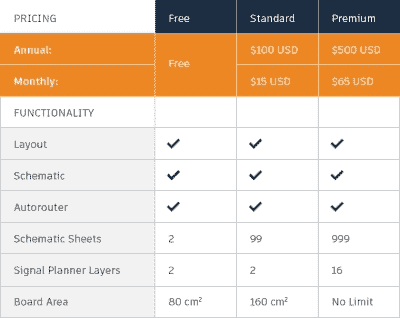

# Autodesk 将 EAGLE 转向仅订阅定价

> 原文：<https://hackaday.com/2017/01/19/autodesk-moves-eagle-to-subscription-only-pricing/>

老鹰用户？我们希望你喜欢订阅费。

Autodesk [宣布【EAGLE 现在只能作为订阅购买。以前，用户只需购买一次 EAGLE，就可以无限期地使用该软件(通常长达数年),然后再决定一次性购买新版本。现在，他们将按月或按年向 Autodesk 付费。](http://www.autodesk.com/products/eagle/blog/the-new-eagle-subscription-has-landed/)

让我们分解一下费用。在 Autodesk 从 CadSoft 购买 EAGLE 之前，一个标准许可证需要 69 美元，一次性支付。下一级是保险费，820 美元，一次性付清。Autodesk 的新定价层略有不同。标准版的价格为 15 美元/月或 100 美元/年，提供与旧的高级版类似的功能，但只有两个信号层。如果您需要更多层，或者超过 160 cm^2 的板空间，您将需要新的高级级别，每月 65 美元或每年 500 美元。

New Pricing Table for EAGLE

这对于许多用户的钱包来说是一笔糟糕的交易。如果您可以使用旧的标准选项，您现在每年支付 100 美元，而不是一次性支付 69 美元。如果你需要更多的空间或层，你可能会高达 500 美元/年。Autodesk 还取消了非商业用途的低成本选项，过去是面向业余爱好者的 169 美元版本。

免费版本仍然存在，但对于任何将 Eagle 用于商业目的的人(从 Tindie 卖家到工程公司)来说，这是一个巨大的变化。即使你同意新的定价，订阅模式意味着你永远不会真正拥有软件。这种模式将需要授权软件，需要定期打电话回家，并可以远程杀死。如果您需要在几年后回顾某个设计，您最好希望您的订阅是有效的，Autodesk 仍在运行许可服务器，并且您有一个活动的互联网连接。

另一方面，我们可以假设 Eagle 被出售的部分原因是现有的定价模型没有发挥出应有的作用。Autodesk 承诺将在所有订阅中包含更频繁的更新和功能，以证明这些更改是合理的。但遗憾的是，Autodesk 不承认新定价对用户有不利影响:

> “我们知道每隔几年一次性支付软件更新费用并不容易。这可能会增加您的预算，而且您永远不知道何时需要为下一次升级准备好资金。”

在他们的新闻稿中，他们声称此举只对客户有利。他们的营销用语甚至把每天的咖啡价格比作陈词滥调。说真的。

[Garrett Mace]在 Twitter 上很好地总结了他的观点:“之前支付 1591.21 美元，为期 88 个月= = 18.08 美元/月。移动到 65 美元/月？KICAD 更好看。”

我们同意[加勒特]。过去几年来，KiCad 一直在稳步改进，现在绝对是 EAGLE 用户在签署 Autodesk 订阅计划之前考虑它的好时机。