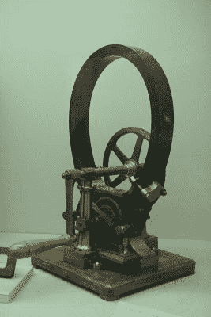
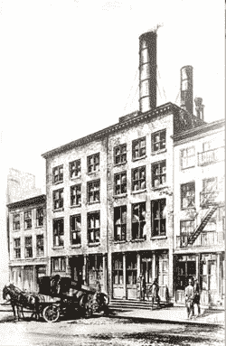
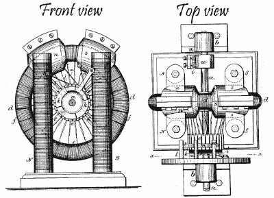
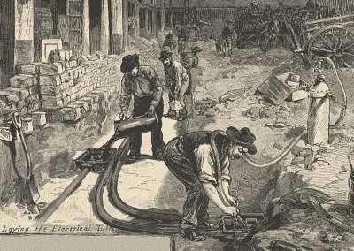
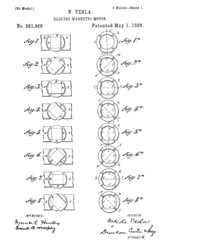

# 特斯拉 Vs 爱迪生

> 原文：<https://hackaday.com/2017/01/25/tesla-vs-edison/>

“特斯拉 vs 爱迪生”这个短语让人想起过去时代的战斗巨人、疯狂科学家的形象。我们可以很容易地想象他们两个面对面，背后是发光的日冕，手里射出闪电。然而现实却有些不同。他们争论的焦点是特士拉对交流电的热情与爱迪生创造 DC 电力系统来为电灯供电的动力。他们的个性在许多方面也不同，这里最相关的是他们截然不同的研究方法。这就是他们竞争的故事。

## 特斯拉对交流电的热情

Gramme Machine

尼古拉·特斯拉对交流电的热情间接开始于 1876 年，当时他正在奥地利格拉茨的奥地利理工学院学习物理、数学和力学。他的一位教授向他展示了一台直流[格拉姆机器](https://en.wikipedia.org/wiki/Gramme_machine)，它既可以用作电动机，也可以用作发电机。它有一个绕线电枢和一个换向器，在那里它会发出很多火花。特斯拉仔细检查了它，并告诉教授，他可以通过去掉换向器，改用交流电来大大改进它，尽管他当时不知道如何改进。

很长一段时间里，他觉得自己已经找到了答案，但最终在 1882 年，当他和一个朋友在公园散步时，答案浮出了水面。他找到一根棍子，在尘土中画了一张它的示意图，向他的朋友展示它是如何既作为发动机又作为发电机工作的。它使用一个旋转磁场，使用两个或多个彼此不同步的交流电旋转。特斯拉发明了一种真正的交流感应电机。根据他的自传《我的发明》，在两个月内，他“进化出了几乎所有类型的马达和系统的改进，现在都以我的名字命名。”

## 爱迪生的 DC 系统

大约在同一时间，在大西洋彼岸，托马斯·爱迪生正忙于研制白炽灯泡。白炽灯泡的工作原理是让电流流过一种叫做灯丝的材料，将它加热到白炽或发光。19 世纪的一个问题是细丝在高温下不能持续很久。爱迪生致力于解决这个问题，并于 1878 年开始申请电灯专利。与此同时，他成立了爱迪生电灯公司，作为一家专利控股公司，这是他拥有商业利益的众多公司之一。

Pearl Street station – Note the chimneys needed for burning coal

一旦他想出了一个商业上可行的灯泡，他需要一些方法让他的顾客为他们供电。1880 年，他成立了爱迪生照明公司，从纽约市开始建造发电站。1882 年，他开启了珍珠街站的配电系统，这是众多配电系统中的第一个，为 59 个用户提供 110 伏 DC。

但与此同时，用于弧光灯的交流系统不断涌现。交流系统的优点是能够用更细的电线传输更长的距离。使用变压器，电力可以在发电机处升压到高电压低电流，然后在用户附近再次降压到更安全的电压。

当时 DC 还没有这么好的电压转换技术，所以爱迪生必须在整个路线上保持合理的低电压。这意味着电流相对较高，因此电线很粗，难以承受。为了降低电线成本，发电机必须靠近用户。这意味着爱迪生只能服务于顾客密度高的地区，有时会跳过两者之间密度较低的地区。

但是出于我们今天只能推测的原因，爱迪生拒绝改用交流电。这可能是因为他可能无法理解与交流有关的更抽象的理论，或者可能他关心的是与交流输电有关的高电压，或者可能他只是在他众多的 DC 电站上投资太多。不管出于什么原因，尽管爱迪生不时涉足交流电，但表面上他坚决反对。

## 特斯拉在巴黎为爱迪生工作

1882 年是特斯拉顿悟交流电的一年，也是爱迪生为 DC 珍珠街站供电的一年，也是特斯拉开始为爱迪生在巴黎的电话子公司——爱迪生大陆公司工作的一年。他的工作基本上是为法国和德国的爱迪生电厂排除故障。

Early Edison dynamo – From [US219393](https://patents.google.com/patent/US219393A)

特斯拉认为这是一个利用交流电的优点出售公司的机会，但失望地发现谈论交流电是一种禁忌，因为爱迪生甚至不喜欢提到它。然而，这并没有阻止他进行实验，当他去阿尔萨斯工作时，他带着材料制造了他的第一台交流感应电机，第一次看到了交流电机在没有换向器的情况下转动。

在斯特拉斯堡，该公司安装了一个火车站照明设备。然而，在开幕式期间，当德国皇帝威廉一世在场的情况下，电站的一面墙因短路而被炸掉了一大块。德国人对此很不高兴，并对使用照明设备有了新的想法。面对财务损失，该公司向特斯拉提供奖金，条件是他去改进发电机并让德国人冷静下来。

特斯拉设法改善了系统，安抚了德国人，这得益于他会说德语。但当他返回巴黎领取奖金时，他的三名主管拒绝付款，而是互相推诿责任。特斯拉辞职了，结束了他在爱迪生的第一份工作。

## 特斯拉在美国为爱迪生工作

斯特拉斯堡工厂的经理查尔斯·巴彻勒对特斯拉印象深刻，劝他搬到美国去，在那里他可以找到更多的机会。他还给了特斯拉一封介绍信，让他交给爱迪生。

Laying the electrical tubes under the street – Pearl Street station June 21, 1882 Harper’s Weekly

到达美国后，泰斯拉很快找到爱迪生，并把信交给他。特斯拉告诉他他在法国和德国的工作，然后告诉他他对交流系统的想法，以及一个有事业心的人如何从中赚很多钱。爱迪生拦住他，生气地说:“站住！别跟我说废话。这很危险。我们在美国建立了直流电。人们喜欢它，我只会摆弄它。”但是由于要解决的问题太多，他让特斯拉马上着手解决其中一个问题。特斯拉当然很快就解决了这个问题，爱迪生对此印象深刻，于是继续使用特斯拉。

到了 1885 年，特士拉发现了让爱迪生的 DC 发电机更有效率的方法，也帮他省了一大笔钱。爱迪生喜欢省钱的想法，但意识到这需要大量的工作，所以他告诉特斯拉，如果他能做到，他会给他 50，000 美元。经过近一年的努力，特斯拉完成了改进，并去爱迪生那里了解他何时能收到 5 万美元。爱迪生当时斜靠在桌子上，张着嘴直起身子说:“特斯拉，你不明白我们美国人的幽默。”相反，他给特斯拉每周 18 美元的薪水增加了 10 美元。特斯拉走出去辞职了。他在为爱迪生工作时又一次被欺骗了。

经过一些困难之后，在 1887 年，特士拉和另外两个人一起成立了特士拉电气公司。正是在那里，他开始开发他的交流感应电机和他的多相系统的其余部分并申请专利，很快积累了大量的专利:到 1891 年已有 40 项。

## 洋流之战

Tesla’s patent [US381968 Electro Magnetic Motor](https://patents.google.com/patent/US381968A)

电流之战指的是从 19 世纪 80 年代末到 20 世纪初，通过交流电或 DC 分配电力的斗争最激烈的时期。这场战争主要发生在爱迪生电灯公司和乔治·威斯汀豪斯西屋电气公司之间。

西屋电气公司于 1886 年成立，开始涉足交流电配电领域。他已经购买了美国对 Gaulard-Gibbs 变压器的权利，并开始安装配电系统。

但他需要特斯拉详尽的多相和感应电机专利，1888 年，他购买了所有相关的美国专利。他们两人有着相同的新能源系统的梦想，以及利用尼亚加拉瀑布发电的梦想，因此特斯拉去西屋公司做顾问，月薪 2000 美元。当爱迪生听到这个消息时，他怒不可遏，就在那时，爱迪生和威斯汀豪斯之间的电流大战开始了。

尼亚加拉瀑布发电站于 1893 年开工，并于 1896 年开始为纽约州布法罗供电。至于是 AC 还是 DC 赢得了电流之战，你只需要看看今天我们的配电系统就知道了。

## 性格差异

作为 Hackaday 的读者，我们知道需要各种各样的个性来组成我们的社区。这是爱迪生和特斯拉大相径庭的领域，经常造成他们之间的关系紧张。

泰斯拉有照相般的记忆力，可以在他的头脑中模拟整个工作机器系统。这导致了他和其他工程师之间的摩擦，因为当他在头脑中工作时，他们想要蓝图。他解决问题的方法是利用理论和计算来完成大部分工作。由于这个原因，爱迪生认为特斯拉是一个书呆子和理论家。

根据爱迪生的说法，百分之九十九的天才是“知道那些行不通的东西”。因此，爱迪生解决问题的方法是通过反复试验。为了做到这一点，他的门洛帕克实验室储备了大量不同的化学品和材料。特斯拉曾经说过:“如果爱迪生在干草堆里找到一根针，他会像蜜蜂一样勤奋地一根接一根地检查稻草，直到找到他要找的东西。”

## 结论

然而，考虑到他们各自的成就在过去和现在都产生了积极的影响，我们不能因为他们解决问题或选择 AC 或 DC 的不同方法而指责他们。

你最喜欢的一些科技战或者科技奇才之战是什么？最近出现在这里的有[无线电的发明](http://hackaday.com/2017/01/09/did-a-russian-physicist-invent-radio/)和[飞机](http://hackaday.com/2017/01/10/the-wright-flyer-engineering-and-iterating/)。请在下面的评论中告诉我们。