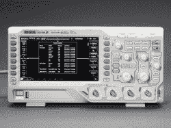
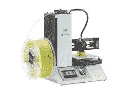
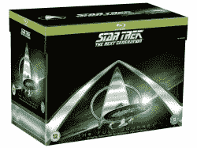
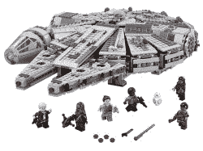

# Hackaday 的科幻竞赛达到了超光速

> 原文：<https://hackaday.com/2017/01/23/hackadays-sci-fi-contest-hits-warp-speed/>

黑客们的汗水可能会用在焊接、编码和构建上。对于我们许多人来说，这些项目的灵感来自科幻小说。我们从小到大阅读的书籍、电影、电视节目、短篇故事和漫画，直到今天还在继续。我们通过最近的比赛向所有这些伟大的科幻故事致敬。

科幻竞赛不是关于建造 555 电路的最有效方式或最严密的代码。这一个是关于用我们知道的最好的方式庆祝科幻小说——建造令人敬畏的项目。这是黑客日，所以你必须在你的参赛作品中使用某种形式的工作电子设备。除此之外，就看你的了。给我们带来你的守望角色扮演，你的迷航三录仪，你的星球大战 pod 赛车。

这不是我们第一次参加科幻竞赛了。事实上，[科幻是 Hackaday.io 早在 2014 年](https://hackaday.io/page/276-sci-fi-contest-on-hackaday-projects)的第一次竞赛之一。
三年后，超过 100，000 名新黑客，是时候重新审视一下你们都在做些什么了。进入第一届科幻竞赛的项目是合格的，但你需要创建一个新的项目页面，做一些新的工作。

[查看规则](https://hackaday.io/contest/19541-hackadays-2017-sci-fi-contest)了解全部细节。一旦你发布了一个项目，使用左边栏的下拉菜单，让它参加黑客日科幻竞赛。

### 奖赏

伟大的工作收获巨大的回报。这是我们为这场比赛准备的:

*   **大奖**是一台 Rigol DS1054Z 4 通道 50 MHz 示波器。
*   **一等奖**是一家独家制造商选择迷你 3D 打印机
*   **二等奖**是一个完整的《星际迷航:下一代》蓝光盒子
*   三等奖是乐高最新推出的千年隼。

截止时间为 2017 年 3 月 6 日星期一，太平洋标准时间晚上 09:00(+8 UTC)，所以不要浪费时间！加热你的烙铁，旋转你的曲速驱动器，创造一些令人敬畏的东西！