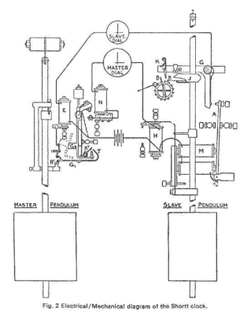

# Retrotechtacular:最好的摆钟

> 原文：<https://hackaday.com/2017/01/30/retrotechtacular-the-best-pendulum-clock/>

你会相信一个摆钟能把时间精确到每年一秒以内吗？如果你回答“是”，要么你自己从未尝试过调节摆钟，要么你已经知道短钟。让一个机电设备表现得如此之好，精确到百万分之 0.03 以内，这是一个不小的壮举，Shortt 时钟是第一个比地球本身表现得更有规律的计时设备。

 【马特·利特尔】给了我们这个链接，是一篇关于这款钟的[有趣的技术报道](http://nawcc.oimg/stories/1980/articles/1985/235/235_165.pdf) (PDF)。最精确的摆钟背后的诀窍是，它实际上有两个钟摆(钟摆？).其中一个被封闭在一个金属圆筒中，保持适当的真空，记录时间，但根本不做任何机械功。相反，通过一系列旨在尽可能少地改变钟摆摆动的机制，它每 30 秒钟发送一次电信号，并启动特意设计得慢一点的从属时钟。这样，从时钟就可以像移动时钟指针一样自由地做繁重的工作。

当作者开始在主钟摆上的镜子上照射光线，并将它的行为与现代超高精度时钟源进行比较时，文章的酷部分就来了。在时钟的周期中有许多看起来像是随机噪声的东西，但最大的贡献者原来是有物理起源的:月亮(明显)和太阳(什么？)改变当地的重力足以留下他们的痕迹。

如果你不能得到足够的短时钟，看看设备上的维基百科条目，或者查看这个[私人收藏家网站](http://www.clockvault.com/heritage/index.htm)上的漂亮图片，包括横幅图像中使用的图片。或者如果你的口味更倾向于[现代赛博朋克原子钟](http://hackaday.com/2014/11/27/jaw-dropping-atomic-clock-build/)，我们就把这个链接留在这里。