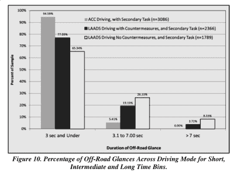

# 自动驾驶不会杀死司机，人类会

> 原文：<https://hackaday.com/2017/01/23/autopilots-dont-kill-drivers-humans-do/>

美国国家公路交通安全管理局(NHTSA)关于 2016 年 5 月佛罗里达州涉及自动驾驶模式下特斯拉 Model S 的致命事故的报告[刚刚出炉](https://static.nhtsa.gov/odi/inv/2016/INCLA-PE16007-7876.PDF) (PDF)。判决结果？“自动紧急制动(AEB)系统没有为碰撞事件提供任何警告或自动制动，驾驶员没有采取制动、转向或其他行动来避免碰撞。”这起事故是司机滥用技术的结果。

这并不怪特斯拉，因为该系统根本不是为处理与汽车成 90 度的障碍物而设计的。因为特斯拉撞上的卡车是汽车的侧面，“目标图像(拖拉机拖车的侧面)…在 EyeQ3 视觉系统数据集中不会是“真正的”目标。”当前技术状态范围之外的其他情况包括超车、超车和交叉路径碰撞。简而言之，特斯拉有助于防止与前面的汽车追尾，但侧面视野有限。司机应该知道这一点。

NHTSA 报告的结论是，“先进的驾驶辅助系统……需要驾驶员持续和充分的注意力来监控交通环境，并准备采取行动以避免撞车。”该报告还提到了最近(佛罗里达之后)特斯拉自动驾驶仪的新增功能，这些功能有助于确保驾驶员处于循环中。

要点是，人类仍然要对自己的安全负责，“自动驾驶”更像是防抱死刹车，而不是天网。我们最喜欢的脚注用精心措辞的法律术语写道:“NHTSA 认识到，其他司法管辖区已经对特斯拉使用“自动驾驶”这个名称提出了担忧。这个问题不在本次调查范围内。”(横幅图片来自[德国 YouTube 视频](https://www.youtube.com/watch?v=uX4ykJV7zmw)，后座的特斯拉代表告诉记者，他可以把手从方向盘上拿开。这里可能有混杂的信号。)

 如果你[像我们一样，希望看到更多关于自动驾驶汽车在道路上实际表现的数据](http://hackaday.com/2016/12/05/self-driving-cars-are-not-yet-safe/)，那么这份报告还有其他细节值得一读。一方面，特斯拉的 Autosteer 功能似乎降低了他们的汽车发生碰撞的几率。另一方面，驾驶辅助功能的使用越来越多，导致驾驶员注意力不集中的时间持续三秒或更长。

人们只是简单地认为自动驾驶仪应该比它实际做的更多。根据该报告，这个问题“在半自动驾驶汽车的背景下，司机滥用是一个新出现的问题。”技术进步的速度是否足以保护我们免受自身伤害，这是一个悬而未决的问题。

【via [科普](http://www.popsci.com/department-transportation-finds-no-defect-responsible-for-fatal-tesla-crash)。