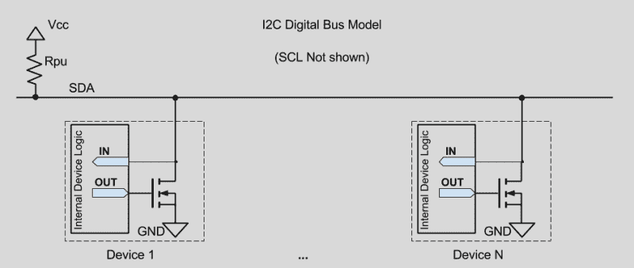

# 从跳板上跳下来:通过长电线介绍 I2C

> 原文：<https://hackaday.com/2017/02/08/taking-the-leap-off-board-an-introduction-to-i2c-over-long-wires/>

[prototyping](https://forum.pololu.com/t/vl53l0x-maximum-sensors-on-i2c-arduino-bus/10845) starts here, but we’re in danger when projects finish with this sort of wiring

如果你正在阅读这几页，很有可能你以前使用过 I C 设备。你甚至可能自豪地拥有几十个预装在分线板上的传感器，准备好进行试验，露出它们的引脚。随着 Sparkfun 和 Adafruit 这样的供应商将 I C 设备放到可爱的分线板上，人们很容易用我们开始时使用的相同连接线来完成一个项目。也很容易开始思考我们甚至可以让这些电线更长——长到足以连接我的前臂、我的机器人底盘或其他一些遥感容器。(有罪！)事实上，由于所有的构建日志都公布了神奇的传感器“圣诞树”从试验板中伸出，人们很容易忘记，I C 信号本来就不应该沿着任何长度的电缆传输！

正如我在第一份工作中很快了解到的那样，对于工业级(以及几乎任何其他坚固耐用的)项目，沿着任何形式的长电缆运行无保护的 SPI 或 I C 信号都有可能导致各种故障。

我想我应该利用这个星期来打破这种通过电缆运行 I C 的误解，然后给出几个“如何正确操作”的例子。

注意:如果你只是一头扎进 I C，让我们自己的[Elliot]带你上一堂[速成课](http://hackaday.com/2016/07/19/what-could-go-wrong-i2c-edition/)。

## 虫子——什么虫子？

好吧，也许我把几英尺长的电缆穿过我的机器人底盘来和我的传感器交流。有什么大不了的？一旦我们开始通过电缆传输信号，许多假设就开始失效。让我们快速浏览一下两个迫不及待要咬我们的最大挑战:总线电容和 EMI。

### 扩展我们的总线电容

首先，是那些长线的电容。请记住，电容器只是“两个导体，由绝缘体隔开。”听起来可疑吗？如果我们看一下电缆拓扑结构，信号线和接地线就形成了一个不需要的电容！我们的电缆越长，这个电容器就越大。

Image Source: [All About Circuits](http://www.allaboutcircuits.com/textbook/alternating-current/chpt-14/characteristic-impedance/)

好了，现在我们知道系统中有一个电容，它对我们的信号到底有什么影响？在理想情况下，或者至少当我们的导体很短时，我们可以预期信号从一个器件发出到进入下一个器件的时间会有很短的延迟。事实上，它非常短，我们几乎可以完全忘记总线电容。然而，随着布线距离的增加，寄生电容会接收我们干净的信号，并开始衰减它。

为什么会这样？让我们看看总线架构。I C 实现了*开漏*配置，这意味着每个器件的输入端都有一个 MOSFET，使其能够将整个总线拉低至“逻辑 0”。

假设我们通过一条长电缆运行 I C 总线，现在让我们将寄生总线电容添加到电路图中。

稍微调整一下，让我们只检查一个器件，现在将其晶体管建模为开关。

看哪！出现了野低通滤波器！

当任何器件将我们的 SDA 或 SCL 线从低电平释放到高电平时，就像上面的开关断开一样，我们不能瞬间改变总线的值。为什么？我们必须*首先*让我们的信号通过这个低通滤波器，或者用更常规的术语来说，给这个寄生电容充电。结果呢？接收到的信号不是我们都熟悉和喜爱的原始的、断续的方波，而是原始信号的稀释表示，就像在酒吧度过一个艰难的夜晚后蹒跚回家一样。

**有趣的事实:**总线电容主要影响上升时间，而不是下降时间，因为 N 沟道 MOSFET 关闭时会产生“逻辑 0”信号，实质上是产生对地短路，完全绕过电容。

当信号在长导线上延伸时，我们需要开始考虑如何保持足够低的上升时间，以便接收设备正确读取输入信号。上升时间是电压在被读取之前达到有效“逻辑 1”阈值电平的时间量。对于 I C，[规格](http://www.nxp.com/documents/user_manual/UM10204.pdf)规定标准模式(100 kHz)为 1000 纳秒，快速模式(400 kHz)为 300 纳秒。如果我们进一步延长上升时间，我们将冒着发送不被识别为“逻辑 0”或“逻辑 1”的位的风险。

对我们来说幸运的是，我们对这个上升时间有少量的控制；我们通过改变上拉电阻值来控制它。不过，首先，让我们澄清一下上拉值是如何影响 I C .总线的。之前，我提到过从主机到从机的 looong 线产生的杂散电容。

一个更强(更少欧姆)的上拉电阻*通过*增加*可以流过任一信号线的允许电流来减少*我们信号的上升时间，这反过来又使我们的寄生电容*更快地充电*。

好吧，那我们能走多远？我们能设计多小的电阻？如果我们想要一个快速的上升时间，为什么不使用 100 欧姆的电阻或者更小的电阻呢？不幸的是，如果上拉更强，任何一个总线器件需要吸收的电流量也会增加。让我们再看一下那张图表。

注意每个器件中的 N 沟道 MOSFETs 是如何形成的？这些 fet 负责将总线驱动至低电平，进而将总线值变为“逻辑 1”或“逻辑 0”。由于这些 MOSFETs 在每个器件内部，因此它们受限于在不损坏相应器件的情况下可以吸收多少电流。幸运的是，I C 规范实际上规定了最大*吸电流*、T2 电流；只有微不足道的 3 毫安。因此，在只有 3 mA 的情况下，最大值的上拉电阻很快被限制在最低的千欧范围内。

如果您实际上有一个运行在这些限制范围内的应用程序，那么您是幸运的！TI 在一篇[应用笔记](http://www.ti.com/lit/an/slva689/slva689.pdf)中汇集了计算总线上拉电阻值所需的等式。不过，请记住一点:我们可以用更强的上拉来降低总线电容的范围只能到此为止。大多数人并不在乎——这是理所当然的，因为大多数人不会首先用很长的电缆敷设 I C，以至于总线电容真的很重要。

我们在用长电缆传输 I C 时遇到的问题并不仅限于总线电容。还有一个敌人可能更加邪恶。

### 淘气的咬翻

我们可以感谢智能手机行业为我们提供了一些漂亮的杀手级 MEMs 传感器，其中大多数都使用 I C。使用 st 的 VL6180 飞行时间传感器( [Sparkfun Breakout](https://www.sparkfun.com/products/12785) )和博世的 BNO055 IMU 等传感器，人们很容易通过长导线将这些传感器塞进机器人底盘的角落。不过，等一下。机器人平台有运动部件的味道，运动部件闻起来像电机——这是电磁干扰的巨大来源！

那么，EMI 到底做了什么危害我们的系统呢？EMI 会在长电缆上引起电压尖峰。记住:每一根长电线本质上都是一根很好的天线，容易接收附近的电磁波。在经典的模拟调幅收音机中，天线接收到的振幅变化会转换成可听见的声音。然而，数字系统不能解释连续的波形幅度。它只解释转化为二进制 0 或 1 的两个阈值振幅。虽然 EMI 可能以模拟形式出现，但当这些不需要的 EMI 感应电压尖峰超过数字域的阈值时，我们就开始发现问题了。后果？对于我们的 I C 总线，这些感应电压可能会导致不必要的位翻转。更好的协议有*纠错码*,用于处理偶然的比特翻转和请求重传。唉，我 C 没有这种东西。

## 长期运行的解决方案

当我们决定让 I C 和 SPI 器件长距离运行时，总线电容和 EMI 是两个最常见的问题。幸运的是，有很多现成的解决方案可以处理这些情况。让我们浏览一下手头上的东西。

### 屏蔽电缆

对于短电缆，降低噪声风险的最简单方法是通过屏蔽电缆传输本地 SDA 和 SCL 信号。到目前为止，这个解决方案需要最少的努力，因为，就有线电视而言，它只是一个整容。请注意，这种解决方案只能缓解噪声，并不能解决总线电容问题。为此，您仍然需要指定一个合适的上拉电阻。

Image Credit: solidsignal.com

正确使用屏蔽电缆意味着我们需要将屏蔽层的一端接地。屏蔽层不接地的屏蔽电缆只是为了这种场合而设计的，但它完全没有用。一根屏蔽电缆的两端*都接地，现在就是一个接地回路(又名:天线)，这几乎与一开始就不屏蔽电缆一样糟糕。从这里开始的规则是:屏蔽层的一端接地，并且只在一端接地。*

为了方便我们，制造商通常会添加一根裸露的额外导线，称为*排扰线*(见左侧)，它与屏蔽层电连接。只要将这根电线的一端接地，我们就大功告成了！

### 总线缓冲器

对于长距离电缆布线，一些专用 I C 可以缓冲 I C 信号，使信号能够通过一对电容比 IC 总线通常允许的电容高得多的导线传输。PCA9605 使器件能够在 I C 规格允许的最大总线电容(400 pF)下工作。PCA9605 更进一步，电缆端最高允许 4000 pF。

P82B96 不仅如此。除了允许更高的总线电容之外，它*还*使总线能够在一个提升的电压下运行，使其更加不受噪声影响。此外，P82B96 甚至可以进行光隔离，支持不同电源上的器件之间的交互。数据手册宣称可在长达 20 米的电缆上传输 I C 信号。此外，通过在电缆下游放置额外的 P82B96 器件，信号可以得到增强和再生，从而传播得更远。

Image Credit: NXP P82B96 Datasheet

请记住，带有 P82B96 芯片的系统将成对出现，如上图所示。这种配对是必要的，以便从一个芯片获取升压后的 I C 信号，并重新编码为传统 I C，其总线电压对于我们其余的 I C 器件来说足够合理。

### 差分总线缓冲器

虽然一些总线缓冲器只是提高了 I/C 总线的电压，但其他缓冲器将其重新编码为差分信号。 [PCA9615](http://www.nxp.com/documents/data_sheet/PCA9615.pdf) 正是这样做的。它将 SDA 和 SCL 线编码为两个分离的差分对。差分对离魔术还差一步。通过在两根紧密间隔的导线上发送相等和相反的信号，我们使信号远比简单地提高电压更不受噪声的影响。(关于差分信号和 PCA9615 的更多信息将在下一篇文章中介绍！)

在目前所有的解决方案中，这是我个人最喜欢的一个。我们不仅获得了差分信号的所有抗噪优势，还没有牺牲 I C 的主要优势:它是一条共享总线，因此只有少量导线。就这一点而言，该芯片还支持多点配置，使其成为该协议的真正板外扩展。

Image Credit: PCA9615 Datasheet

在上图中，大边框反映了多个 PCBs 每个 PCB 都连接在同一电缆的任意点上。到目前为止，我将这张图转化为实际元件的最佳选择是从带状电缆开始，像这样简单地沿电缆压接连接器。(然而，这些电缆长度可以跨越几米，没有任何问题。)

A PCA9615 Chain

对于典型的总线缓冲器，在最嘈杂的环境中，通过带状电缆发送升压信号仍有可能产生 EMI。对于差分信号，只要每对线在电缆上间隔很近，这就不是问题。

与之前的解决方案不同，连接到该设置的每个节点具有相同的拓扑结构，每个分支只有一个 PCA9615。不过，有一个例外。最后一个压降需要终端电阻来完成差分对拓扑结构。

几年前，在长电线上运行高速信号可能是一件非常头痛的事情。如今，有大量的集成电路可以帮助我们在这个领域快速起步。这些嵌入式解决方案可能是我们前辈的心血，因此我在本文底部引用了主要的应用笔记。如今，在我看来，在长电缆上运行 I C 是一个已经解决的问题。如果我们遵循推荐的指导方针，我们将会很好地实现一个开箱即用的解决方案

在接下来的几周里，请加入我们，让我们一起来看看解决这些问题的具体实现。在那之前，干杯！

### 参考

*   [I2C 布线](http://www.analog.com/media/en/technical-documentation/technical-articles/I2C-Cabling.pdf)
*   [I2C 总线规范 UM10204](http://www.nxp.com/documents/user_manual/UM10204.pdf)
*   [AN11084 超大型 I2C 总线系统和长总线](http://www.nxp.com/documents/application_note/AN11084.pdf)
*   [AN10658 通过长通信电缆发送 I2C 总线信号](http://www.nxp.com/documents/application_note/AN10658.pdf)
*   [AN255-02 I2C/SMBus 中继器、集线器和扩展器](http://www.nxp.com/documents/application_note/AN255.pdf)