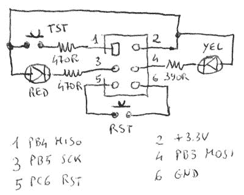

# 电压表无库显示 MQTT

> 原文：<https://hackaday.com/2017/01/25/voltmeter-speaks-mqtt-without-libraries/>

[埃米利奥·菲卡拉][给自己造了一台联网的 MQTT 万用表]([http://ficara.altervista.org/](http://ficara.altervista.org/))([由机器人从意大利语翻译过来](https://translate.google.com/translate?sl=auto&tl=en&js=y&prev=_t&hl=en&ie=UTF-8&u=http://ficara.altervista.org/&edit-text=&act=url))。或者我们应该说，埃米利奥·菲卡拉(Emilio Ficara)进行了一长串很酷的黑客活动，最终得到了一个支持 WiFi 的万用表，因为目的地远不如航行有趣。

DT-4000ZC 万用表有一个串行输出，但它不是直接传输数据，而是发送给[LCD 屏幕上的哪些单元需要激活](http://hackaday.com/2013/08/26/logging-two-multimeters-at-nearly-the-same-time/)。为了进行测试，[Emilio]使用了他自己的 [USB-serial-to-ESP01 加密狗](http://ficara.altervista.org/?p=3041)，如果你正在调试 AT 命令会话，这听起来是一个有用的工具。他制作了一个可爱的 AVR SPI 端口调试工具，带有复位按钮和诊断 led，我们现在就要复制它。其他自制工具，如 3.7V 锂离子电池管理器和串行数据监听器，使这个项目值得一看。

但我们真正喜欢的是[Emilio]的绝对简约的方法，即使用 ESP-01 的 AT 命令集通过 WiFi 发送数据，并简单地写入必要的字节。当然，他得到了帮助，形式是写得相当清楚的 MQTT 标准。但是如果您想将一些强大的功能塞进一个小的闪存空间，手写 MQTT 事务是一个不错的选择。

不幸的是，[Emilio]的代码只能以编译形式下载。我们很想看看源代码，至少对于 AVR 来说是这样的。但是内联图像中的可见内容已经足够让您入门了。如果您还没有使用 MQTT 作为家庭数据网络的主干，那么[可以看看我们的四篇系列文章](http://hackaday.com/2016/05/09/minimal-mqtt-building-a-broker/)来做这件事。正如[Emilio]演示的那样，MQTT 足够轻量级，可以进行位碰撞，但也很容易在更高级的设备上使用，只要你有内存。这是我们选择的数据穿梭协议，也是电潜泵的天然伴侣。