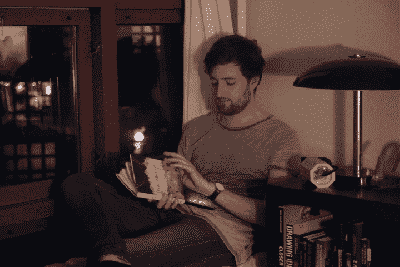

# 反对者:国内技术总监

> 原文：<https://hackaday.com/2017/01/26/objectifier-director-of-domestic-technology/>

【比约恩·卡门】的[客体化器](http://bjoernkarmann.dk/objectifier)是一种设备，通过使用机器学习和计算机视觉，让你控制家庭物体，让它们对独特的动作或行为做出反应。对象化者可以在你打开书的时候打开台灯，在你合上书的时候关掉台灯。当你把马克杯放在壶旁边时，打开咖啡机，当马克杯移开时，关闭咖啡机。戴上安全眼镜时打开砂带磨光机，取下眼镜时停止砂带磨光机。把香蕉放在面前就给手机充电，把苹果放在面前就停止充电。你明白其中的意思——可能性是无穷无尽的。希望在不久的将来，我们能够以这种方式与无生命的物体互动。我们可以让它们从我们的行为中学习，而不是我们学习如何给它们编程。

该设备使用计算机视觉和神经网络来学习与您的触发命令相关的复杂行为。使用手机应用程序的训练模式允许你训练它的开和关动作。一些动作需要更多的人力来训练它——例如检测一本打开和合上的书——但最终，神经网络做得相当好。

当前版本是该系列的第六个原型，[比约恩]在每个阶段都投入了大量工作来完善项目。在其最新的虚拟形象中，设备硬件包括一个 Pi Zero，一个 Raspberry-Pi 相机模块，一个 SMPS 电源块，一个切换输出的继电器块，一个输入电源的 230 V 插头和一个最终输出的 230 V 插座。所有的部件都用丙烯酸激光切割支撑件整齐地组装在一起，然后进一步封装在一个漂亮的木制外壳中。

在软件方面，所有的机器学习部分都使用“ [Wekinator](http://www.wekinator.org/) ”来处理——这是一个免费的开源软件，允许使用机器学习来构建乐器、手势游戏控制器、计算机视觉或计算机听力系统。计算机视觉通过处理来处理。所有代码都使用[open framework](http://openframeworks.cc/)包装， [ml4A](https://github.com/ml4a) 提供用于机器学习的应用。

从他博客上的图片和信息中，我们可以推断出以上所有情况。硬件方面没有太多细节，但图片足以告诉我们一切。这个软件还没有发布，但是这可能会刺激你们中的一些黑客去开发另一个版本的 Objectifier。休息后看看视频，显示人类教物化者它的把戏。

[https://player.vimeo.com/video/195086230](https://player.vimeo.com/video/195086230)