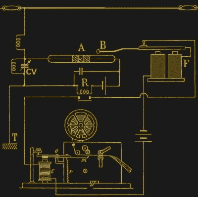
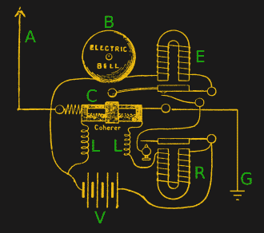
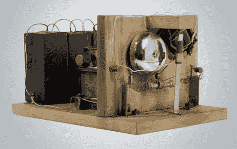
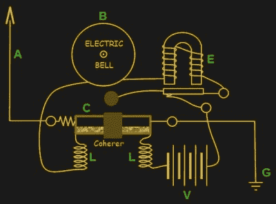
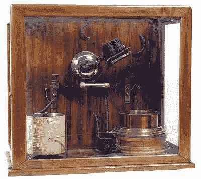
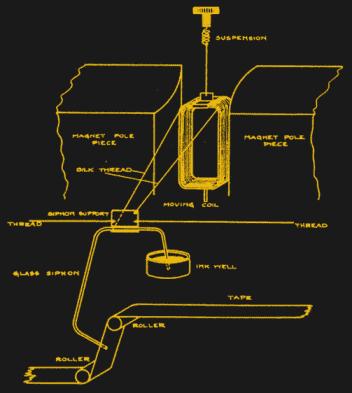

# 早期机电电路

> 原文：<https://hackaday.com/2017/02/01/early-electromechanical-circuits/>

在半导体二极管、晶体管甚至真空管出现之前的日子里，机械手段被用来做许多同样的事情。但是今天使用那些机械手段仍然有很多乐趣，就像[Manuel]最近使用他的中继计算机一样。这篇文章介绍了在更多电子和更少机械的方法出现之前，使用这些机械解决方案的一些电路。

## 相干莫尔斯码接收机

下面显示的电路很有趣，尤其是如果你玩过[水晶收音机](http://hackaday.com/2016/04/07/getting-serious-about-crystal-radios/)的话。它接收以特定频率的无线电波脉冲形式传输的[莫尔斯电码](https://en.wikipedia.org/wiki/Morse_code)。当时的传输是使用[火花隙发射器](https://en.wikipedia.org/wiki/Spark-gap_transmitter)完成的。点是该频率下的一小段传输时间，而虚线是一段较长的传输时间。在点和划之间，没有任何东西被传输。这个电路解码这些点和破折号，并把它们记录在纸带上。点会导致一个或几个缩进，破折号会导致更多的缩进。胶带以恒定的速度移动，所以点和划被没有缩进的胶带隔开。

顶部是天线。从天线下行的导线连接到由线圈和可变电容 CV 组成的并联 LC 谐振电路。他们一起调谐到所需的频率。与之平行的右边是相干器 A 和继电器 r。

[粘结器](https://en.wikipedia.org/wiki/Coherer)是一个由两个电极组成的管子，电极之间有金属屑。通过在电极之间施加无线电频率，锉屑粘在一起，实际上在颗粒之间形成了微小的微焊缝，这使得粘合剂导电。这样，它就起到了射频检测器的作用。

在内聚器导通之前，包括内聚器和继电器的电路路径或者开路，或者内聚器的电阻过高，不允许继电器由它右侧的电池供电。但是一旦内聚器变得导电，继电器就通电并闭合其开关。

该开关激活由两个螺线管 F、螺线管 E 和沿着 E 和 F 之间的电线的电池组成的电路。这导致螺线管 E 通电，并吸引在 O 处枢转的臂上的金属块，向上推动臂的右侧，并在胶带上打出凹痕。

一旦做了标记，螺线管 E 就保持通电，不管怎样，它必须断电。只要内聚器是导电的，就不会发生这种情况，这就是螺线管 F 发挥作用的地方。

当继电器 R 关闭其开关，给螺线管 E 通电时，它也给螺线管 F 通电。螺线管 F 向下吸引臂 B(“敲击器”)。这导致了两件事。部分电路通过 B 臂中间的一点，当它向下移动时，接触在该点断开。电路断开，所有螺线管断电，释放标记臂，标记臂被弹簧 r 拉回来。

当臂 B 被向下吸引时发生的另一件事是，臂 B 最左端的球敲击粘附器，打碎铁屑，使粘附器回到低或不导电状态。这也导致继电器 R 打开其开关。因此，即使当螺线管 F 断电时，臂 B 向上放松，再次闭合那里的电路，继电器 R 同时打开其开关的事实意味着电路保持打开。不用说，获得两个杠杆臂和继电器的时间刚刚好，使一个小点需要一些调整。

但是我们还没完。如果正在发送一个破折号，则无线电频率仍在接收，相干仪立即再次导电，整个过程重复进行另一次磁带敲击。查看旧磁带，似乎一个点也会导致多次点击，只是没有破折号多。任何一个莫尔斯手都知道一个破折号比一个点长三倍。现在你知道为什么了。

[Ashish Derhgawen]制作了[一个火花隙发射器和一个接收电路](http://hackaday.com/2016/03/29/spark-gap-and-coherer-meet-beagle-bone/)与上面的非常相似，并配有一个相干敲击装置。但是，他没有把信息写在磁带上，而是把它发送到一个 BeagleBone 板进行解释，并在显示器上显示为英语文本:这是一个完全可以接受的现代妥协。

## 用铃铛代替

  Popov’s lightning detector circuit  The world’s first radio receiver. Source: [ITU News](http://www.itu.int/net/itunews/issues/2009/09/57.aspx)

下一个机电电路是上一个的变体，被[亚历山大·斯捷潘诺维奇·波波夫](http://hackaday.com/2017/01/09/did-a-russian-physicist-invent-radio/)用来探测即将到来的雷暴。

闪电发出各种频率的电磁波。当天线 A 接收到这些频率中的一部分时，会使粘着器 C 中的金属屑附着在一起，使粘着器导电。这闭合了电路 C-L-V-R-L。这样做使继电器 R 通电，它吸引正上方的臂，闭合连接到该臂的触点。这给包括继电器 e 在内的电路提供了能量，这样做可以拉起手臂，用球敲击铃，使铃响。

但是当铃响臂被拉起时，它断开该臂与该电路的接触，关闭该电路。响铃臂回落下来，并有足够的松动，让球轻击内聚器，关闭 C-L-V-R-L 电路。因此，在这种情况下，铃响球作为敲击臂具有双重功能。

你可能会问，为什么我需要两个扼流圈？它们的存在是因为继电器触点有射频噪声。这种噪音会使凝聚器中的锉屑导电。扼流圈防止噪音返回到内聚器。

你可能会问，为什么要使用两个继电器？为什么不在这个修改版本中只有一个呢？看起来它会起作用。波波夫增加第二个继电器的原因是，凝聚器无法提供足够的电流来敲响铃铛。因此，额外的继电器允许电路独立于相干器——一种机械放大器。

请注意，该图显示了 U 形电磁铁在继电器中的应用。大概是为了利用地核感应磁场的两端。一旦我想到这一点，我意识到这可能是为什么上面的莫尔斯电码接收电路在 F 使用两个螺线管，这是我挠头的事情。它们的底座可能是铁的，也是核心的一部分，螺线管缠绕的方式可能会导致一个北极朝上，另一个南极朝上。两个螺线管和底座很可能形成一个 U 形电磁铁的等价物。

## 添加虹吸图表记录器

  Popov lightning detector with chart recorder  Syphon recorder mechanism (1922)

这里展示的照片是波波夫的一台机器，用于在有雷击时鸣钟，但它也在图表记录器上记录雷击。我们没有他的特定图表记录器的电路，但这让我们更深入地寻找，并找到一个旧的，过时的机电虹吸记录器的图表，看起来足够有趣，值得谈论。

驱动机制是一个动圈，就像模拟仪表中的线圈一样。线圈悬挂在两块磁铁的磁极之间。当电流流过线圈时，它会产生一个磁场，与磁铁产生的磁场相互作用，使线圈在垂直轴上稍微旋转。旋转量与电流量成正比。

线圈通过螺纹连接到一个矩形物体上，这个物体可以在垂直轴上自由旋转。当线圈旋转时，这些线导致矩形也旋转。一根管子连接到那个长方形上，管子的一端在墨池里，另一端向下并面对着一条移动的胶带。随着墨水沉积在胶带上，更多的墨水从墨池中被吸出。

## 终点挡板

因此，这是一个有趣的嬉戏通过一些旧的机电电路。我们很想听听你最喜欢的一些电机制，或者电时代错误，尤其是你复制的或者你自己想出来的。