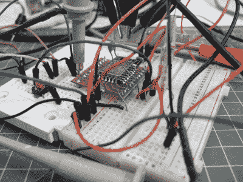
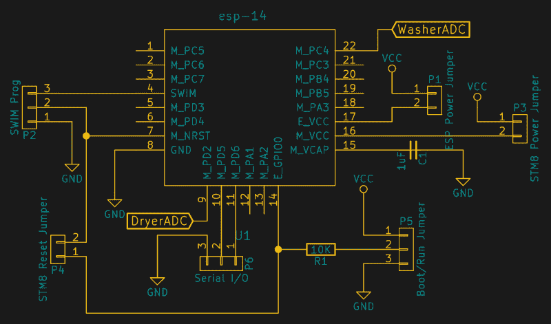
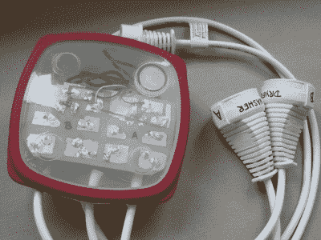
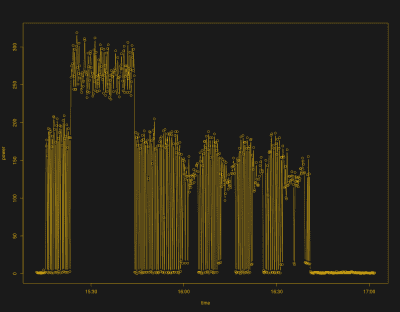
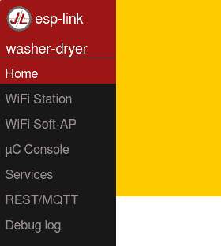
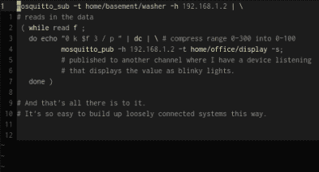

# 黑进最奇怪的 ESP 模块

> 原文：<https://hackaday.com/2017/02/13/hacking-on-the-weirdest-esp-module/>

有时候，我看到一个非常奇怪的组件，我就买下它，看看我是否真的能用它做些什么。今天的例子 ESP-14 就是这种情况。乍一看，你会问自己，许多更受欢迎的 ESP8266 模块的制造商 AI Thinker 在想什么。

ESP-14 采用了异常强大的 ESP8266 芯片，并将其隐藏在最便宜的微控制器之一的下面:8 位 STM8S003“价值线”芯片。ESP 芯片的几乎所有引脚都被锁在 RF 笼的金属坟墓内——只有电源、bootloader 和串行 TX/RX 引脚被公开，TX/RX 引脚与 STM8S 共享。模块的其余引脚专用于 STM8S。将 ESP8266 与 STM8S 捆绑在一起就像把一辆法拉利包在一辆大众甲壳虫里。

我以前从未接触过 STM8 芯片，只是想看看我可以用这个奇怪的野兽做什么。最后，具有讽刺意味的是，我最终做了一些在阿里巴巴上不会太出格的事情，但做了一些非常简单的改变:我们的洗衣机和烘干机的监视器通过 MQTT 报告电力使用情况，通过透明的 WiFi 串行桥编程到芯片中，进行交互式调试，而不必拖到地下室。一切都是开放的，可调整的，STM8S 的第四个实现甚至是在 Hackaday.io 上开发的。

对于最古怪的 ESP 模块来说，这是一个古怪的项目。我想我应该带你浏览一下，看看它是否能激发你想出 ESP8266 和-STM8S 这对奇怪的组合 ESP-14 的任何替代用途。

## 把一个哑芯片放到网上

STM8S 系列的 8 位器件很便宜。因此，它们出现在各种只需要最低限度微控制的商业产品中。因此，有很多熟悉芯片的中国设计师，这也是事情重新变得有意义的地方。根据 ESP-14 数据表( [PDF mirror](https://github.com/hexagon5un/hackaday_esp-14_power_meter/blob/master/docs/AI-Thinker_ESP-14.pdf) 我们从 [Watterott](http://www.watterott.com/de/AI-Thinker-ESP8266-ESP-14-WiFi/WLAN-Modul-STM8S-MCU) 下载的数据表)，其预期用途是通过 UART 和使用 ESP8266 的默认 AT 命令集固件为小型 STM8S 提供 WiFi 连接。也就是说，如果你已经有了一个使用 STM8 的稍微花哨的灯开关设计，那么你只需几个命令就可以拥有一个带有 ESP-14 的超级花哨的物联网灯开关。

和 ESP8266 模块都有一个致命弱点:单一 ADC 通道。因此，如果你想制造一个能读取多个模拟值的联网设备，你必须添加自己的多路复用器电路。或者将它与一个内置 ADC 和一些空闲引脚的普通廉价微控制器结合使用。因此，我们推测，bizarro ESP-14 诞生了。

## 资源和计划

STM8S 提供多个 ADC，而 ESP8266 则提供 WiFi 连接和大量存储器。我试图为这个组合想出一个方案。几乎在同一时间，我的妻子想要一个显示器，它可以告诉她洗衣机和烘干机是如何工作的，而不用走到地下室。需要两个 ADC，每个设备一个。完美。用 ESP-12 做不到！

ST 在 C 语言中为 STM8 系列提供了一个看起来相当完整的标准外设库,这应该会使事情变得非常容易。如果你在寻找其他资源，[The Way of Register](http://blog.mark-stevens.co.uk/the-way-of-the-register/)中有很多 STM8S 硬件的好例子。STM8S 的编译由 [SDCC](http://sdcc.sourceforge.net/) 支持，使用廉价的 ST-Link 加密狗上传代码由 [stm8flash](https://github.com/vdudouyt/stm8flash) 支持。你可能还需要[数据表](http://www.st.com/resource/en/datasheet/stm8s003k3.pdf)和[参考手册](http://www.st.com/content/ccc/resource/technical/document/reference_manual/9a/1b/85/07/ca/eb/4f/dd/CD00190271.pdf/files/CD00190271.pdf/jcr:content/translations/en.CD00190271.pdf)。

 但这是一个奇怪的项目，也就是说一种奇怪的编程语言。我最近一直在用 Forth 玩，【托马斯】在 Hackaday.io 上将一个 [Forth 环境移植到 STM8S](https://hackaday.io/project/16097-eforth-for-cheap-stm8s-value-line-gadgets) 上。如果你对 Forth 不感兴趣，它是一种介于 Python 和汇编之间的交互式编程语言，但具有老式 TI 计算器的语法。这是一种后天养成的习惯，但是交互意味着它需要一个串行连接来编程。

JeeLab 的 [esp-link](https://github.com/jeelabs/esp-link) 是你盒子里的一个很棒的工具。该软件将任何 bog 标准的 ESP 模块变成一个透明的 WiFi-串行桥，并添加了各种各样的铃铛和哨子。这些包括通过 SLIP 接口提供连接的微控制器 MQTT 和 REST 功能。对于这个项目来说，它是一个完美的组合:ESP-14 模块的 ESP8266 部分将允许我调用运行在 STM8 上的第四个解释器，并为它提供一个“简单”的方法来将洗衣机和烘干机的功率使用情况发送给 MQTT 代理。这意味着我可以构建电路，将其安装在地下室，远离我舒适的办公室。差不多了。

### 复位和电源

用 Forth 编程，至少在我做的时候，意味着要按很多次重置键；硬崩溃通常会导致运行在微控制器上的交互式外壳崩溃。幸运的是，esp-link 从 ESP8266 的 web 界面提供了复位功能，并且可以从 esp-link 的 web 界面将其重新映射到单个暴露的 ESP8266 引脚(GPIO0)。最终结果是，如果您愿意，可以通过向 ESP: `curl -XPOST "http://${ip}/pgm/sync"`发送 POST 请求来重置 STM8S。几秒钟后，一切又恢复正常。

 如示意图所示，目前这个项目中到处都有跳线，但它们都派上了用场，特别是因为共享的 RX/TX 线路使得很难在不被另一个芯片偷听或打断的情况下与一个芯片通话。例如，要刷新 ESP8266，您可以断开 STM8 的电源，使用编程跳线将 ESP8266 的 boot 引脚拉低，然后输入您的软件。要对 STM8 进行编程，您可以使用 SWIM 接口，或者断开 ESP8266 的电源引脚，切换 TX 和 RX 线，这样就有了一个直接的串行连接。当运行时，所有跳线就位，一切都在网络上工作。太好了。如果你想建立一个 ESP-14 分线板，这将是一个很好的起点。

### 其他硬件和安全

我的垃圾箱里有两个大电流电流变压器，所以这很容易。差不多了。插上一个已知瓦数的旧白炽灯泡，变压器只能输出几十毫伏的微弱信号。我添加了尽可能多的电器粗铜线环，以适应结实的圆环，这就行了。最终，洗衣机和烘干机在变压器输出端读取的峰峰值约为 500 mV，因此使用 3.3 V 基准电压的 ADC 很容易读取，即使它并不理想。合适的电流互感器会有所帮助:如果你买现成的，它们会有额定电流。提前计划。

 为了“安全”，这个项目的电源电压部分被完全密封在一个宜家三明治盒子里。由于这是我在转向 230 V 电压后完成的第一个基于 PCB 的项目，我实际上查阅了相关规定，并允许多一点安全余量:电源和任何其他焊盘之间的 PCB 上有 1 cm。两条延长线被牺牲并焊接到 PCB 上，以提供一个到墙壁的连接和一个洗衣机和烘干机的连接。

电流互感器的输出和 ESP-14 的 3.3 V 电源从低压逻辑电路的盒子中伸出。这是设计中让我犹豫的一部分；如果高压进入低压电线，盒子外面的 ESP-14 可能会变热。我用尽可能多的空气间隙将所有东西分开，并涂了大量的热胶水来固定它们。不过，当我不得不处理这件事的时候，我会尊重地对待它。照现在的样子，它被藏在洗衣机后面了。

由于来自电流互感器的信号是(低压)交流信号，并且关于地对称，因此电容和分压器可以将失调放回到 STM 8 ADC 的合理范围内。我在与高压电路相同的 PCB 上完成了这项工作，但回想起来，我本可以在机箱外完成所有的低压信号处理。在变压器原型制作阶段，PCB 是一个方便的模块，可以用一些灯泡和我的示波器在工作台上进行测试。

### 固件

我想用一个二极管和一些电容在硬件中实现峰值检测，但小电压信号无法实现，所以我用软件来实现。

A Load in the Washer

从夹层盒出来的电线携带的电压大约在 0 到 3.3 伏的中间，产生 50 赫兹的近似正弦波。这个正弦波的振幅与流经洗衣机或烘干机的电流成正比。我对实际的 [RMS 功率](https://en.wikipedia.org/wiki/Root_mean_square#Average_power)不感兴趣，更感兴趣的是简单地知道洗衣机或烘干机何时运行，因此峰值检测算法将工作得很好。

对于一个不费吹灰之力就能实现数十千赫兹频率的 ADC 来说，50 Hz 信号慢得离谱，因此这里有很大的过采样和求平均值空间，这很好，因为原始信号的噪声相当大。我尝试了许多方案，但其中最简单的是采用 16 个值的指数加权移动平均值，并在交流电源周期的两个周期内跟踪最大和最小平均值。最大值和最小值之间的差异是电器使用多少功率的一个很好的代理。这是发送给 MQTT 代理的值。

### MQTT

由于 esp-link 软件内部有一个 MQTT 客户机，剩下的工作就是与它对话。它使用[串行线路互联网协议](https://en.wikipedia.org/wiki/Serial_Line_Internet_Protocol) (SLIP)，如果你从 20 世纪 90 年代以来没有做过任何拨号网络，你可能不熟悉它，但它不能再简单了。原则上，您只需在每个包的末尾标记一个 SLIP `END`字符。知道一个包何时开始也很好，所以现代 SLIPs 也简单地在开头加上另一个`END`字符——零长度的包被无声地丢弃。还有转义和结束字符的转义版本，但是我不需要它们。

 Esp-link 还使用了一种特殊的数据格式，这种格式是为 C 代码和函数指针回调量身定制的。它还在整个数据包上安装了一个 [CRC](https://en.wikipedia.org/wiki/Cyclic_redundancy_check) 来拒绝无意中看起来像短信的对话。如果您使用基于 C/C++的代码，包括为 Arduinos 编写的代码，有[库和示例](https://github.com/jeelabs/el-client)可以简化与 MQTT/REST 服务器或通过通用 UDP 和 TCP 套接字的通信，并且所有这些都是在运行 WiFi 桥的同时完成的。

总结一下 MQTT 的故事，我需要设置数据包来匹配 esp-link 想要的内容，计算数据的 CRC，然后将其包装在 SLIP `END`字符中。然后，STM8 以 115，200 波特的速度将它发送到串行端口，一切都很顺利。

完整的固件被分成几个第四文件。有兴趣就看看吧。 [`mqtt.fs`](https://github.com/hexagon5un/hackaday_esp-14_power_meter/blob/master/forth_system/mqtt.fs) 文件和 [`power_meter.fs`](https://github.com/hexagon5un/hackaday_esp-14_power_meter/blob/master/forth_system/power_meter.fs) 文件几乎拥有所有用户有用的词汇，剩下的就是支持。最终结果是类似于`mqtt.preamble washer.topic 42 message.value qos.and.retain send`的东西使用 washer 的 MQTT 主题、服务质量级别 0 和无保留标志向代理发送数字 42(ASCII 格式)。

### 显示

当洗衣机或烘干机完成时，会有一个显示屏提醒我们。目前，它是一个简单的 MQTT 客户端，构建在一个乏味的 ESP-12 模块上，从代理中读取洗衣机和烘干机主题，并在一条 WS2812 LEDs 上以彩色条形图的形式显示数据。它本质上是一个多 LED 版本的显示节点，这是我在本专栏中使用 MQTT 和 NodeMCU 时为[构建的。](http://hackaday.com/2016/05/17/minimal-mqtt-networked-nodes/)

## 发明和尺寸

这个项目的全部意义就是用奇怪的部分做一些奇怪的事情。为此，我认为这是一个混合的成功。在这个互联家庭的时代，最后一个设备相当普通:一个向(本地)云报告的双通道电源监控器。但在引擎盖下，这是荒谬的。

 这种荒谬有一半要归功于【托马斯】的第八次尝试。随着 esp-link 完成繁重的 WiFi 提升以及提供远程重置，远程处理代码是一个梦想。如果你不确定这有多荒谬，请单击右边的图片，观看我登录 STM8，发送任意值，然后将其恢复到默认监控模式。

当然，您可以按预期使用 ESP-14:在 STM8 上运行的预编译 C 固件，并在 ESP8266 上使用库存 AT-command 固件。如果你熟悉 STM8 库的话，你可能在同样的时间内得到完全相同的器件。您必须自己编写 MQTT 协议位，但是对于像这样的简单消息来说，这实际上并不困难。

但是，使用一个毫无意义的模块，重新闪存内部的两个芯片，并拼凑出一些奇怪但实用的东西，这只是一点点极客的满足感。我可以远程登录到我地下室的一个 50 美分的微控制器，并询问它洗衣机使用了多少电力。在 23 号端口！多酷啊。

事实上，我花了一周时间，在几个小时内完成了这个，并把它放到了最小可行产品阶段。随着时间的推移，使用设置将告诉你哪些硬边需要打磨，哪些不起作用。这件事的真正意义在于，我使用了我所见过的最奇怪的 ESP 模块，尽管它*很可笑，但却很有用。你会用一个绑在 ESP8266 模块上的微型微控制器做什么？*