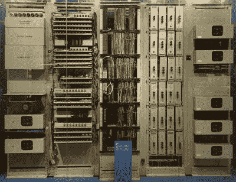

# 厄尼

> 原文：<https://hackaday.com/2017/02/14/retrotechtacular-ernie/>

无论你生活在世界的哪个角落，你希望谁对你微笑并给你带来好运？你可能会惊讶地发现，对于相当多的英国人来说，这个角色是由一个叫[厄尼]的人担任的。

什么，*芝麻街*的著名二人组伯特和厄尼中的[吉姆·汉森]厄尼？遗憾的是没有，因为橡胶鸭子的主人不可能给你每月一百万英镑的机会。相反，[厄尼]是一台在国民想象中被拟人化的计算机。更恰当的称呼是 E . R . N . I . E,**E**电子**R**andom**N**number**I**indicator**E**设备，他是为英国政府运作的一项彩票投资计划“优质债券”挑选中奖债券号码的机器。

自 20 世纪 50 年代以来，英国人可以购买 1 英镑的债券，今天可以购买多达 5 万英镑，每个月他们都会参加抽奖，厄尼从中挑选获胜者。最高的两个奖项是 100 万英镑，但对于大多数债券持有者来说，他们所能期望的最好的是偶尔的 25 英镑支票。溢价债券通常是为年幼的孩子购买的，所以许多英国人会有一些，通常完全忘记了。奖品永不过期，所以如果你是旧债券的持有者，你应该考虑询问国民储蓄和投资部是否有人欠你什么。

### 高级债券提款的始祖

 

原作于 1957 年的厄尼，现藏于伦敦科学博物馆。geni[CC BY-SA 4.0-3.0-2.5-2.0-1.0，通过 Wikimedia Commons。

目前的欧尼是第四代车型，但我们今天的关注点在它的 50 年代祖先上。在某种程度上，它是最有趣的机器，因为它有一个不寻常的血统，是伦敦多利山邮局研究站的创造。因此，它来自于巨像工程师汤米·弗劳尔斯的实验室，被描述为第二次世界大战解密者使用的现在著名但当时仍是绝密的第一台数字计算机的后代。因此，对于研究计算机历史的学生以及计算机在英国战后社会史中的作用来说，这是一项令人着迷的研究，因为它代表了英国公众对十年前帮助过他们的技术的唯一一瞥(如果他们当时知道的话)。

我们做了大量的工作来确保抽奖是真正随机的，并且在每次抽奖之前,[Flowers]和他的团队采用的解决方案都经过了彻底的测试。对氖管上产生的热离子噪声进行采样，这个随机电压产生了真正的随机数，用来产生中奖的债券号码。这种机器的构造非常容易让人想起它战时的前身，但也要记住，这要归功于当时英国电话交换机中使用的标准机架和油漆。八管已经消失，取而代之的是他们更熟悉的微型继任者。

我们为你准备了两部展示厄尼的电影。第一个是国家储蓄宣传片，解释了厄尼的目的，而第二个向我们展示了当时的部长开始第一次抽奖。信不信由你，这在当时引起了全国的极大兴奋。

 [https://www.youtube.com/embed/21sGqH5Gskw?version=3&rel=1&showsearch=0&showinfo=1&iv_load_policy=1&fs=1&hl=en-US&autohide=2&wmode=transparent](https://www.youtube.com/embed/21sGqH5Gskw?version=3&rel=1&showsearch=0&showinfo=1&iv_load_policy=1&fs=1&hl=en-US&autohide=2&wmode=transparent)

 [https://www.youtube.com/embed/5W1nLEmaOoo?version=3&rel=1&showsearch=0&showinfo=1&iv_load_policy=1&fs=1&hl=en-US&autohide=2&wmode=transparent](https://www.youtube.com/embed/5W1nLEmaOoo?version=3&rel=1&showsearch=0&showinfo=1&iv_load_policy=1&fs=1&hl=en-US&autohide=2&wmode=transparent)

这个厄尼在 1972 年被替换，并赠送给伦敦的科学博物馆。与此同时，我们在这里展示了巨像，去年夏天我们描述了位于布莱奇利公园的国家计算博物馆建造的复制机器。

顺便说一句，如果你是欧尼债券持有人，祝你好运！