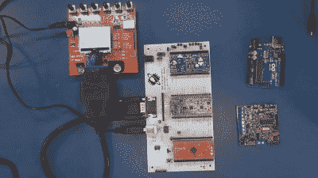
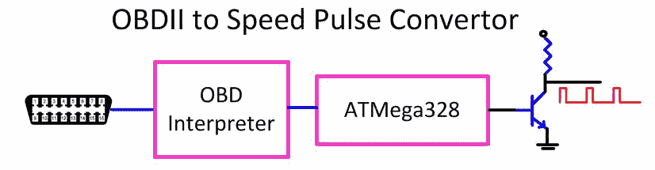
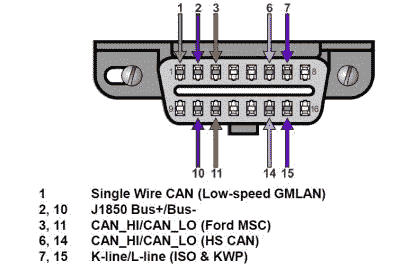
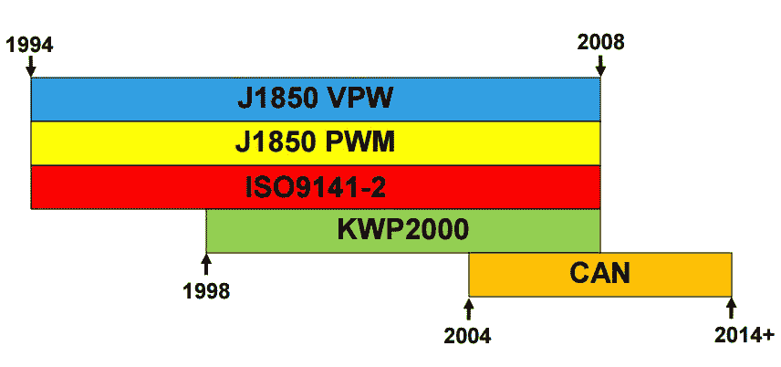
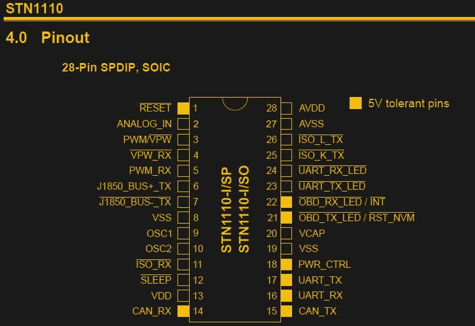
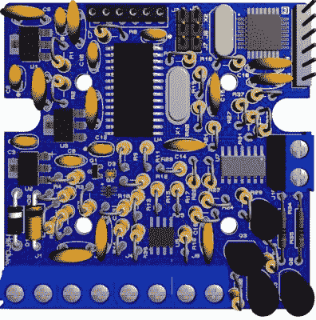
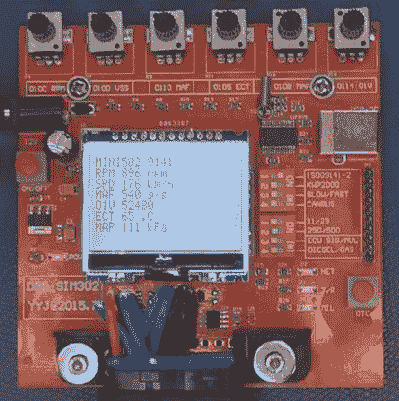

# 比尔·赫德问 OBD“我开得有多快？”

> 原文：<https://hackaday.com/2017/02/15/obd-and-asking-the-question-how-fast-am-i-going/>

每当我拥有一辆新车时，我最终都会坚持使用新的 GPS/接收器组合，以获得更好的音质和更好的 GPS。

我在家里很喜欢摆弄仪表板，因为我十几岁时就获得了安装 CB 收音机的许可，并且在 70 年代是当地 8 声道立体声升级的首选。我花了一生的一部分时间倒躺在汽车地板上的水坑里，向上看着杂乱的电线和支架，试图防止东西掉到我的脸上。如果你记得我在我的 [Datsun 280ZXT](https://hackaday.com/2016/09/08/megasquirting-my-1983-datsun-z/) 上的帖子，我在焊接离合器踏板支架时躺在相同的位置，脸上只有很少的焊渣。我确实记下了，下一次当我把汽车从自动挡换成手动挡的时候，车还在拆卸。【T2

更换工厂无线电通常涉及选择是否逐线侵入现有的工厂布线，或者我的偏好，获得与工厂插头匹配的电缆线束，并通过将其拼接到新无线电附带的连接器来制作适配器。

通常我还是要追捕几个信号，比如倒车指示灯，驻车制动指示灯，车速传感器之类的。在我的最后一辆车中，车速传感器(VSS)线应该在工厂线束中，但驾驶经验表明，它一定不是，因为 GPS 会显示我行驶在高速公路右侧 30 英尺处。这和 GPS 上的校准屏幕证实了它没有接收到速度脉冲。

 [https://www.youtube.com/embed/XMhdHVvWE8I?version=3&rel=1&showsearch=0&showinfo=1&iv_load_policy=1&fs=1&hl=en-US&autohide=2&wmode=transparent](https://www.youtube.com/embed/XMhdHVvWE8I?version=3&rel=1&showsearch=0&showinfo=1&iv_load_policy=1&fs=1&hl=en-US&autohide=2&wmode=transparent)

### 查找 VSS 线

深入研究仪表板，证实了一根电线确实不见了，尽管在标准的 Haynes 手册中有显示。很多时候，VSS 信号位于 GPS 使用的线束上，或者用于收音机的自动音量调节——随着车辆行驶速度的加快，工厂收音机的声音会变大。

我检查了我所有的在线安装资源，没有人发现这个信号出现在驾驶室的任何地方。最后，我直接从福特那里租到了福特图表，并且能够识别一个安全的速度信号来使用。我应该注意到，我远离防抱死制动系统的轮速传感器，我已经被一个微控制器代表我运行刹车的想法吓坏了。事实证明，当车辆加速时，有一个单独的信号让挡风玻璃刮水器控制器加速，就像只对刮水器进行自动音量控制。

所有这些努力让我开始思考，如果不将电线穿过防火墙，并从连接到车载电子控制单元(ECU)的 300 根电线中选取一根，我还能如何做到这一点。换句话说，正常人会怎么做？

Microchip Technology Incorporated 18060 IVN

我的一个想法是，组装一个专用电路，可以从内置的车载诊断总线(OBD 或 OBDII)查询车辆速度，并从结果数据中合成速度脉冲。简单地在网上看了一下，我发现有一家公司为出租车加装计价器硬件做了这项工作，但仅此而已。除此之外，我需要一个黑客视频的主题。

在这里，我们可以看到各种 OBD 协议被使用的年份和一个快速总结。

| 名称 | 速度 | 由使用 |
| ISO 9141 | 10 千比特/秒 | 大多数亚洲和欧洲制造商 |
| J1850 脉宽调制(脉宽调制) | 100 千比特/秒 | 马自达福特 |
| J1850 VPW(可变脉冲宽度) | 100 千比特/秒 | 主要是通用汽车 |
| 能(控制器局域网) | 200-500千比特/秒 | 较新的车辆 |

查看 OBDII 连接器和协议，首先映入眼帘的是它不是一个单一的协议；它是遗留协议的集合。自 2008 年以来制造的车辆通常使用控制器局域网(CAN)协议。

Microchip Technology Incorporated 18060 IVN

我知道的一件事是，我不想学习这些底层协议的复杂性以及如何在位或帧级别编程，我只想问一个简单的问题并得到答案:“车速是多少？”在视频中，我介绍了 J1850、ISO9141 和 CAN 的不同电气接口。

### 读取 CAN 数据

我偶然发现了 OBD 公司生产的 OBD 翻译芯片。它被称为 STN1110，将物理和低级协议转换为简单的基于 ASCII 的 UART 接口。

发送对车速“010d”的参数标识(PID)的查询导致三个字节的响应，其中第三个字节是以公里和小时为单位的车速，为单字节十六进制值。(0-255 公里/小时)。根据这些数据，只需根据 VSS 值的大小创建一个更快的脉冲，VSS 值越大，输出频率越高。实际上我不知道 GPS 期望的正常频率是多少，但作为软件，如果我遇到问题，我总是可以调整它。

查看 STN1110 的数据手册，他们给出了各种协议的接口电路示例:CAN、J1850、ISO9141。如果我做这个项目是为了生产，我会仔细检查接口的细节，但对于视频和一次性电路，我更愿意采用供应商建议的电路，因为他们最有可能知道什么是正常的。

设计师还需要做的是确保浪涌保护、电流消耗和“休眠”能力都已设计在内。关于浪涌抑制，汽车是一个肮脏的环境；巨大的电感器(启动器、交流发电机)和许多可以注入尖峰和电涌的地方。关于电流消耗，该组件将被“永久”插入，这意味着它的电流消耗必须在使用电池电源数周的情况下保持极小。我曾经在我的一辆汽车上安装了一个警报系统，它在一周内就把电池用完了，太糟糕了。

### 在一块电路板上塞满太多东西

看着电路板，你会发现我做了一件疯狂的事情，我混合了表面贴装和通孔，而不是任何通孔，我径向安装电阻，这意味着它们像 70-80 年代的日本老式收音机一样直立。部分想法是，如果我想做一个套件，另一个是，我真的很讨厌放置 50 个 SMT 电阻，因为它们会进入我的手臂头发，很容易放错位置。PCB 的尺寸是根据我从 Digikey 上取下的塑料外壳来选择的。

事实证明，一旦我进入一切，我意识到，如果我把设计削减到只有 CAN 协议(2008+)它会做我需要的一切，所以 rev 2 将全部是通孔，所以我可以把备用件作为一个套件放在 Tinde 上。

除了我忽略了一个 LED 指示器引脚也用于启动非易失性 RAM 初始化的事实之外，最终的电路板工作得很好…我的意思是谁会将一个 LED 引脚兼作输入引脚？即使 LED 在适当的位置，也需要一个电阻器将其连接到  已知状态，因为关闭的 LED 不传导电流或像电阻器一样工作。

最后，在视频的最后，我拿出了我的廉价 OBD 模拟器，它基本上是把我的卡车停在工作台上，电子地说。有很好的版本，我的是一个 70 美元的易贝。说明书是中文的，但实际上并不需要。使用内置 USB 连接器的开发板模拟我的定制板，没有我在 Hackaday Pro 小饰品和串行监视器之间获得的 FTDI 交互。我将波特率设置为 9600，并为 VSS: 010D(或者$010D，因为我是一个老计时器)发出 PID 查询

它回复 B5，表示模拟器以 181 公里/小时的速度行驶(十六进制 B5 的十进制数是 181)

在下一篇文章中，我将介绍这个软件。作为一种简单的仪器形式，我倾向于将其实现为一个(简单的)实时操作系统(RTOS ),这意味着与 crystal 相关的硬件计数器和定时器创建最终信号，该信号不会根据代码的执行时间而变化。我也倾向于使用汇编程序(你参加了 [Hackaday 1k 挑战](http://hackaday.com/2017/01/13/1-kb-challenge-and-the-winners-are/)吗？？)因为我是一名硬件工程师，所以我喜欢真正的电路仿真器(ICE)。你知道，在那里你实际上看到了处理器本身的执行，并且可以设置真正的断点(IDE 不是 ICE)。下次见！