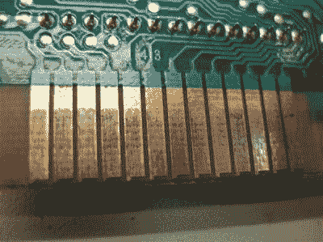
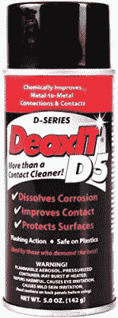

# 用接触式清洁剂清洗羽绒和脏物

> 原文：<https://hackaday.com/2017/02/17/contact-cleaners/>

我有一个朋友是一家小电视台的工程师。我去他工作的地方看过他一次，尽管他不让我爬 1200 英尺高的天线塔，我还是玩得很开心。当时我在一家视频制作工作室工作，所以我们的工作有很多相似之处。我们面临的日常杂务之一是清洁磁带机的磁头。他的长凳下有一桶 5 加仑的清洁液，他告诉我是氟利昂，他发誓用它来清洁头部和一般接触部位。他给了我一些装在小罐子里的东西给我的商店。

我从来不知道那东西是不是氟利昂，但那是 80 年代中期，在含氯氟烃被禁止之前不久，所以它可能是。我所知道的是，在清洁电子设备方面，我从未发现它能与之匹敌。考虑到这一点，我想我应该看看现在使用的隐形眼镜清洁剂，当你清洁隐形眼镜时到底发生了什么，以及为什么隐形眼镜首先需要清洁。

## 氧化是敌人

Badly oxidized game cartridge connectors. Source: [Racketboy](http://www.racketboy.com/forum/viewtopic.php?p=501002)

可能看起来不像，但我们生活在腐蚀性气体的海洋底部。大气中的氧气是罪魁祸首，金属是受害者。纯金属迅速与氧结合形成金属氧化物，金属氧化物通常具有与基底金属不同的性质。有时这是很方便的，当一个铝纱门形成一层氧化铝，使它基本上不受进一步腐蚀。其他时候，金属氧化物会引起问题。铜和锌的氧化物的导电性远不及任何一种贱金属，所以如果黄铜上有太多的氧化，那么由黄铜制成的电触点就会有问题。

暴露在空气中并不是接触者的唯一麻烦。触点上的电弧也会导致腐蚀和氧化。一般来说，直流电比交流电更难接触，因为交流电弧在过零时容易自熄。但不管怎样，电弧产生的热量会氧化触点，并产生干扰导电性的碎屑。

一定量的接触氧化是不可避免的，适当设计的电路会考虑到这一点。*润湿电流*是处理氧化的一种方式。润湿电流是“击穿”触点上氧化层电阻所需的最小电流。如果润湿电流太低，看似物理连接的触点实际上可能仍然是电断开的。缓冲电容可以用来解决这一问题。

## 清洁溶液

然而，总有一天触点需要清洗，而这项工作主要包括去除氧化层。这似乎需要一种比实验室标准更强的溶剂，异丙醇(IPA)。金属氧化物不特别溶于醇，因此 IPA 似乎不是处理它们的好选择。但是并不是所有的接触污染都是以氧化物的形式存在的——油脂、油和有机物也会污染接触——也不是所有的氧化物都是以坚硬的薄膜形式存在的。一些氧化物自然地从基底金属上剥落，但仍然通过其他粘性碎片粘在上面。所以 IPA 和类似的挥发性溶剂，比如我很久以前的氟利昂，是冲走一些粘性物质的首选。这些溶剂的挥发性是关键，因为它很快蒸发，几乎没有残留。

 然而，并不是所有接触清洁的工作都那么简单。有时，金属氧化物膜需要更多的劝说才能离开现场，在这种情况下，可能需要配方更复杂的接触式清洁剂。很长一段时间以来，艰苦工作的黄金标准一直是 CAIG 实验室的脱氧 T4。DeoxIt 声称是一个包含各种好东西的“联系更新器”。DeoxIt 中到底有什么是商业秘密——安全数据表只列出了除推进剂和矿油精之外的“专有商业秘密”成分。似乎有一个城市传说，秘密酱是油酸，但 CAIG 否认了他们的常见问题页面。像油酸这样的弱酸性物质是有意义的，因为它会与金属氧化膜反应，露出裸露的金属。不管里面有什么，它似乎足以激发强烈的品牌忠诚度。

尽管 DeoxIt 很好，但它很贵——一个 5 盎司的喷雾罐要 18 美元甚至更多。如果你不想付那么多钱，你可能会开始寻找其他选择。市场上有大量的商业替代品，一些人甚至声称 5%的油酸石脑油溶液是 DeoxIt 的合适 DIY 替代品。有许多[面对面的比较视频](https://www.youtube.com/watch?v=Jg6FmNTNv98)让 DeoxIt 与 WD-40 等更便宜的竞争对手进行竞争。然而，从这些高度不科学的测试中并不清楚这些清洁剂的效果如何。但对于一些最好少用的东西，我倾向于只买原版的，然后就到此为止。

现在轮到你了——你如何清洁触点和控制装置？当谈到接触清洁工时，似乎有相当多的巫术，我们想听听你的经历。在下面留下评论，让大家知道你对抗触点腐蚀的常用方法。

[来自 [WD-40](https://www.wd40specialist.com/products/contact-cleaner) 的特色图片]