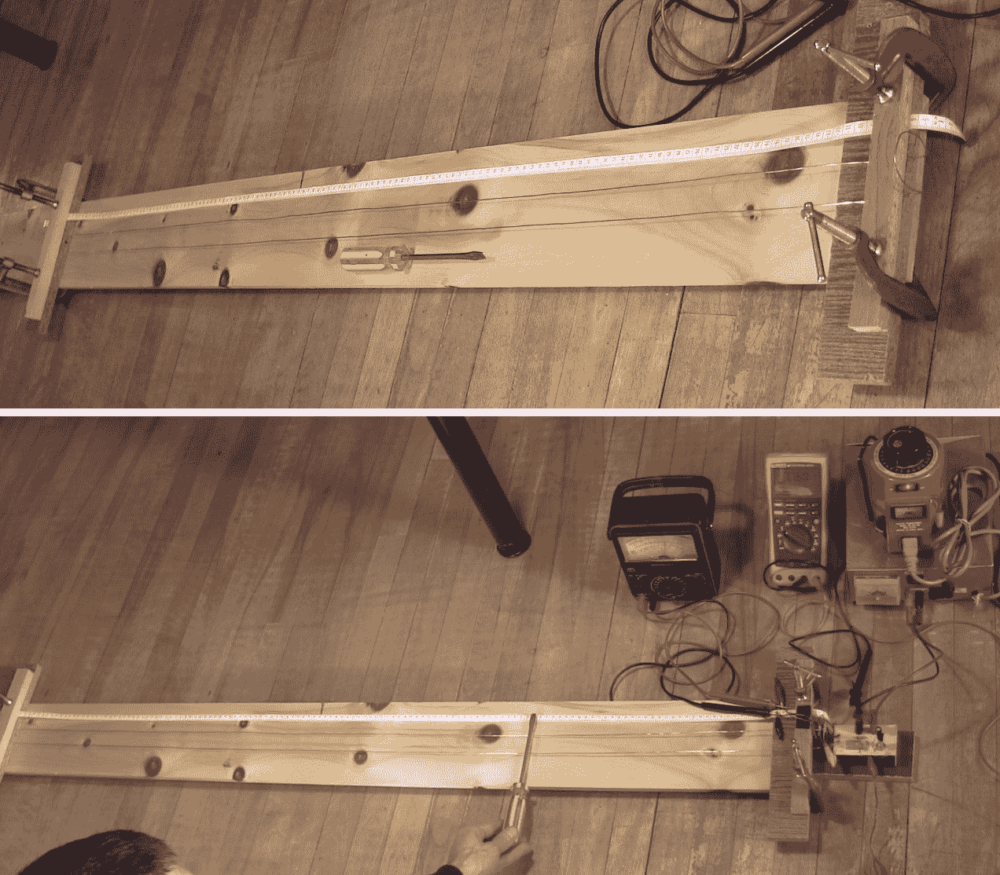
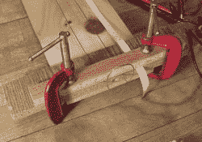
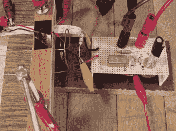
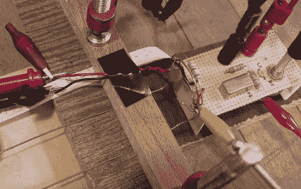
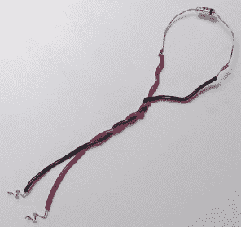
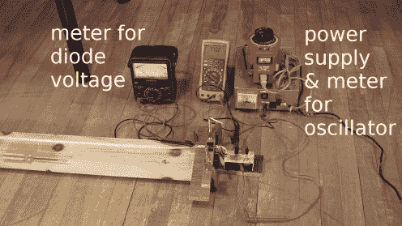
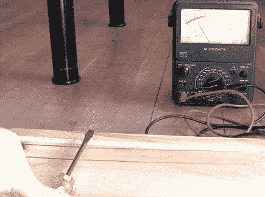
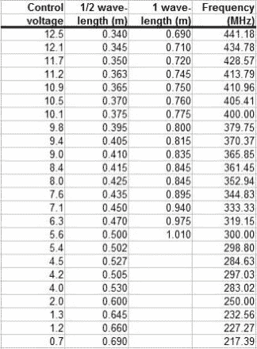
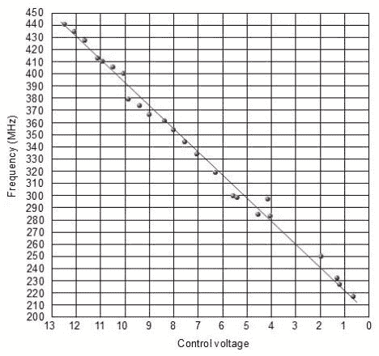

# 用勒歇线测量高频

> 原文：<https://hackaday.com/2017/02/07/using-a-lecher-line-to-measure-high-frequency/>

如果只有一个 100MHz 示波器、几个万用表和一个 DC 电源，如何测试刚刚制作的工作在 200MHz 至 380MHz 之间的振荡器电路？一个答案是把示波器收起来，用剩下的部分和一段电线代替。将电线形成一条[勒歇线](https://en.wikipedia.org/wiki/Lecher_lines)。

当我想测试基于 [Mini-Circuits POS-400+压控振荡器芯片](http://www.minicircuits.com/pdfs/POS-400+.pdf)的振荡器电路时，我就是这么做的。我不追求精度，只是验证芯片工作正常，我的电路可以调整频率。如下图所示，我得到了一个控制电压与不同频率之间的线性关系图。

接下来是一些关于色狼的台词，我是如何做到的，以及结果。

## 什么是色狼线？



Plain Lecher line and with test equipment in use



The end with a loop

勒歇线由两根平行的线或杆组成，形成一条[平衡传输线](https://en.wikipedia.org/wiki/Transmission_line#Balanced_lines)。这项技术产生了一种物理测量波长的方法。这种方法由来已久。与它同名的是奥地利物理学家恩斯特·莱赫，他在 1888 年完善了这一实践。

长度应该是振荡器输出波长的几倍。振荡器的波被施加到 Lecher 线的一端，在那里两条线连接在一起，在我的设置中形成一个环路。另外，在我的设置中，线路的另一端是开放的，电线没有连接在一起。

一根金属棒，或者在我的情况下是一把螺丝刀，横放在两根平行导线的宽度上，使它们短路。当我沿着电线滑动金属条时，它会影响波浪。当棒到达波的节点时，沿着线的位置是半波长或全波长(零交叉位置)，它可以用各种方法检测。其中一种方法是让酒吧成为霓虹灯的两个终端。灯泡在电压为零的节点处熄灭。但是我没有霓虹灯，所以我将在下面展示另一种方式。

在照片中，你可以看到一个卷尺沿着电线的长度测量从 Lecher 线的末端到节点的距离。通过这样做，你在测量波的波长，并可以用它来计算频率。

导线之间的距离应该是均匀的，并且应该明显小于被测波长的长度。

## 我的设置

由于我的振荡器可以产生 200MHz 到 380MHz 之间的频率，我需要一条足够长的 Lecher 线来适应这个范围。就电磁波而言，将频率转换为波长的公式为:

```
wavelength = speed_of_light / frequency
```

这给出了:

```
300,000,000 m/s / 200,000,000 cycles/second = 1.5 m
300,000,000 m/s / 380,000,000 cycles/second = 0.79 m

```

我做的有 1.5 米长。

 [](https://hackaday.com/2017/02/07/using-a-lecher-line-to-measure-high-frequency/oscillator_pulled_back_from_lecher_line/) The end with the oscillator but pulled back from the Lecher line [](https://hackaday.com/2017/02/07/using-a-lecher-line-to-measure-high-frequency/oscillator_and_diode_at_lecher_line_view_2/) Another angle showing the diode

为了测试振荡器电路，我在振荡器的输出端形成了一个环路，与 Lecher 线路末端的环路相匹配。环路的一部分是一个 6.8 千欧的电阻，这样振荡器电路就不会出现完全短路。为了将电路的波形应用于 Lecher 线，我简单地将振荡器的环路放在非常接近 Lecher 线的地方。即振荡器利用感应将电磁波置于勒歇线上。在上面的第一张照片中，振荡器被拉回了一点，以使事情更加清晰。

 [](https://hackaday.com/2017/02/07/using-a-lecher-line-to-measure-high-frequency/nte583_diode_loop/) NTE583 diode loop [](https://hackaday.com/2017/02/07/using-a-lecher-line-to-measure-high-frequency/lecher_line_and_oscillator_setup/) Lecher line, oscillator and other equipment

下一步是检测螺丝刀何时位于 Lecher 线上的节点处。为此，我使用了一个高频二极管，一个 NTE583 硅二极管，其包装上写着“用于高水平 UHF/VHF 检测和脉冲应用的肖特基开关”。我焊接电线两端，形成一个循环。如上图所示，我将二极管回路添加到 Lecher 线末端的回路集合中。

二极管的两条线连接到一个设置为 1 伏刻度的模拟仪表。当螺丝刀距离振荡器端仍不到半米时，在第一半波长的节点处，二极管两端的电压高于 0.5 伏。当螺丝刀在节点之间时，电压小于 0.1 伏。但是节点离振荡器越远，电表上的电压就越低，直到电表的指针几乎不偏转为止。



Making a measurement

## 结果

最靠近勒歇线振荡器端的节点是半个波长。下一个更远的是全波长。当螺丝刀位于导致模拟表上出现电压峰值的位置时，您就找到了一个节点，并记录了从振荡器端到该节点的距离。

振荡器是压控振荡器。我的电路包括一个分压器和用于调节电压的电位计，它控制振荡器的输出频率。黄色福禄克数字表显示控制电压。这与距离测量一起被记录。

振荡器的控制电压然后被调高，增加频率和减少波长。然后记录新的距离和控制电压测量值。

对于振荡器的整个 0 到 12 伏的控制电压范围，这是重复的。结果数据和图表如下所示。

使用以下公式从数据中得出频率:

```
frequency = 300,000,000 m/s / (2 * half-wavelength measurement)
```

半波长测量值(表中的 1/2 波长栏)乘以 2，而不是使用全波长测量值(1 波长栏)。这是因为，如上所述，螺丝刀离振荡器的 Lecher 线末端越远，模拟表上的电压就越低，几乎没有任何偏转。

 [](https://hackaday.com/2017/02/07/using-a-lecher-line-to-measure-high-frequency/lecher_line_pos_400_plus_data/) Lecher line data [](https://hackaday.com/2017/02/07/using-a-lecher-line-to-measure-high-frequency/lecher_line_pos_400_plus_graph/) Graph of the data

在 Hackaday 上寻找更多高频测量项目？有一个使用 74 逻辑的 DIY 100MHz 频率计数器，一个[Gerry]为 HP 53131 10MHz 频率计数器构建的[廉价时基附件，而不是购买 1000 美元的股票，还有一个项目是作为子项目开始的，](http://hackaday.com/2013/08/26/making-a-hp-frequency-counter-more-accurate/)[纳米计数器，由 FPGA，STM32F072 和 Android 前端](http://hackaday.com/2016/03/29/nanocounter-frequency-counter-with-an-android-ui/)构建。

我们一直在寻找独特的机制和测量方法，以便在 Hackaday 上深入研究。如果你在你收集的工作台技巧中有一个最喜欢的，请在下面告诉我们，我们会把它添加到我们的列表中，供以后的文章使用！