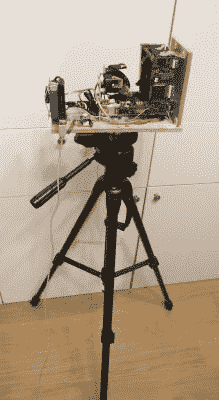

# 令人惊叹的 3D 扫描仪拆卸和重建

> 原文：<https://hackaday.com/2017/02/06/amazing-3d-scanner-teardown-and-rebuild/>

 给自己倒杯热茶，因为【伊利亚萨姆】的[关于激光测距仪的最新作品](https://geektimes.ru/post/278972/)(俄语，[此处翻译](https://translate.google.com/translate?sl=auto&tl=en&js=y&prev=_t&hl=en&ie=UTF-8&u=https%3A%2F%2Fgeektimes.ru%2Fpost%2F278972%2F&edit-text=))是一篇冗长而有趣的阅读。更简短的版本是，他得到了一个坏了的激光安全扫描仪，几乎完全逆向工程，让它再次工作，把它放在一个能够绘制他公寓地图的 Roomba 上，然后重新设计成一个三脚架安装的全房间 3D 扫描仪。哇哦。

该扫描仪有一个旋转镜和一个激光飞行时间测距仪，旨在当人们进入“禁区”时关闭机器。建成后，它返回沿水平面的范围——这是一个 2D 扫描仪。向 3D 扫描仪的转换意味着增加另一个轴，为了达到足够的精度，需要翻转钻机，从 VHS 机器上抢救出奇妙的轴承，并使用令人惊讶的普通 A4988 步进驱动器和 Arduino 驱动它。电脑上的程序读入数据，步进机再移动 0.36 度。结果不言自明。

这自然不是[伊利亚萨姆]的第一个激光测距仪项目。我们之前展示过他自制的基于视差的游侠用于移动机器人，同样令人印象深刻。这些构建最让我们惊讶的是在预算有限的情况下获得的近乎专业的质量。

 [https://www.youtube.com/embed/3SnqrfDCc70?version=3&rel=1&showsearch=0&showinfo=1&iv_load_policy=1&fs=1&hl=en-US&autohide=2&wmode=transparent](https://www.youtube.com/embed/3SnqrfDCc70?version=3&rel=1&showsearch=0&showinfo=1&iv_load_policy=1&fs=1&hl=en-US&autohide=2&wmode=transparent)

