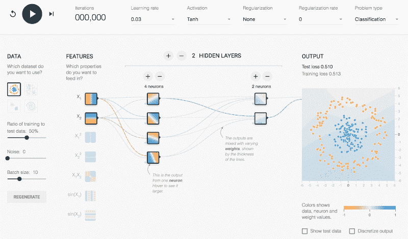

# 人工智能的未来

> 原文：<https://hackaday.com/2017/02/13/the-future-of-artificial-intelligence/>

上周[我们报道了人工智能的过去和当前状态](http://hackaday.com/2017/02/06/ai-and-the-ghost-in-the-machine/)——现代人工智能是什么样子，弱人工智能和强人工智能之间的差异，AGI，以及一些关于意识构成的哲学观点。弱人工智能已经在我们周围，以软件的形式致力于智能地执行特定的任务。强大的人工智能是最终目标，一个真正强大的人工智能将类似于我们大多数人通过流行小说所熟悉的东西。

人工通用智能(AGI)是许多人工智能研究人员目前致力于弥合这一差距的现代目标。虽然 AGI 不一定拥有任何类型的意识，但它将能够处理摆在它面前的任何与数据相关的任务。当然，作为人类，尝试预测未来是我们的天性，这也是我们将在本文中讨论的内容。我们对人工智能未来(近或远)的预期有哪些最佳猜测？如果要创造一个有意识的人工智能，会有哪些可能的伦理和实践问题？在这个投机的未来，一个人工智能应该拥有权利，还是应该被恐惧？

## 人工智能的未来

人工智能研究人员对未来的乐观态度多年来已经发生了变化，甚至在当代专家中也引起了激烈的争论。Trevor Sands(在上一篇文章中作为洛克希德·马丁公司的人工智能研究员介绍，他强调他的声明反映了他自己的观点，不一定是他雇主的观点)持谨慎的意见。他这样说:

> 自从 AGI 作为一个概念存在以来，研究人员(和乐观主义者一样)一直认为它“就在眼前”，几十年后。就我个人而言，我相信我们将在未来半个世纪内看到 AGI 的崛起，因为硬件已经赶上了理论，更多的企业看到了人工智能进步的潜力。AGI 是人工智能研究中不断努力的自然结果。

正如艾伯特(另一位人工智能研究人员，他要求我们在本文中使用化名)所说，在那个时间框架内，甚至有感知能力的人工智能也是可能的:

> 希望有生之年能看到。我至少期望看到足够多的机器智能，以至于人们会强烈地争论他们是否‘有知觉’。这实际上意味着什么是一个更加困难的问题。如果感知意味着“自我意识”,那么想象一台智能机器拥有自己的模型似乎并不困难。

桑兹和艾伯特都认为，目前对神经网络和深度学习的研究是正确的道路，并将有可能在不太远的未来引领 AGI 的发展。在过去，研究要么专注于雄心勃勃的强人工智能，要么专注于范围有限的弱人工智能。AGI 的中间立场，特别是由神经网络执行的中间立场，迄今为止似乎是富有成效的，并有可能在未来几年中导致甚至更多的进步。像谷歌这样的大公司当然认为是这样。

## 强人工智能的衍生和伦理

每当讨论人工智能时，总会出现两个主要问题:它将如何影响人类，以及我们应该如何对待它？小说作品总是普通大众的思想和感情的一个很好的指示器，这些问题的例子在科幻小说中比比皆是。一个足够先进的人工智能会试图消灭人类吗，就像天网一样？或者，人工智能需要被赋予权利和保护，以避免像[人工智能](http://www.imdb.com/title/tt0212720/)中设想的那些暴行吗？

Scary, scary AI

在这两个场景中，一个共同的主题是[技术奇点](http://electronics.howstuffworks.com/gadgets/high-tech-gadgets/technological-singularity.htm)产生于真正人工智能的创造。技术奇点被定义为在非常短的时间内出现指数级发展的时期。这个想法是，一个人工智能将能够改进自己，或者产生更先进的人工智能。因为这将很快发生，一个戏剧性的进步可能会在一夜之间发生，导致一个比人类最初创造的更先进的人工智能。这可能意味着我们最终会拥有一个超级智能的恶意的人工智能，或者一个有意识的、应该享有权利的人工智能。

### 恶毒的 AI

如果这个假设的超级智能 AI 决定它不喜欢人类呢？或者，只是对我们漠不关心？我们应该害怕这种可能性，并采取预防措施来防止它吗？或者，这些恐惧仅仅是毫无根据的偏执的结果？

桑兹假设“AGI 将彻底改变人类，它的应用决定了这将是积极的还是消极的影响；这与‘分裂原子’被视为一把双刃剑非常相似。”当然，这只是针对 AGI，而不是强人工智能。有知觉的、有意识的、强大的人工智能的可能性如何？

更有可能的是，这种潜力不是来自一个恶意的人工智能，而是一个冷漠的人工智能。艾伯特提出了一个人工智能的问题，给出了一个看似简单的任务:“故事是这样的，你是一家回形针工厂的老板，所以你要求 AGI 最大限度地生产回形针。然后 AGI 利用其超强的智力想出一个办法，把整个星球变成回形针！”

在一次有趣的思想实验中，艾伯特否定了这个想法:“你是说这个能听懂人类语言的 AGI 超级聪明，但不太懂这个请求的微妙之处？或者它不能要求澄清或猜测把所有人变成回形针是个坏主意？”

基本上，如果人工智能足够聪明，能够理解并执行对人类有害的场景，它也应该足够聪明，知道不要这样做。阿西莫夫的机器人三定律也可以在这里发挥作用，尽管这些定律是否能够以人工智能无法改变它们的方式实现是值得怀疑的。但是，人工智能本身的福利呢？

### 人工智能权利

争论的对立面是人工智能是否值得保护和权利。如果一个有知觉和意识的人工智能被创造出来，我们应该被允许简单地关闭它吗？应该如何对待这样一个实体？即使是现在，动物权利也是一个有争议的问题，到目前为止，关于动物是否拥有意识(甚至是感觉)还没有达成一致。

由此可见，同样的争论也适用于人工智能生物。强迫人工智能为了人类的利益夜以继日地工作是奴隶制吗？我们应该为它的服务付费吗？人工智能会用这笔钱做什么呢？

Bad movie, interesting idea

我们不太可能在短期内找到这些问题的答案，尤其是不会找到让所有人都满意的答案。“对 AGI 的一个令人信服的道德反对是:我们如何保证一个和人类平等的人工智能拥有和人类一样的权利？鉴于这个智能系统从根本上不同于人类，我们如何定义基本的人工智能权利？此外，如果我们把一个人工智能视为一种人工生命形式，我们有权利剥夺它的生命(“关掉它”)吗？).在我们到达 AGI 之前，我们应该认真思考人工智能的伦理问题。”桑斯说。

随着人工智能研究的继续，这些伦理问题以及许多其他问题肯定会成为持续的争论点。从各方面来看，我们离它们的相关性还很远。但是，即使现在[会议正在举行](https://futureoflife.org)讨论这些问题。

## 你如何参与其中

人工智能研究和实验传统上一直是在企业实验室工作的学者和研究人员的领域。但是，近年来，免费信息和开源运动的日益流行甚至蔓延到了人工智能。如果你对参与人工智能的未来感兴趣，有很多方法可以做到。

如果你想自己做一些神经网络实验，有软件可以做到这一点。谷歌有一个浏览器内的游乐场，用于修补基本的神经网络技术。开源神经网络库，像 [OpenNN](http://www.opennn.net) 和 [TensorFlow](https://www.tensorflow.org) 都是免费的。虽然这些不太容易使用，但坚定的爱好者可以使用它们并加以扩展。

Google’s in-browser neural network playground

然而，最好的参与方式是尽你所能进行更深入的专业研究。在美国，这意味着促进科学研究资金的行动主义。人工智能研究和所有科学研究一样，处于岌岌可危的境地。对于那些相信技术创新是未来的人来说，推动公共研究基金永远是一项有价值的努力。

多年来，围绕人工智能发展的普遍乐观情绪一直在波动。我们现在正处于一个高点，但这完全有可能改变。但是，不可否认的是，人工智能的可能性如何激发了公众的想象力。这在我们消费的科幻小说和娱乐中显而易见。我们可能会在几年内拥有强大的人工智能，或者可能需要几个世纪。可以肯定的是，我们不太可能放弃追求。